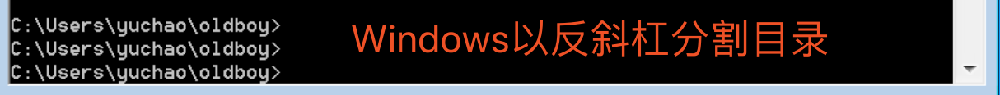

# 第一阶段、Liunx运维基础

## **第二章、linux文件管理命令**


### **2.1、linux命令语法**

**Linux命令行语法**


| 命令               | 空格 | 参数（可写可不写）    | 空格 | 文件、文件夹（可写可不写） |
| ------------------ | ---- | --------------------- | ---- | -------------------------- |
| ls列出目录下的内容 |      | -a 显示所有藏文件信息 |      | /opt 根目录下opt目录       |
|                    |      |                       |      |                            |

基本命令用法如上

- 一般情况下、linux'的命令参数为选项、根据情况选择什么样的参数、可写也可不写；
- linux命令之间、必须的由一个或多个空格；


**Linux命令提示符**


```shell
root：登录名
@：占位符
lb1：主机名
~：当前家目录
#：超级用户身份提示符
$：普通用户身份提示符
```


### 2.2、linux目录结构

**操作系统目录分隔符**

*windows平台命令行目录分隔符*



*Linux平台命令行目录分隔符*


**Linux与Windows的目录结构比较**

Linux首先是建立一个根"/"文件系统，所有的目录也都是由根目录衍生出来。

登录系统后，在当前命令窗口输入命令:

```
ls /
```

查看结果如下图：


在Linux底下，所有的文件与目录都是由根目录开始，是目录与文件的源头，然后一个个的分支下来，如同树枝状，因此称为这种目录配置为：**目录树**。

目录树的特点是什么呢？

- 目录树的起始点是根目录(/,root);
- 每一个目录不止能使用本地的文件系统，也可以使用网络上的文件系统，可以利用NFS服务器挂载特定目录。
- 每一个文件在此目录树中的文件名，包含完整路径都是独一无二的。

**图解linux与Windows目录**

*Linux与windows区别*

- windows特点:E:\学习视频\高清视频\
- Linux目录特点:/etc/hosts /root/data/oldboy.txt


**Linux** 系统目录结构基本特点：

1.Linux下一切从`根`开始

2.Linux下面的目录是一个有层次的目录结构

3.在linux中每个目录可以挂载到不同的设备(磁盘)上

4.Linux 下设备不挂载不能使用，不挂载的设备相当于没门没窗户的监狱(进不去出不来)，挂载相当于给设备创造了一个入口(挂载点，一般为目录)


### **2.3、linux常用目录含义**


**Linux目录挂载**

**挂载**通常是将一个`存储设备`挂接到一个已经存在的`目录`上，访问这个`目录`就是访问该存储设备的内容。

对于Linux系统来说，一切接文件，所有文件都放在以`根目录`为起点的树形目录结构中，任何硬件设备也都是文件形式


如图所示，是U盘存储设备和Linux系统自己的文件系统结构，此时Linux想要使用U盘的硬件设备，必须将Linux`本身的目录`和硬件设备的文件目录合二为一，此过程就称之为`挂载`。

```
挂载操作会隐藏原本Linux目录中的文件，因此选择Linux本身的目录，最好是新建空目录用于挂载
挂载之后，这个目录被称为挂载点
```


此时U盘文件系统已经是Linux文件系统的一部分，访问/sdb-u文件夹，即是访问访问U盘系统中的文件夹。


- **/bin**：bin是Binary的缩写, 这个目录存放着最经常使用的命令。

- **/boot：**这里存放的是启动Linux时使用的一些核心文件，包括一些连接文件以及镜像文件。

- **/dev ：**dev是Device(设备)的缩写, 该目录下存放的是Linux的外部设备，在Linux中访问设备的方式和访问文件的方式是相同的。

- **/etc：**这个目录用来存放所有的系统管理所需要的配置文件和子目录。

- **/home**：用户的主目录，在Linux中，每个用户都有一个自己的目录，一般该目录名是以用户的账号命名的。

- **/lib**：这个目录里存放着系统最基本的动态连接共享库，其作用类似于Windows里的DLL文件。几乎所有的应用程序都需要用到这些共享库。

- **/lost+found**：这个目录一般情况下是空的，当系统非法关机后，这里就存放了一些文件。

- **/media**：linux系统会自动识别一些设备，例如U盘、光驱等等，当识别后，linux会把识别的设备挂载到这个目录下。

- **/mnt**：系统提供该目录是为了让用户临时挂载别的文件系统的，我们可以将光驱挂载在/mnt/上，然后进入该目录就可以查看光驱里的内容了。

- **/opt**： 这是给主机额外安装软件所摆放的目录。比如你安装一个ORACLE数据库则就可以放到这个目录下。默认是空的。

- **/proc**：这个目录是一个虚拟的目录，它是系统内存的映射，我们可以通过直接访问这个目录来获取系统信息。 这个目录的内容不在硬盘上而是在内存里，我们也可以直接修改里面的某些文件，比如可以通过下面的命令来屏蔽主机的ping命令，使别人无法ping你的机器：

  ```
  echo 1 > /proc/sys/net/ipv4/icmp_echo_ignore_all
  ```

- **/root**：该目录为系统管理员，也称作超级权限者的用户主目录。

- **/sbin**：s就是Super User的意思，这里存放的是系统管理员使用的系统管理程序。

- **/selinux**： 这个目录是Redhat/CentOS所特有的目录，Selinux是一个安全机制，类似于windows的防火墙，但是这套机制比较复杂，这个目录就是存放selinux相关的文件的。

- **/srv**： 该目录存放一些服务启动之后需要提取的数据。

- **/sys**：这是linux2.6内核的一个很大的变化。该目录下安装了2.6内核中新出现的一个文件系统 sysfs 。

  sysfs文件系统集成了下面3种文件系统的信息：针对进程信息的proc文件系统、针对设备的devfs文件系统以及针对伪终端的devpts文件系统。该文件系统是内核设备树的一个直观反映。当一个内核对象被创建的时候，对应的文件和目录也在内核对象子系统中被创建。

- **/tmp**：这个目录是用来存放一些临时文件的。

- **/usr**：这是一个非常重要的目录，用户的很多应用程序和文件都放在这个目录下，类似于windows下的program files目录。

- **/usr/bin：**系统用户使用的应用程序。

- **/usr/sbin：**超级用户使用的比较高级的管理程序和系统守护程序。

- **/usr/src：**内核源代码默认的放置目录。

- **/var**：这个目录中存放着在不断扩充着的东西，我们习惯将那些经常被修改的目录放在这个目录下。包括各种日志文件。

在linux系统中，有几个目录是比较重要的，平时需要注意不要误删除或者随意更改内部文件。

**/etc： 上边也提到了，这个是系统中的配置文件，如果你更改了该目录下的某个文件可能会导致系统不能启动。**

**/bin, /sbin, /usr/bin, /usr/sbin: 这是系统预设的执行文件的放置目录，比如 ls 就是在/bin/ls 目录下的。**

**值得提出的是，/bin, /usr/bin 是给系统用户使用的指令（除root外的通用户），而/sbin, /usr/sbin 则是给root使用的指令。**

**/var： 这是一个非常重要的目录，系统上跑了很多程序，那么每个程序都会有相应的日志产生，而这些日志就被记录到这个目录下，具体在/var/log 目录下，另外mail的预设放置也是在这里。**

### 2.4、etc重要配置文件


| 文件名      | 文件路径                                   | 作用                                         |
| ----------- | ------------------------------------------ | -------------------------------------------- |
| ifcfg-ens33 | /etc/sysconfig/network-scripts/ifcfg-ens33 | 配置网卡                                     |
| resolv.conf | /etc/resolv.conf                           | 用于配置域名解析的域名服务器                 |
| hosts       | /etc/hosts                                 | 用于配置ip、域名绑定、使本地能够解析这个域名 |
| hostname    | /etc/hostname                              | 用于定义主机名字                             |
| motd        | /etc/motd                                  | 定义开机时显示的内容                         |
| os-release  | /etc/os-release                            | 查看具体的版本信息                           |


有关内存、cpu的信息文件

| 文件名  | 文件路径      | 作用          |
| ------- | ------------- | ------------- |
| meminfo | /proc/meminfo | 查看内存信息  |
| cpuinfo | /proc/cpuinfo | 查看cpu的信息 |


### 2.5、核心命令ls和cd


**Linux文件及目录管理命令**

| 命令         | 对应英文             | 作用                   |
| ------------ | -------------------- | ---------------------- |
| ls           | list                 | 查看文件夹内容         |
| pwd          | print work directory | 查看当前所在目录       |
| cd 目录名    | Change directory     | 切换文件夹             |
| touch 文件名 | touch                | 如果文件不存在，则创建 |
| mkdir 目录名 | Make directory       | 创建目录               |
| rm 文件名    | Remove               | 删除指定文件           |

我们知道切换目录的指令是cd，那么首先得知道如何切换目录，这个得用心记呀！

```
.    当前目录
..    上一层目录
-    前一个工作目录
~    当前【用户】所在的家目录
/            顶级根目录
```

***cd命令，变换目录***

cd是change directory的缩写，这是用来变换工作目录的命令，注意命令和目录之间有一个空格。


需要注意的是，在所有目录底下都存在两个目录，分别是【.】和【..】，分别代表当前目录，上层目录！那么如何证明它的存在呢？

```
命令： ls -la /
查看命令解释：man ls  (Linux下的帮助指令)
结论：ls - list directory contens (列出目录内容)
ls -la /  以竖状格式化显示列出/目录所有内容
```


#### tree命令

以树形结构显示目录下内容


tree命令可能要单独安装：

**yum install tree -y**

```
tree命令语法：

tree常用参数

-C 在文件和目录清单加上色彩，便于区分各种类型。
-d 显示目录名称而非内容。
-D 列出文件或目录的更改时间。
-f 在每个文件或目录之前，显示完整的相对路径名称。
-F 在条目后加上文件类型的指示符号(* ， /， = ， @ ， | ，其中的一个) 目录/
```

#### ls命令


显示目录下内容及属性信息的命令

```
-a 显示指定目录下所有子目录与文件，包括以.开头的隐藏文件
-l 以列表方式显示文件的详细信息   ls -l 等于ll 用法
-h, --human-readable          与-l 一起，以易于阅读的格式输出文件大小
                                (例如 1K 234M 2G)
-t 根据最后修改时间排序，默认是以文件名排序，通常与-l 连用
-F 在条目后加上文件类型的指示符号(* ， /， = ， @ ， | ，其中的一个)
    注:可以标识文件类型
    加上 * 代表可执行的普通文件
    加上 = 表示套接字
    加上 | 表示FIFOS(队列系统)
  加上 @表示符号链接
  加上 / 表示文件夹

-d 显示目录本身的信息 而不是显示目录的内容
-r, --reverse                 逆序排列
-S                            根据文件大小排序,从大到小排序
-i 显示索引节点信息(索引节点相当于身份证号)
--full-time 以完整的时间格式输出(也就是按照中国的时间日期显示)
```

案例

```
ls -lt 按照时间进行排序
ls -lrt 找出最新的文件
ls -d */    列出当前所有目录
ll -hS    ./*    显示出当前目录下所有内容详细，且以kb,mb,gb单位从大到小排序
```


### 2.6、mkdir命令

***mkdir命令***

创建文件夹

```
用法：mkdir [选项]... 目录...
若指定目录不存在则创建目录。

-m, --mode=模式       设置权限模式(类似chmod)，而不是rwxrwxrwx 减umask
-p, --parents         需要时创建目标目录的上层目录，但即使这些目录已存在也不当作错误处理
mkdir {1..3}加花括号创建连续的目录，用..隔开 花括号内可以是连续的数字、连续的字母mkdir {a..e}
```

案例

```
mkdir {alex,pyyu,mjj}  创建三个文件夹，逗号隔开
mkdir alex{1..5}    创建连续的目录
mkdir cunzhang longting  创建少量连续目录
```


### 2.7、绝对、相对路径与touch命令


#### ***touch命令***

创建文件或修改文件时间戳

```
用法：touch [选项]... 文件...
将每个文件的访问时间和修改时间改为当前时间。

不存在的文件将会被创建为空文件，除非使用-c 或-h 选项。

touch {连续数字或字母} 创建多个文件序列
touch {1..10}
touch {a..z}

  -c, --no-create       不创建任何文件
  -t STAMP              使用[[CC]YY]MMDDhhmm[.ss] 格式的时间替代当前时间
  -r, --reference=文件  使用指定文件的时间属性替代当前文件时间
```

案例


```
修改文件时间
touch -t 06010808 alex1    #修改alex1文件的时间是 6月1号8点8分
touch -r alex1 alex2        #把alex2的时间改成alex1一样
```


#### **绝对路径与相对路径**

Linux中非常重要的概念--路径，路径用来定位如何找到某个文件。

这里超哥先讲个例子，到底什么是相对路径，绝对路径

比如一个老外，要来老男孩教育学习python，但是他找不到地点，因此向你问路，你可以告诉他：

1.先坐飞机来中国北京，从北京机场坐地铁到沙河地铁站，然后走路800米到沙河汇德商厦，上四楼，找到超哥，结束寻路。

　　2. 超哥就在汇德商厦403办公室，武佩奇后面坐着呢！！！

Linux下特别注意文件名/路径的写法，可以将所谓的路径(path)定义为绝对路径(absolute)和相对路径(relative)。这两种文件名/路径的写法依据是这样的：

- 绝对路径：由根目录(/)为开始写起的文件名或者目录名称，如/home/oldboy/test.py;
- 相对路径：相对于目前路径的文件名写法。例如./home/oldboy/exam.py或../../home/oldboy/exam.py，简单来说只要开头不是/，就是属于相对路径

因此你必须了解，相对路径是：**以你当前所在路径的相对路径来表示的。**


例如你现在在/home 这个目录下，如要进入/var/log这个路径，如何写呢？

1. cd /var/log (绝对路径)
2. cd ../var/log(相对路径)

结果如图：

因为你在/home底下，因此你要回到上一层(../)之后，才能继续前往/var，特别注意：

- . :代表当前的目录，也可以用./ 来表示
- .. :代表上一层的目录，也可以用../来表示


### 2.8、cp命令


#### **cp复制**

复制命令

windows复制

```
可以说是相当简单了
ctrl + c 复制
ctrl + v 黏贴
```


linux复制

```
用法：cp [选项]... [-T] 源文件 目标文件
　或：cp [选项]... 源文件... 目录
　或：cp [选项]... -t 目录 源文件...
将源文件复制至目标文件，或将多个源文件复制至目标目录。

-r 递归式复制目录，即复制目录下的所有层级的子目录及文件 -p 复制的时候 保持属性不变
-d 复制的时候保持软连接(快捷方式)
-a 等于-pdr
-p                等于--preserve=模式,所有权,时间戳，复制文件时保持源文件的权限、时间属性
-i, --interactive        覆盖前询问提示
```

案例

```
复制 > copy > cp
#移动xxx.py到/tmp目录下
cp xxx.py /tmp/
#移动xxx.py顺便改名为chaoge.py
cp xxx.py /tmp/chaoge.py

Linux下面很多命令，一般没有办法直接处理文件夹,因此需要加上（参数） 
cp -r 递归,复制目录以及目录的子孙后代
cp -p 复制文件，同时保持文件属性不变    可以用stat
cp -a 相当于-pdr
#递归复制test文件夹，为test2
cp -r test test2

cp是个好命令，操作文件前，先备份
cp main.py main.py.bak

移动多个文件，放入文件夹c中
cp -r  文件1  文件2  文件夹a   文件夹c
```

案例2

```
[root@pylinux opt]# cp luffy_boy.zip  luffy_boy.zip.bak2
cp：是否覆盖"luffy_boy.zip.bak2"？ y

[root@pylinux opt]# cp luffy_boy.zip  luffy_boy.zip.bak2 -i
cp：是否覆盖"luffy_boy.zip.bak2"？ y

cp确认是否覆盖是-i参数作用，默认alias因为添加了别名
[root@pylinux opt]# alias
alias cp='cp -i'

[root@pylinux opt]# cp luffyCity/ luffyCity2    #必须添加-r参数才可以复制递归目录
cp: omitting directory 'luffyCity/'
[root@pylinux opt]#
[root@pylinux opt]#
[root@pylinux opt]#
[root@pylinux opt]# cp -r luffyCity/ luffyCity2
[root@pylinux opt]#
[root@pylinux opt]#
[root@pylinux opt]# ls
luffyCity  luffyCity2
```

取消cp别名的方式

- 使用命令绝对路径
- 命令开头用反斜线 \
- 取消cp命令别名
- 写入环境变量配置文件

```
1.
[root@pylinux opt]# which cp
alias cp='cp -i'
    /usr/bin/cp
[root@pylinux opt]# /usr/bin/cp luffy_boy.zip luffy_boy.zip.bak

2.
[root@pylinux opt]# \cp luffy_boy.zip luffy_boy.zip.bak

3.
[root@pylinux opt]# unalias cp
[root@pylinux opt]#
[root@pylinux opt]# cp luffy_boy.zip luffy_boy.zip.bak

4.
[root@pylinux opt]# vim ~/.bashrc  #可以注释掉如下配置
# .bashrc

# User specific aliases and functions

alias rm='rm -i'
#alias cp='cp -i'
alias mv='mv -i'
```

快速备份配置文件


***mv命令***


```
mv命令就是move的缩写，作用是移动或是重命名文件

用法：mv [选项]... [-T] 源文件 目标文件
　或：mv [选项]... 源文件... 目录
　或：mv [选项]... -t 目录 源文件...
将源文件重命名为目标文件，或将源文件移动至指定目录。

-f, --force                  覆盖前不询问
-i, --interactive            覆盖前询问
-n, --no-clobber             不覆盖已存在文件如果您指定了-i、-f、-n 中的多个，仅最后一个生效。
-t, --target-directory=DIRECTORY      将所有参数指定的源文件或目录移动至 指定目录
-u, --update                  只在源文件文件比目标文件新，或目标文件不存在时才进行移动
```

**mv移动|重命名**


mv案例

```
移动（搬家）命令  > move > mv

1.给文件重命名
mv abc  abc.py  
2.如果目标文件存在，-i参数则提示是否覆盖
mv test1.txt  test2.txt 

3.使用反斜杠命令屏蔽别名
\mv kunkun wuyifan

4.取消别名
5.移动单个文件
mv file1.txt  dir/
6.移动多个文件
mv file1.txt file2.txt dir/
7.通配符移动多个文件
mv dir/file*   ../
```


### 2.9、rm删除命令

#### *rm命令*

Linux在使用rm（删除）、cp（覆盖）、mv（搬家）等命令的时候，必须非常小心，因为这些命令都是“炸弹”，想必大家都听过“删库到跑路”，一言不合“rm -rf /”，假如你真的这么做了，那么。。。上帝保佑你


```
用法：rm [选项]... 文件...
删除 (unlink) 文件。

rm命令就是remove的含义，删除一个或者多个文件，这是Linux系统重要命令
-f, --force           强制删除。忽略不存在的文件，不提示确认
-i                    在删除前需要确认
-I                    在删除超过三个文件或者递归删除前要求确认。
-d, --dir    删除空目录
-r, -R, --recursive   递归删除目录及其内容
-v, --verbose         详细显示进行的步骤
      --help            显示此帮助信息并退出
      --version         显示版本信息并退出
```

案例

```
1.删除普通文件,需要确认提示,默认添加了-i参数
rm file1.txt

2.强制删除文件，不提示
rm -f file2.txt

3.递归删除文件夹
[root@pylinux tmp]# rm -r heh/
rm：是否进入目录"heh/"? y
rm：是否删除普通空文件 "heh/kuanmian2"？y
rm：是否删除普通空文件 "heh/kuanmian"？y
rm：是否删除目录 "heh/"？y
```

**炸弹命令**

务必看清楚敲打的命令，是否正确、不得有空格

务必看清楚敲打的命令，是否正确、不得有空格

务必看清楚敲打的命令，是否正确、不得有空格

```
1.强制删除且不让用户确认
rm -rf 文件夹

2.强制删除且显示过程
[root@pylinux tmp]# rm -rfv ./*
已删除"./456.txt"
已删除目录："./q/w/e/r/t/yt"
已删除目录："./q/w/e/r/t"
已删除目录："./q/w/e/r"
已删除目录："./q/w/e"
已删除目录："./q/w"
已删除目录："./q"
```

**注意文件恢复**

rm命令删除文件后可以通过如ext3grep工具恢复数据，若是想要粉碎文件，还有其他方式

### 2.10、linux帮助命令


#### **Linux帮助命令**

*man帮助命令*

当你不知道linux命令如何使用的时候，使用man命令帮助你

```
语法
man 命令  

如：
man  ls  

进入man帮助文档后，按下q退出
```


*使用--help参数*

```
语法：
命令 --help

帮助命令的精简版
如 ls --help
```

*help命令获取帮助*

```
语法：
help  命令  

只针对bash内置命令
```

*info命令获取帮助*

```
语法：
info 命令
```

*从互联网中获取*

```
互联网有很多在线linux中文文档网站
```

#### Linux开关机命令

*shutdown重启或者关机*

```
[root@pylinux ~]#shutdown --help
shutdown [OPTIONS...] [TIME] [WALL...]

Shut down the system.
```

*重启*

```
语法：
shutdown -r参数    -r --reboot    Reboot the machine

shutdown -r 10    #十分钟后重启
shutdown -r 0        #立刻重启
shutdown -r now #立刻重启
```

*关机*

```
语法：
shutdown -h    --halt  停止的含义

shutdown -h 10 #十分钟后关机
shutdown -h 0  
shutdown -h now #立即关机
```

*halt，poweroff，reboot命令关机与重启*

```
reboot 重启
poweroff
halt 关机
```

*关机、重启、注销命令列表*

| 命令            | 说明                              |
| --------------- | --------------------------------- |
| shutdown -h now | 立刻关机，企业用法                |
| shutdown -h 1   | 1分钟后关机，也可以写时间如 11:30 |
| halt            | 立刻关闭系统，需手工切断电源      |
| init 0          | 切换运行级别为0，0表示关机        |
| poweroff        | 立刻关闭系统，且关闭电源          |
| 重启            |                                   |
| reboot          | 立刻重启机器，企业用法            |
| Shutdown -r now | 立刻重启，企业用法                |
| shutdown -r 1   | 一分钟后重启                      |
| Init 6          | 切换运行级别为6，此级别是重启     |
| 注销命令        |                                   |
| logout          | 注销退出当前用户                  |
| exit            | 注销退出当前用户，快捷键ctrl + d  |


### 2.11、vim使用


vim与程序员

所有的 Unix Like 系统都会内建 vi 文书编辑器，其他的文书编辑器则不一定会存在。

但是目前我们使用比较多的是 vim 编辑器。

vim 具有程序编辑的能力，可以主动的以字体颜色辨别语法的正确性，方便程序设计。

**什么是vim**

Vim是从 vi 发展出来的一个文本编辑器。代码补完、编译及错误跳转等方便编程的功能特别丰富，在程序员中被广泛使用。

简单的来说， vi 是老式的字处理器，不过功能已经很齐全了，但是还是有可以进步的地方。 vim 则可以说是程序开发者的一项很好用的工具。

**vi/vim 的使用**

基本上 vi/vim 共分为三种模式，分别是**命令模式（Command mode）**，**输入模式（Insert mode）**和**底线命令模式（Last line mode）**。 这三种模式的作用分别是：

#### vim工作模式

命令模式:进入 vim 默认的模式

编辑模式:按 i 进入的 a i o 也可以进入

底行模式: 按下:(冒号)之后进入到的模式


**vim基础用法**

- vi oldboy.txt #打开文件
- 打开后无法直接编辑，需要按 i 进入编辑模式
- 修改这个文件内容吧
- 修改完后，按 esc 退出编辑模式:wq
- 保存退出 #注意":"必须是英文符号

```
:wq 保存并退出
:q! 强制退出不保存
:wq! 强制保存退出
```

**命令模式**

用户刚刚启动 vi/vim，便进入了命令模式。

此状态下敲击键盘动作会被Vim识别为命令，而非输入字符。比如我们此时按下i，并不会输入一个字符，i被当作了一个命令


*移动光标*

```
w(e)　　移动光标到下一个单词
b　　　　移动到光标上一个单词

数字0　　移动到本行开头
$　　　　移动光标到本行结尾

H　　　　移动光标到屏幕首行
M　　　　移动到光标到屏幕的中间一行
L　　　　移动光标到屏幕的尾行
gg　　　 移动光标到文档的首行
G　　　　移动光标到文档尾行

ctrl + f　　下一页
ctrl + b　　上一页

`.　　移动光标到上一次的修改行
```

*查找*

```
/chaoge     在整篇文档中搜索chaoge字符串,向下查找
?chaoge     在整篇文档中搜索chaoge字符串,向上查找

*        查找整个文档，匹配光标所在的所有单词,按下n查找下一处,N上一处
#        查找整个文档，匹配光标所在的所有单词,按下n查找下一处,N上一处

gd        找到光标所在单词匹配的单词，并停留在非注释的第一个匹配上

%　　　　找到括号的另一半！！
```

*复制、删除、粘贴*

```
yy    拷贝光标所在行
dd    删除光标所在行
D     删除当前光标到行尾的内容
dG    删除当前行到文档尾部的内容
p     粘贴yy所复制的内容
x　　  向后删除字符
X     先前删除字符
u     撤销上一步的操作
.       重复前一个执行过的动作
```

*数字与命令*

```
3yy　　　　拷贝光标所在的3行
5dd　　　　删除光标所在5行
```

*快捷操作*

```
删除光标所在位置到行尾的内容并进入编辑模式 C(大写字母)
在命令模式下按下字母i，即可进入输入模式，可以编写代码啦。。。
在当前行下面插入一行并进入编辑模式 o(小写字母)
在当前行上面插入一行并进入编辑模式 O(大写字母)
快速到达行尾并进入编辑模式 A
快速保存并退出 ZZ
```

*批量快捷操作*

```
批量删除:
进入批量编辑模式(可视块)
ctrl+v 
选择 上下左右
删除 d 

批量增加:进入批量编辑模式(可视块)ctrl+v
选择区域
输入大写的 I 进入编辑模式 编辑
按下ESC键

批量去掉注释
1. 进入命令行模式，按ctrl + v进入 visual block模式，按字母l横向选中列的个数，例如 // 需要选中2列
2. 按字母j，或者k选中注释符号
3. 按d键就可全部取消注释
```


**vim批量缩进**

```
:set tabstop=4 设定tab宽度为4个字符
:set shiftwidth=4 设定自动缩进为4个字符
:set expandtab 用space替代tab的输入
:set noexpandtab 不用space替代tab的输入

1.命令模式，按下v，进入可视模式
2.光标移动选择行，输入 > 大于号，缩进，输入< 缩进

输入行号缩进：
1.显示行号
:set nu        #显示
:set nonu    #关闭

2.行号缩进
:10,20 >    #10到20行，缩进一次
```

**底线命令模式**

在命令模式下输入冒号（英文的:），就进入了底线命令模式，在底线命令模式下可以输入单个或多个字符的命令，常用命令有：

```
:q!     强制退出
:wq!    强制写入退出
:set nu 显示行号
:数字　　调到数字那行
:set nonu 取消显示行号

随时按下esc可以退出底线命令模式
```

#### vim执行流程与常见故障解析

*swp文件*


==Linux的环境变量==

同学们应该都会配置windows下的环境变量（PATH），都知道系统会按照PATH的设定，去每个PATH定义的目录下搜索可执行文件。

那么如何查看Linux下的PATH环境变量呢？

```
执行命令：
echo $PATH
echo命令是有打印的意思
$符号后面跟上PATH,表示输出PATH的变量
```

PATH(一定是大写的)这个变量是由一堆目录组成，分隔符是":"号，而不同于windows的";"号。


### 2.12、vim快捷键


==Linux命令行常用快捷键==

```shell
ctrl + c     cancel取消当前操作
ctrl + l    清空屏幕内容
ctrl + d    退出当前用户
ctrl + a     光标移到行首
ctrl + e    光标移到行尾
ctrl + u  删除光标到行首的内容
```

### 2.13、vim交换文件解决办法

swp文件产生原因:

当vim打开一个文件进行编辑时、突然中断退出会产生1个swp交换文件；此时数据会存放在这个swp文件、防止数据丢失；等到下次再次打开这个文件时、会询问是否编辑、还是别的操作。

```shell
[root@lb1 /]# vim 123.txt 

fewsfeasfs
fsdfsdfs
asdada
#这里突然中断输入


#发现生成一个swp文件
[root@lb1 /]# ls -la
总用量 28
dr-xr-xr-x.  17 root root   259 10月 28 21:10 .
dr-xr-xr-x.  17 root root   259 10月 28 21:10 ..
-rw-r--r--    1 root root     0 10月 28 21:07 123.txt
-rw-r--r--    1 root root 12288 10月 28 21:10 .123.txt.swp

#之前存放的数据就存放在swp文件
通过这个命令可恢复之前的数据
[root@lb1 /]# vim -r .123.txt.swp 

#再次打开123.txt
使用交换文件 ".123.txt.swp"
原始文件 "/123.txt"
E308: 警告: 原始文件可能已被修改
Recovery completed. Buffer contents equals file contents.
You may want to delete the .swp file now.

请按 ENTER 或其它命令继续

#发先原来的数据恢复
fewsfeasfs
fsdfsdfs
asdada
~          

#然后保存退出、将swp文件删除、下次打开就不会出现提示
[root@lb1 /]# rm  .123.txt.swp 
rm：是否删除普通文件 ".123.txt.swp"？y

[root@lb1 /]# vim 123.txt 
fewsfeasfs
fsdfsdfs
asdada
~       
```

### 2.14、重定向符号

**重定向符号**

| 符号                                 | 解释                        |
| ------------------------------------ | --------------------------- |
| 重定向的意思是，”将数据传到其他地方“ |                             |
| < 或者<<                             | 标准输入stdin，代码为0      |
| >或>>                                | 标准输出stdout，代码为1     |
| 2>或2>>                              | 标准错误输出stderr，代码为2 |


### 2.15、cat命令


#### **cat命令**

cat命令用于查看纯文本文件（常用于内容较少的）， 可以理解为是`猫`，瞄一眼文件内容

其单词是`concatenate`，指的是可以连接多个文件且打印到屏幕，或是重定向到文件中


*cat功能*

| 功能                   | 说明                                                        |
| ---------------------- | ----------------------------------------------------------- |
| 查看文件内容           | cat file.txt                                                |
| 多个文件合并           | cat file.txt file2.txt > file3.tx                           |
| 非交互式编辑或追加内容 | cat >> file.txt << EOF 欢迎来到路飞学城 EOF                 |
| 清空文件内容           | cat /dev/null > file.txt 【/dev/null是linux系统的黑洞文件】 |

参数

```
用法：cat [选项] [文件]...
将[文件]或标准输入组合输出到标准输出。

清空文件内容,慎用
> 文件名


-A, --show-all           等价于 -vET
-b, --number-nonblank    对非空输出行编号
-e                       等价于 -vE
-E, --show-ends          在每行结束处显示 $
-n, --number             对输出的所有行编号
-s, --squeeze-blank      不输出多行空行
-t                       与 -vT 等价
-T, --show-tabs          将跳格字符显示为 ^I
-u                       (被忽略)
-v, --show-nonprinting   使用 ^ 和 M- 引用，除了 LFD 和 TAB 之外
--help     显示此帮助信息并退出
--version  输出版本信息并退出

如果[文件]缺省，或者[文件]为 - ，则读取标准输入。
```

案例

```shell
#查看文件，显示行号
cat -n xxx.py

#猫,查看文件
cat xxx.py

#在每一行的结尾加上$符
[root@master tmp]# cat -E 1.txt

#追加文字到文件
cat >>/tmp/oldboy.txt << EOF
唧唧复唧唧
木兰开飞机
开的什么机
波音747
EOF

[root@luffycity tmp]# cat -b file.txt            #输出非空行的编号
     1    欢迎来到路飞学城
     2    学生还有五分钟到达战场


     3    全军出击
[root@luffycity tmp]#
[root@luffycity tmp]#
[root@luffycity tmp]#
[root@luffycity tmp]# cat -n file.txt        #输出所有行的编号
     1    欢迎来到路飞学城
     2    学生还有五分钟到达战场
     3
     4
     5    全军出击


[root@luffycity tmp]# cat -E file.txt        #显示出每行的结束符，$符号
欢迎来到路飞学城$
学生还有五分钟到达战场$
$
$
全军出击$

[root@luffycity tmp]# cat -s file.txt        # -s参数把多个空行，换成一个，可以让文件更精炼阅读
欢迎来到路飞学城
学生还有五分钟到达战场

全军出击


[root@luffycity tmp]# cat > alex.txt        #cat写入内容，用ctrl+c 结束，一般不用
我是金角老妖怪alex
^C
```

**tac命令**

与cat命令作用相反，反向读取文件内容

```shell
[root@luffycity tmp]# cat alex.txt
我是金角老妖怪alex
我是老妖怪alex
[root@luffycity tmp]#
[root@luffycity tmp]# tac alex.txt
我是老妖怪alex
我是金角老妖怪alex
```

### 2.16、其他读取文件内容命令


#### **管道符**


```
Linux提供的管道符“|”讲两条命令隔开，管道符左边命令的输出会作为管道符右边命令的输入。
常见用法：
#检查python程序是否启动
ps -ef|grep "python"

#找到/tmp目录下所有txt文件
ls /tmp|grep '.txt'

#检查nginx的端口是否存活
netstat -tunlp |grep nginx
```

#### **more命令**

More是一个过滤器, 用于分页显示 (一次一屏) 文本，以当前屏幕窗口尺寸为准

```
语法
more 参数  文件

-num 指定屏幕显示大小为num行
+num 从num行开始显示

交互式more的命令：
空格     向下滚动一屏
Enter 向下显示一行
=            显示当前行号
q            退出
```

案例

```
#显示5行内容
[root@luffycity tmp]# more -5 alex.txt
root:x:0:0:root:/root:/bin/bash
root:x:0:0:root:/root:/bin/bash
root:x:0:0:root:/root:/bin/bash
root:x:0:0:root:/root:/bin/bash
root:x:0:0:root:/root:/bin/bash
--More--(0%)

#从6行开始输出内容到屏幕
more +6 alex.txt


#将显示结果分页输出，需控制窗口大小
[root@luffycity tmp]# netstat -tunlp |more -3
```

#### less命令

less命令是more的反义词

```
语法：
less 参数 文件

-N 显示每行编号
-e 到文件结尾自动退出，否则得手动输入q退出

子命令

整个的翻页
b    向前一页
f 向后一页

空格    查看下一行，等于 ↓
y            查看上一行，等于↑

q退出
```

案例


#### **head命令**

用于显示文件内容头部，默认显示开头10行

```
用法：head [选项]... [文件]...
将每个指定文件的头10 行显示到标准输出。
如果指定了多于一个文件，在每一段输出前会给出文件名作为文件头。
如果不指定文件，或者文件为"-"，则从标准输入读取数据。

  -c,  --bytes=[-]K     显示每个文件的前K 字节内容；
                        如果附加"-"参数，则除了每个文件的最后K字节数据外
                        显示剩余全部内容
  -n, --lines=[-]K      显示每个文件的前K 行内容；
                        如果附加"-"参数，则除了每个文件的最后K 行外显示
                        剩余全部内容
  -q, --quiet, --silent 不显示包含给定文件名的文件头
  -v, --verbose         总是显示包含给定文件名的文件头
      --help            显示此帮助信息并退出
      --version         显示版本信息并退出
```

案例

```
[root@luffycity ~]# head -5 /etc/passwd        #显示前五行
root:x:0:0:root:/root:/bin/bash
bin:x:1:1:bin:/bin:/sbin/nologin
daemon:x:2:2:daemon:/sbin:/sbin/nologin
adm:x:3:4:adm:/var/adm:/sbin/nologin
lp:x:4:7:lp:/var/spool/lpd:/sbin/nologin


[root@luffycity ~]# head -c 6 /etc/passwd        #显示文件前6个字节
root:x[root@luffycity ~]#


#显示多个文件
[root@luffycity tmp]# echo 你就是金角大王吧 > alex.txt
[root@luffycity tmp]#
[root@luffycity tmp]#
[root@luffycity tmp]# echo 你就是银角大王吧 > peiqi.txt
[root@luffycity tmp]#
[root@luffycity tmp]#
[root@luffycity tmp]# head alex.txt  peiqi.txt
==> alex.txt <==
你就是金角大王吧

==> peiqi.txt <==
你就是银角大王吧
```

#### **tail命令**

显示文件内容的末尾，默认输出后10行

```
-c 数字                            指定显示的字节数
-n 行数                            显示指定的行数
-f                                  实时刷新文件变化
-F 等于 -f --retry                 不断打开文件，与-f合用
--pid=进程号                 进程结束后自动退出tail命令
-s 秒数                            检测文件变化的间隔秒数
```

案例

```
#显示文件后10行
tail alex.txt

#显示文件后5行
tail -5 alex.txt

#从文件第3行开始显示文件
tail -n +3 alex.txt

#检测文件变化
tail -f alex.txt

# -F与-f参数的用法
[root@luffycity tmp]# tail -f alex.txt            #    -f文件不存在，直接报错，退出
tail: cannot open 'alex.txt' for reading: No such file or directory
tail: no files remaining

[root@luffycity tmp]# tail -F alex.txt            # -F    文件不存在报错，等待文件生成
tail: cannot open 'alex.txt' for reading: No such file or directory

tail: 'alex.txt' has appeared;  following end of new file
qwe
```


### 2.17、cut命令

#### cut命令

cut - 在文件的每一行中提取片断

在每个文件FILE的各行中, 把提取的片断显示在标准输出。

```
语法

cut 参数  文件

-b         以字节为单位分割
-n         取消分割多字节字符，与-b一起用
-c         以字符为单位
-d         自定义分隔符，默认以tab为分隔符
-f         与-d一起使用，指定显示哪个区域
N       第 N 个 字节, 字符 或 字段, 从 1 计数 起 
N-       从 第 N 个 字节, 字符 或 字段 直至 行尾 
N-M     从 第 N 到 第 M (并包括 第M) 个 字节, 字符 或 字段 
-M       从 第 1 到 第 M (并包括 第M) 个 字节, 字符 或 字段
```

案例

*以字节作为分隔符 -b参数*

```
[root@luffycity tmp]# cat alex.txt
My name is alex and i like da xi gua

#切割出第四个字符
[root@luffycity tmp]# cut -b 4  alex.txt
n

[root@luffycity tmp]# cut -b 4-6 alex.txt        #输出第4到6的字符
nam
[root@luffycity tmp]# cut -b 4,6 alex.txt        #输出第4和6的字符
nm

[root@luffycity tmp]# cut -b -5  alex.txt        #输出第一个到第五个的字符
My na    

[root@luffycity tmp]# cut -b 5- alex.txt        #输出第五个字符到结尾的字符
ame is alex and i like da xi gua
```

*以字符作为分隔符 -c 参数，区别在于中英文*

```
[root@luffycity tmp]# cut -b 3-7 alex.txt        #字节切割
 name
[root@luffycity tmp]#
[root@luffycity tmp]# cut -c 3-7 alex.txt        #字符切割，没有区别，因为1个英文字母是1个字节存储
 name
[root@luffycity tmp]# cat alex.txt
My name is alex and i like da xi gua

#注意点如下
[root@pylinux tmp]# cat peiqi.txt
我是小猪佩奇
i am xiao zhu pei qi

[root@pylinux tmp]# cut -c 6- peiqi.txt        #从第六个字符开始切割到结尾
奇                                      #由于当前机器是utf-8编码，一个汉字等于一个字符
xiao zhu pei qi            #英文字符正常
[root@pylinux tmp]# cut -b  6- peiqi.txt    #从第六个字节开始切割到结尾
�小猪佩奇                         #乱码，-b以二进制字节计算
xiao zhu pei qi    

#加上-n参数，取消切割多字节的字符
[root@pylinux tmp]# cut -nc 6- peiqi.txt
奇
xiao zhu pei qi
[root@pylinux tmp]# cut -nb 6- peiqi.txt
奇
```

自定义分隔符

```
cut -f7 -d : /etc/passwd |head -5       #以冒号切割，显示第七区域信息

[root@pylinux tmp]# cut -f6-7 -d : /etc/passwd |head -5        #以冒号切割，显示第6-7的区域信息
/root:/bin/bash
/bin:/sbin/nologin
/sbin:/sbin/nologin
/var/adm:/sbin/nologin
/var/spool/lpd:/sbin/nologin
```


### 2.18、sort排序命令

#### sort命令

sort命令将输入的文件内容按照规则排序，然后输出结果

```
用法：sort [选项]... [文件]...
　或：sort [选项]... --files0-from=F
串联排序所有指定文件并将结果写到标准输出。

 -b, --ignore-leading-blanks   忽略前导的空白区域
 -n, --numeric-sort            根据字符串数值比较
 -r, --reverse                 逆序输出排序结果
 -u, --unique          配合-c，严格校验排序；不配合-c，则只输出一次排序结果
 -t, --field-separator=分隔符  使用指定的分隔符代替非空格到空格的转换
 -k, --key=位置1[,位置2]       在位置1 开始一个key，在位置2 终止(默认为行尾)
```

案例

```
#sort 是默认以第一个数据来排序，而且默认是以字符串形式来排序,所以由字母 a 开始升序排序

[root@luffycity tmp]# cat /etc/passwd | sort  

[root@luffycity tmp]# sort -n sort.txt        #按照数字从大到小排序

[root@luffycity tmp]# sort -nr sort.txt        #降序排序

[root@luffycity tmp]# sort -u sort.txt        #去重排序

[root@luffycity tmp]# sort -t " " -k 2 sort.txt            #指定分隔符，指定序列
10.0.0.15 a
10.0.0.12 e
10.0.0.22 e
10.0.0.54 f
10.0.0.34 q
10.0.0.63 q
10.0.0.3 r
10.0.0.34 r
10.0.0.4 v
10.0.0.44 w
10.0.0.5 x

[root@luffycity tmp]# cat /etc/passwd| sort -t ":" -k 3     #以分号分割，对第三列排序，以第一位数字排序

#以分号分割，对第一个区域的第2到3个字符排序
[root@luffycity tmp]# cat /etc/passwd | sort -t ":" -k 1.2,1.3
```


### 2.19、uniq、wc、tr命令


#### uniq命令

uniq命令可以输出或者忽略文件中的重复行，常与sort排序结合使用

```
用法：uniq [选项]... [文件]
从输入文件或者标准输入中筛选相邻的匹配行并写入到输出文件或标准输出。

不附加任何选项时匹配行将在首次出现处被合并。

-c, --count           在每行前加上表示相应行目出现次数的前缀编号
-d, --repeated        只输出重复的行
-u, --unique          只显示出现过一次的行,注意了，uniq的只出现过一次，是针对-c统计之后的结果
```

案例

```
#测试数据文件
[root@luffycity tmp]# cat luffy.txt    
10.0.0.1
10.0.0.1
10.0.0.51
10.0.0.51
10.0.0.1
10.0.0.1
10.0.0.51
10.0.0.31
10.0.0.21
10.0.0.2
10.0.0.12
10.0.0.2
10.0.0.5
10.0.0.5
10.0.0.5
10.0.0.5

[root@luffycity tmp]# uniq luffy.txt            #仅仅在首次出现的时候合并，最好是排序后去重
10.0.0.1
10.0.0.51
10.0.0.1
10.0.0.51
10.0.0.31
10.0.0.21
10.0.0.2
10.0.0.12
10.0.0.2
10.0.0.5

[root@luffycity tmp]# sort luffy.txt |uniq -c            #排序后去重且显示重复次数
      4 10.0.0.1
      1 10.0.0.12
      2 10.0.0.2
      1 10.0.0.21
      1 10.0.0.31
      4 10.0.0.5
      3 10.0.0.51


[root@luffycity tmp]# sort luffy.txt |uniq -c  -d            #找出重复的行，且计算重复次数
      4 10.0.0.1
      2 10.0.0.2
      4 10.0.0.5
      3 10.0.0.51


[root@luffycity tmp]# sort luffy.txt |uniq -c -u        #找到只出现一次的行
      1 10.0.0.12
      1 10.0.0.21
      1 10.0.0.31
```

#### wc命令

wc命令用于统计文件的行数、单词、字节数

```
-c, --bytes打印字节数
-m, --chars  打印字符数 
-l, --lines  打印行数 
-L, --max-line-length  打印最长行的长度
-w, --words 打印单词数
```

案例

```
[root@luffycity tmp]# wc -l luffy.txt        #统计文本有多少行，如同cat -n 看到的行数
21 luffy.txt

#统计单词数量，以空格区分
[root@luffycity tmp]# echo "alex peiqi  yuchao  mjj  cunzhang" | wc -w
5

[root@luffycity tmp]# echo "alex" |wc -m        #统计字符数，由于结尾有个$
5

[root@luffycity tmp]# echo "alex" |cat -E        #证明结尾有个$
alex$

[root@luffycity tmp]# wc -L alex.qq            #统计最长的行，字符数
9 alex.qq

[root@luffycity tmp]# who|wc -l        #当前机器有几个登录客户端
```

#### tr命令

tr命令从标准输入中替换、缩减或删除字符，将结果写入到标准输出

```
用法：tr [选项]... SET1 [SET2]
从标准输入中替换、缩减和/或删除字符，并将结果写到标准输出。

字符集1：指定要转换或删除的原字符集。

当执行转换操作时，必须使用参数“字符集2”指定转换的目标字符集。

但执行删除操作时，不需要参数“字符集2”；

字符集2：指定要转换成的目标字符集。

-c或——complerment：取代所有不属于第一字符集的字符；
-d或——delete：删除所有属于第一字符集的字符；
-s或--squeeze-repeats：把连续重复的字符以单独一个字符表示；
-t或--truncate-set1：先删除第一字符集较第二字符集多出的字符。
```

案例

```
#将输入字符由小写换为大写：
[root@luffycity ~]# echo "My name is alex" | tr 'a-z' 'A-Z'
MY NAME IS ALEX

#tr删除字符或数字，只要匹配上属于第一个字符串的字符，都被删掉
[root@luffycity ~]# echo "My name is alex and i am 30 years old." | tr -d "0-9"
My name is alex and i am  years old.

[root@luffycity ~]# echo "My name is alex and i am 33456 years old." | tr -d "1234"
My name is alex and i am 56 years old.

#删除字符，所有的数字，以及小写字符
[root@luffycity ~]# echo "My name is alex and i am 33456 years old." | tr -d "0-9","a-z"
```


```
[root@luffycity tmp]# tr "[a-z]" "[A-Z]" < alex.txt            #全部换成大写
I AM LUFFYCITY CTO.
I AM 30 YEARS OLD.
I LIKE EAT DA XI GUA .


#删除文中出现的换行符、制表符（tab键）
tr -d "\n\t" < alex.txt

#去重连续的字符，tr是挨个匹配" ia" 每一个字符，包括空格去重
[root@luffycity tmp]# echo "iiiii      am  aaaaalex,iiii like  hot girl" | tr -s " ia"
i am alex,i like hot girl

#-c取反结果，将所有除了'a'以外的全部替换为'A'
[root@luffycity tmp]# echo 'i am alex' | tr -c 'a' 'A'
AAaAAaAAAA
```

#### stat命令

**stat命令**用于显示文件的状态信息。stat命令的输出信息比ls命令的输出信息要更详细。

语法

```
stat(选项)(参数)
```

选项

```
  -L, --dereference     跟随链接
  -f, --file-system     显示文件系统状态而非文件状态
  -c --format=格式      使用指定输出格式代替默认值，每用一次指定格式换一新行
      --printf=格式     类似 --format，但是会解释反斜杠转义符，不使用换行作
                                输出结尾。如果您仍希望使用换行，可以在格式中
                                加入"\n"
  -t, --terse           使用简洁格式输出
      --help            显示此帮助信息并退出
      --version         显示版本信息并退出

 有效的文件格式序列(不使用 --file-system)：
  %a    八进制权限
```

参数

文件：指定要显示信息的普通文件或者文件系统对应的设备文件名。

```
[root@www ~]#stat abc.ph
  文件："abc.ph"
  大小：0               块：0          IO 块：4096   普通空文件
设备：801h/2049d        Inode：1200314     硬链接：1
权限：(0644/-rw-r--r--)  Uid：(    0/    root)   Gid：(    0/    root)
最近访问：2013-05-14 13:24:30.830729223 +0800
最近更改：2013-05-14 13:24:30.830729223 +0800
最近改动：2013-05-14 13:24:30.830729223 +0800
创建时间：-

[root@luffycity tmp]# stat test.txt
  File: 'test.txt'
  Size: 16            Blocks: 8          IO Block: 4096   regular file
Device: fd00h/64768d    Inode: 17540200    Links: 1
Access: (0644/-rw-r--r--)  Uid: (    0/    root)   Gid: (    0/    root)
Context: unconfined_u:object_r:user_tmp_t:s0
Access: 2019-10-18 14:58:59.465647961 +0800
Modify: 2019-10-18 14:58:57.799636638 +0800
Change: 2019-10-18 14:58:57.799636638 +0800
 Birth: -


#显示文件权限
[root@pylinux test_find]# stat -c  %a alex.txt
644
```

#### stat的时间戳

```
Access: 2019-10-18 14:58:59.465647961 +0800
Modify: 2019-10-18 14:58:57.799636638 +0800
Change: 2019-10-18 14:58:57.799636638 +0800

access、最近访问，文件每次被cat之后，时间变化，由于操作系统特性，做了优化，频繁访问，时间不变
modify，最近更改，更改文件内容，vim等
change，最近改动，文件元数据改变，如文件名
```

### 2.20、find命令、xargs命令

#### find命令

**find命令**用来在指定目录下查找文件。任何位于参数之前的字符串都将被视为欲查找的目录名。

如果使用该命令时，不设置任何参数，则find命令将在当前目录下查找子目录与文件。

并且将查找到的子目录和文件全部进行显示。


语法

```
find 查找目录和文件，语法：

find 路径 -命令参数 [输出形式]

参数说明：
路径：告诉find在哪儿去找你要的东西，
```

| 参数                     | 解释                                                         |      |
| ------------------------ | ------------------------------------------------------------ | ---- |
| pathname                 | 要查找的路径                                                 |      |
| **options选项**          |                                                              |      |
| -maxdepth                | <目录层级>：设置最大目录层级；                               |      |
| -mindepth                | <目录层级>：设置最小目录层级；                               |      |
| **tests模块**            |                                                              |      |
| -atime                   | 按照文件访问access的时间查找，单位是天                       |      |
| -ctime                   | 按照文件的改变change状态来查找文件，单位是天                 |      |
| -mtime                   | 根据文件修改modify时间查找文件【最常用】                     |      |
| -name                    | 按照文件名字查找，支持* ? [] 通配符                          |      |
| -group                   | 按照文件的所属组查找                                         |      |
| -perm                    | 按照文件的权限查找                                           |      |
| -size n[cwbkMG]          | 按照文件的大小 为 n 个由后缀决定的数据块。 其中后缀为： b: 代表 512 位元组的区块（如果用户没有指定后缀，则默认为 b） c: 表示字节数 k: 表示 kilo bytes （1024字节） w: 字 （2字节） M:兆字节（1048576字节） G: 千兆字节 （1073741824字节） |      |
| -type 查找某一类型的文件 | b - 块设备文件。 d - 目录。 c - 字符设备文件。 p - 管道文件。 l - 符号链接文件。 f - 普通文件。 s - socket文件 |      |
| -user                    | 按照文件属主来查找文件。                                     |      |
| -path                    | 配合-prune参数排除指定目录                                   |      |
| **Actions模块**          |                                                              |      |
| -prune                   | 使find命令不在指定的目录寻找                                 |      |
| -delete                  | 删除找出的文件                                               |      |
| **-exec 或-ok**          | **对匹配的文件执行相应shell命令**                            |      |
| -print                   | 将匹配的结果标准输出                                         |      |
| **OPERATORS**            |                                                              |      |
| !                        | 取反                                                         |      |
| -a -o                    | 取交集、并集，作用类似&&和\                                  | \    |

案例

**根据名字查找**

```
[root@luffycity tmp]# ls
alex.txt
[root@luffycity tmp]# find . -name "alex.txt" -delete        #找出名为alex.txt且删除
[root@luffycity tmp]# ls    #已经找不到

[root@luffycity tmp]# touch python{1..10}.pid
[root@luffycity tmp]# ls
python1.pid  python10.pid  python2.pid  python3.pid  python4.pid  python5.pid  python6.pid  python7.pid  python8.pid  python9.pid
[root@luffycity tmp]#
[root@luffycity tmp]#
[root@luffycity tmp]# find . -name "*.pid"        #找出所有的pid
./python1.pid
./python2.pid
....

[root@luffycity tmp]# find . -name "[0-9]*.pid"        #找到所以以数字开头的pid文件
./123a.pid
./123b.pid
.....
```

UNIX/Linux文件系统每个文件都有三种时间戳：

- **访问时间**（-atime/天，-amin/分钟）：用户最近一次访问时间（文件修改了，还未被读取过，则不变）。
- **修改时间**（-mtime/天，-mmin/分钟）：文件最后一次修改时间（数据变动）。
- **变化时间**（-ctime/天，-cmin/分钟）：文件数据元（例如权限等）最后一次修改时间。


- 文件任何数据改变，change变化，无论是元数据变动，或是对文件mv，cp等
- 文件内容被修改时，modify和change更新
- 当change更新后，第一次访问该文件（cat，less等），access time首次会更新，之后则不会

```
touch -a ：仅更新Access time（同时更新Change为current time）
touch -m：仅更新Modify time（同时更新Change为current time）
touch -c：不创建新文件
touch -t：使用指定的时间更新时间戳（仅更改Access time与Modify time，Change time更新为current time）
```

**find根据修改时间查找文件**

```
#一天以内，被访问access过的文件
find . -atime -1  

#一天以内，内容变化的文件
find . -mtime -1 

#恰好在7天内被访问过的文件
[root@pylinux home]# find /  -maxdepth 3  -type f -atime 7
```

时间说明

- -atime -2 **搜索在2天内被访问过的文件**
- -atime 2 **搜索恰好在2天前被访问过的文件**
- -atime +2 **超过2天内被访问的文件**

**find反向查找**

```
[root@pylinux opt]# find . -maxdepth 1  -type d      #在opt目录下 查找最大目录深度为1 文件夹类型的数据

[root@pylinux opt]# find . -maxdepth 1  ! -type d    # 加上感叹号，后面接条件，代表取除了文件夹以外类型
```

**根据权限查找**

```
[root@pylinux opt]# find . -maxdepth 2  -perm 755 -type f  #寻找权限类型是755的文件
```

**按照文件大小查**

```
[root@pylinux opt]# du -h `find . -maxdepth 2 -size +10M`        #找出超过10M大小的文件
14M    ./Python-3.7.3/python
24M    ./Python-3.7.3/libpython3.7m.a
322M    ./s21-centos-vim.tar.gz
```

**查找文件时忽略目录**


```
[root@pylinux s18tngx]# find . -path "./conf.d" -prune -o -name "*.conf" -print
```

**根据用户组匹配**

```
[root@pylinux home]# find / -maxdepth 3 -group yu        #全局搜索深度为3，用户组是yu的文件
/home/yu
/home/yu/.bashrc
/home/yu/.bash_profile
/home/yu/.bash_history
/home/yu/.cache
/home/yu/.bash_logout
/home/yu/.config
```

**使用-exec或是-ok再次处理**

-ok比-exec更安全，存在用户提示确认

```
#找出以.txt结尾的文件后执行删除动作且确认
[root@pylinux opt]# find /opt/luffy_boy  -type f -name "*.txt" -ok  rm  {}  \;

备注
-exec 跟着shell命令，结尾必须以;分号结束，考虑系统差异，加上转义符\;
{}作用是替代find查阅到的结果
{}前后得有空格
#找到目录中所有的.txt文件，且将查询结果写入到all.txt文件中
[root@pylinux opt]# find ./mydj2/ -type f -name "*.txt" -exec cat {} \; > all.txt
#把30天以前的日志，移动到old文件夹中
find . -type f -mtime +30 -name "*.log" -exec cp {} old \;
```

#### xargs命令

xargs 又称管道命令，构造参数等。

是给命令传递参数的一个过滤器,也是组合多个命令的一个工具它把一个数据流分割为一些足够小的块,以方便过滤器和命令进行处理 。

简单的说就是`把其他命令的给它的数据，传递给它后面的命令作为参数`

```
-d 为输入指定一个定制的分割符，默认分隔符是空格
-i 用 {} 代替 传递的数据
-I string 用string来代替传递的数据-n[数字] 设置每次传递几行数据
-n 选项限制单个命令行的参数个数
-t 显示执行详情
-p 交互模式
-P n 允许的最大线程数量为n
-s[大小] 设置传递参数的最大字节数(小于131072字节)
-x 大于 -s 设置的最大长度结束 xargs命令执行
-0，--null项用null分隔，而不是空白，禁用引号和反斜杠处理
```

案例

多行输入变单行

```
[root@luffycity tmp]# cat mjj.txt
1 2 3 4
5 6 7 8
9 10
[root@luffycity tmp]# xargs < mjj.txt
1 2 3 4 5 6 7 8 9 10
```

-n参数限制每行输出个数

```
[root@luffycity tmp]# xargs -n 3 < mjj.txt        #每行最多输出3个
1 2 3
4 5 6
7 8 9
10
```

自定义分隔符-d参数

```
[root@luffycity tmp]# echo "alex,alex,alex,alex,alex," |xargs -d ","
alex alex alex alex alex

#定义分隔符后，限制每行参数个数
[root@luffycity tmp]# echo "alex,alex,alex,alex,alex," |xargs -d "," -n 2
alex alex
alex alex
alex
```

-i参数的用法，用{}替换传递的数据

-I 参数用法，用string代替数据

```
#找到当前目录所有的.txt文件，然后拷贝到其他目录下
[root@luffycity tmp]# find . -name "*.txt" |xargs -i  cp {} heihei/

[root@luffycity tmp]# find . -name "*.txt" |xargs -I data cp data  heihei/

#找到当前目录下所有txt文件，然后删除
[root@luffycity tmp]# find . -name "*.txt" |xargs -i rm -rf {}
```

**重点**

xargs识别字符串的标识是空格或是换行符，因此如果遇见文件名有空格或是换行符，xargs就会识别为两个字符串，就会报错

- -print0在find中表示每一个结果之后加一个NULL字符，而不是换行符（find默认在结果后加上\n，因此结果是换行输出的）
- Xargs -0 表示xargs用NULL作为分隔符


```
#修改find的输出结果，-print0可以改结尾为null
[root@luffycity tmp]# find . -name "*.txt" -print
./hello luffycity.txt
[root@luffycity tmp]# find . -name "*.txt" -print0
./hello luffycity.txt[root@luffycity tmp]#


#修改xargs，理解默认分隔符是NULL
find . -name "*.txt" -print0 |xargs -0 rm
```

### 2.21、文件属性介绍


文件或目录属性主要包括：

- 索引节点，inode
- 文件类型
- 文件权限
- 硬链接个数
- 归属的用户和用户组
- 最新修改时间

查看命令

```
ls -lhi  /opt
```


图解：

1. Inode索引节点号，（人的身份证，家庭地址等信息，唯一），系统寻找文件名 > Inode号 > 文件内容
2. 文件权限，第一个字符是文件类型，随后9个字符是文件权限，最后一个. 有关selinux
3. 文件硬链接数量，与ln命令配合
4. 文件所属用户
5. 文件所属用户组
6. 文件目录大小
7. 文件修改时间
8. 文件名

#### 文件扩展名

windows下的文件扩展名

- docx
- pptx
- pdf
- jpg
- avi
- mp4
- gif
- rar
- Zip

对于windows系统，文件名后缀有问题则会影响使用


*扩展名*

Linux文件的扩展名只是方便阅读，对文件类型不影响

Linux通过文件属性区分文件类型

- .txt文本类型
- .conf .cfg .configure 配置文件
- .sh .bash 脚本后缀
- .py 脚本后缀
- .rpm 红帽系统二进制软件包名
- .tar .gz .zip 压缩后缀

#### 文件类型

可以通过ls -F 给文件结尾加上特殊标识

| 格式              | 类型                                                |
| ----------------- | --------------------------------------------------- |
| ls -l看第一个字符 |                                                     |
| -                 | 普通文件regular file，（二进制，图片，日志，txt等） |
| d                 | 文件夹directory                                     |
| b                 | 块设备文件，/dev/sda1，硬盘，光驱                   |
| c                 | 设备文件，终端/dev/tty1,网络串口文件                |
| s                 | 套接字文件，进程间通信（socket）文件                |
| p                 | 管道文件pipe                                        |
| l                 | 链接文件,link类型，快捷方式                         |

**普通文件**

通过如下命令生成都是普通文件(windows中各种扩展名的文件，放入linux也是普通文件类型)

- echo
- touch
- cp
- cat
- 重定向符号 >

普通文件特征就是文件类型是，"-"开头，以内容区分一般分为

- 纯文本，可以用cat命令读取内容，如字符、数字、特殊符号等
- 二进制文件（binary），Linux中命令属于这种格式，例如ls、cat等命令

**文件夹**

文件权限开头带有d字符的文件表示文件夹，是一种特殊的Linux文件

- mkdir
- cp拷贝文件夹

#### **链接类型**

- ln命令创建

类似windows的快捷方式

#### file命令

显示文件的类型

```
[root@luffycity tmp]# file /usr/bin/python2.7        #二进制解释器类型
/usr/bin/python2.7: ELF 64-bit LSB executable

[root@luffycity tmp]# file /usr/bin/yum                    #yum是python的脚本文件
/usr/bin/yum: Python script, ASCII text executable

[root@luffycity tmp]# file /usr/bin/cd                #shell脚本，内置命令
/usr/bin/cd: POSIX shell script, ASCII text executable

[root@luffycity tmp]# file hehe.txt            #text类型
hehe.txt: ASCII text

[root@luffycity tmp]# file heihei            #文件夹
heihei: directory

[root@luffycity tmp]# file /usr/bin/python2            #软链接类型
/usr/bin/python2: symbolic link to `python2.7'
```

#### which

查找PATH环境变量中的文件，linux内置命令不在path中

```
[root@luffycity tmp]# which python
/usr/bin/python
```

#### whereis命令

whereis命令用来定位指令的二进制程序、源代码文件和man手册页等相关文件的路径。

```
[root@luffycity tmp]# whereis python
python: /usr/bin/python /usr/bin/python2.7 /usr/lib/python2.7 /usr/lib64/python2.7 /etc/python /usr/include/pyth
```

### 2.22、tar、gzip、zip命令


#### **tar命令**

tar命令在linux系统里，可以实现对多个文件进行，压缩、打包、解包


*打包*

将一大堆文件或目录汇总成一个整体。

*压缩*

将大文件压缩成小文件，节省磁盘空间。


```
语法：
tar(选项)(参数)

-A或--catenate：新增文件到以存在的备份文件；
-B：设置区块大小；
-c或--create：建立新的备份文件；
-C <目录>：这个选项用在解压缩，若要在特定目录解压缩，可以使用这个选项。
-d：记录文件的差别；
-x或--extract或--get：从备份文件中还原文件；
-t或--list：列出备份文件的内容；
-z或--gzip或--ungzip：通过gzip指令处理备份文件；
-Z或--compress或--uncompress：通过compress指令处理备份文件；
-f<备份文件>或--file=<备份文件>：指定备份文件；
-v或--verbose：显示指令执行过程；
-r：添加文件到已经压缩的文件；
-u：添加改变了和现有的文件到已经存在的压缩文件；
-j：支持bzip2解压文件；
-v：显示操作过程；
-l：文件系统边界设置；
-k：保留原有文件不覆盖；
-m：保留文件不被覆盖；
-w：确认压缩文件的正确性；
-p或--same-permissions：用原来的文件权限还原文件；
-P或--absolute-names：文件名使用绝对名称，不移除文件名称前的“/”号；不建议使用
-N <日期格式> 或 --newer=<日期时间>：只将较指定日期更新的文件保存到备份文件里；
--exclude=<范本样式>：排除符合范本样式的文件。
-h, --dereference跟踪符号链接；将它们所指向的文件归档并输出
```

*案例*

*仅打包，不压缩*

```
#tar 参数 包裹文件名  需要打包的文件
[alex@luffycity tmp]$ tar -cvf alltmp.tar ./*
```

*打包后且用gzip命令压缩，节省磁盘空间*

```
[alex@luffycity tmp]$ tar -zcvf alltmp.tar ./*
```

**注意**

- f参数必须写在最后，后面紧跟压缩文件名
- tar命令仅打包，习惯用.tar作为后缀
- tar命令加上z参数，文件以.tar.gz或.tgz表示

*列出tar包内的文件*

```
#根据tar包文件后缀，决定是否添加z参数，调用gzip
[alex@luffycity tmp]$ tar -ztvf alltmp2.tar.gz
```

*拆开tar包*

```
[root@luffycity tmp]# tar -xf alltmp.tar
```

*拆开tar的压缩包*

```
tar -zxvf ../alltmp2.tar.gz ./
```

*拆除tar包中部分文件*

```
#正常解压命令，单独加上你要拆除的文件名，指定路径
#先看下tar包中有什么内容，再指定文件解压

[root@luffycity tmp]# tar -ztvf ../alltmp2.tar.gz

[root@luffycity tmp]# tar -zxvf ../alltmp2.tar.gz ./alltmp.tar
./alltmp.tar
```

*指定目录解tar包*

```
[root@luffycity tmp]# tar -xf alltmp.tar -C /opt/data/
```

*排除文件解包*

```
#注意--exclude 跟着文件名或是文件夹，不得加斜杠，排除多个文件，就写多个--exclude
[root@luffycity tmp]# tar -zxvf ../alltmp2.tar.gz   --exclude data
```

*打包链接文件*

```
-h参数能够保证，打包的不仅仅是个快捷方式，而是找到源文件
```


*打包/etc下所有普通文件*

```
[root@luffycity tmp]# tar -zcvf etc.tgz `find /etc -type f`
[root@luffycity tmp]# tar -tzvf etc.tgz
```

#### **gzip命令**

要说tar命令是个纸箱子用于打包，gzip命令就是压缩机器

gzip通过压缩算法*lempel-ziv* 算法(*lz77*) 将文件压缩为较小文件，节省60%以上的存储空间，以及网络传输速率

```
gzip(选项)(参数)

-a或——ascii：使用ASCII文字模式；
-c或--stdout或--to-stdout 　把解压后的文件输出到标准输出设备。 
-d或--decompress或----uncompress：解开压缩文件；
-f或——force：强行压缩文件。不理会文件名称或硬连接是否存在以及该文件是否为符号连接；
-h或——help：在线帮助；
-l或——list：列出压缩文件的相关信息；
-L或——license：显示版本与版权信息；
-n或--no-name：压缩文件时，不保存原来的文件名称及时间戳记；
-N或——name：压缩文件时，保存原来的文件名称及时间戳记；
-q或——quiet：不显示警告信息；
-r或——recursive：递归处理，将指定目录下的所有文件及子目录一并处理；
-S或<压缩字尾字符串>或----suffix<压缩字尾字符串>：更改压缩字尾字符串；
-t或——test：测试压缩文件是否正确无误；
-v或——verbose：显示指令执行过程；
-V或——version：显示版本信息；
-<压缩效率>：压缩效率是一个介于1~9的数值，预设值为“6”，指定愈大的数值，压缩效率就会愈高；
--best：此参数的效果和指定“-9”参数相同；
--fast：此参数的效果和指定“-1”参数相同。
```

案例

```
#压缩目录中每一个html文件为.gz,文件夹无法压缩，必须先tar打包
gzip *.html        #gzip压缩，解压都会删除源文件
```

*列出压缩文件中信息*

```
[root@luffycity tmp]# gzip -l *.gz        #不解压显示压缩文件内信息，以及压缩率
         compressed        uncompressed  ratio uncompressed_name
                 28                   0   0.0% 10.html
                 24                   0   0.0% 123
                 27                   0   0.0% 1.html
                 27                   0   0.0% 2.html
                 27                   0   0.0% 3.html
                 27                   0   0.0% 4.html
                 27                   0   0.0% 5.html
                 27                   0   0.0% 6.html
                 27                   0   0.0% 7.html
                 27                   0   0.0% 8.html
                 27                   0   0.0% 9.html
           23581672           118888884  80.2% alex.txt
           23582535           118896640  80.2% alltmp.tar
                289                 470  44.9% glances.log
                 45                  16 -12.5% hehe.txt
           47164836           237786010  80.2% (totals)
```

*解压缩且显示过程*

```
[root@luffycity tmp]# gzip -dv *.gz
10.html.gz:      0.0% -- replaced with 10.html
123.gz:      0.0% -- replaced with 123
1.html.gz:      0.0% -- replaced with 1.html
2.html.gz:      0.0% -- replaced with 2.html
3.html.gz:      0.0% -- replaced with 3.html
4.html.gz:      0.0% -- replaced with 4.html
5.html.gz:      0.0% -- replaced with 5.html
6.html.gz:      0.0% -- replaced with 6.html
7.html.gz:      0.0% -- replaced with 7.html
8.html.gz:      0.0% -- replaced with 8.html
9.html.gz:      0.0% -- replaced with 9.html
alex.txt.gz:     80.2% -- replaced with alex.txt
alltmp.tar.gz:     80.2% -- replaced with alltmp.tar
glances.log.gz:     44.9% -- replaced with glances.log
hehe.txt.gz:    -12.5% -- replaced with hehe.txt
```

*压缩保留源文件*

```
#-c参数
[root@luffycity tmp]# gzip -c  alltmp.tar > alltmp.tar.gz
```

**gzip套件提供了许多方便的工具命令，可以直接操作压缩文件内容**

- zcat，直接读取压缩文件内容`zcat hehe.txt.gz`
- zgrep
- zless
- zdiff

#### **zip命令**

zip 命令：是一个应用广泛的跨平台的压缩工具，压缩文件的后缀为 zip文件，还可以压缩文件夹

```
语法：
zip 压缩文件名  要压缩的内容

-A 自动解压文件
-c 给压缩文件加注释
-d 删除文件
-F 修复损坏文件
-k 兼容 DOS
-m 压缩完毕后，删除源文件
-q 运行时不显示信息处理信息
-r 处理指定目录和指定目录下的使用子目录
-v 显示信息的处理信息
-x “文件列表” 压缩时排除文件列表中指定的文件
-y 保留符号链接
-b<目录> 指定压缩到的目录
-i<格式> 匹配格式进行压缩
-L 显示版权信息
-t<日期> 指定压缩文件的日期
-<压缩率> 指定压缩率
最后更新 2018-03-08 19:33:4
```

案例

```
#压缩当前目录下所有内容为alltmp.zip文件
[root@luffycity tmp]# zip alltmp.zip ./*

#压缩多个文件夹
[root@luffycity tmp]# zip -r data.zip ./data ./data2
```

**unzip命令用于解压**

参数

```
-l：显示压缩文件内所包含的文件；
-d<目录> 指定文件解压缩后所要存储的目录。
```

案例

```
#查看压缩文件内容
[root@luffycity tmp]# unzip -l data.zip

#解压缩zip文件
[root@luffycity tmp]# unzip data.zip
```

#### **date命令**

date命令用于显示当前系统时间，或者修改系统时间

```
语法

date  参数   时间格式
```

参数

```
-d, --date=STRING
    显示由 STRING 指定的时间, 而不是当前时间 

-s, --set=STRING
    根据 STRING 设置时间 

-u, --utc, --universal
    显示或设置全球时间(格林威治时间)
```

时间格式

```
%%
    文本的 % 
%a
    当前区域的星期几的简写 (Sun..Sat) 
%A
    当前区域的星期几的全称 (不同长度) (Sunday..Saturday) 
%b
    当前区域的月份的简写 (Jan..Dec) 
%B
    当前区域的月份的全称(变长) (January..December) 
%c
    当前区域的日期和时间 (Sat Nov 04 12:02:33 EST 1989) 
%d
    (月份中的)几号(用两位表示) (01..31) 
%D
    日期(按照 月/日期/年 格式显示) (mm/dd/yy) 
%e
    (月份中的)几号(去零表示) ( 1..31) 
%h
    同 %b 
%H
    小时(按 24 小时制显示，用两位表示) (00..23) 
%I
    小时(按 12 小时制显示，用两位表示) (01..12) 
%j
    (一年中的)第几天(用三位表示) (001..366) 
%k
    小时(按 24 小时制显示，去零显示) ( 0..23) 
%l
    小时(按 12 小时制显示，去零表示) ( 1..12) 
%m
    月份(用两位表示) (01..12) 
%M
    分钟数(用两位表示) (00..59) 
%n
    换行 
%p
    当前时间是上午 AM 还是下午 PM 
%r
    时间,按 12 小时制显示 (hh:mm:ss [A/P]M) 
%s
    从 1970年1月1日0点0分0秒到现在历经的秒数 (GNU扩充) 
%S
    秒数(用两位表示)(00..60) 
%t
    水平方向的 tab 制表符 
%T
    时间,按 24 小时制显示(hh:mm:ss) 
%U
    (一年中的)第几个星期，以星期天作为一周的开始(用两位表示) (00..53) 
%V
    (一年中的)第几个星期，以星期一作为一周的开始(用两位表示) (01..52) 
%w
    用数字表示星期几 (0..6); 0 代表星期天 
%W
    (一年中的)第几个星期，以星期一作为一周的开始(用两位表示) (00..53) 
%x
    按照 (mm/dd/yy) 格式显示当前日期 
%X
    按照 (%H:%M:%S) 格式显示当前时间 
%y
    年的后两位数字 (00..99) 
%Y
    年(用 4 位表示) (1970...) 
%z
    按照 RFC-822 中指定的数字时区显示(如, -0500) (为非标准扩充) 
%Z
    时区(例如, EDT (美国东部时区)), 如果不能决定是哪个时区则为空 

默认情况下,用 0 填充数据的空缺部分. GNU 的 date 命令能分辨在 `%'和数字指示之间的以下修改.

    `-' (连接号) 不进行填充 `_' (下划线) 用空格进行填充
```

案例

显示当前系统部分时间

```
1.显示短年份
date +%y

2.显示长年份
date +%Y

3.显示月份
date +%m

4.显示几号
date +%d

5.显示几时
date +%H

6.显示几分
date +%M

7.显示整秒
date +%S

8.显示时间如，年-月-日
date +%F

9.显示时间如，时：分：秒
date +%T
```

-d参数指定时间显示，仅仅是显示

```
1.显示昨天
 date +%F -d "-1day"

2.显示昨天
date +%F -d "yesterday"

3.显示前天
date +%F -d "-2day"

4.显示明天日期
date +%F -d "+1day"

5.显示明天，英文表示
date +%F -d "tomorrow"

6.显示一个月之前，之后
[root@pylinux /]# date +%F -d "1month"
2019-12-01
[root@pylinux /]# date +%F -d "-1month"
2019-10-01

7.显示一年后
date +%F -d "1year"

8.显示60分钟后
date +%T -d "60min"


+表示未来
-表示过去
day表示日
month表示月份
year表示年
min表示分钟
```

-s设置时间

```
设置时间较少，一般配置ntp时间服务器

1.设置时间
[root@pylinux /]# date -s "20170808"
2017年 08月 08日 星期二 00:00:00 CST
[root@pylinux /]#
[root@pylinux /]# date
2017年 08月 08日 星期二 00:00:00 CST


2.修改分钟
[root@pylinux /]# date -s "05:06:33"
2017年 08月 08日 星期二 05:06:33 CST
[root@pylinux /]# date
2017年 08月 08日 星期二 05:06:33 CST


3.修改日期和分钟
[root@pylinux /]# date -s "20180606 05:30:30"
2018年 06月 06日 星期三 05:30:30 CST
[root@pylinux /]# date
2018年 06月 06日 星期三 05:30:31 CST

4.可设置不同格式的时间
date -s "2018-06-06 05:30:30"
date -s "2018/07/07 05:30:30"
```

#### **shred命令**


```shell
用法：shred [选项]... 文件...

多次覆盖文件，使得即使是昂贵的硬件探测仪器也难以将数据复原。

-u, --remove 覆盖后截断并删除文件
shred heihei.txt  随机覆盖文件内容，不删除源文件
```

案例

彻底粉碎且删除文件

```shell
[root@pylinux tmp]# ls -lh
总用量 25M
-rw-r--r-- 1 root root 25M 10月 14 15:02 heihei.txt
[root@pylinux tmp]#
[root@pylinux tmp]# shred -u heihei.tx
```


