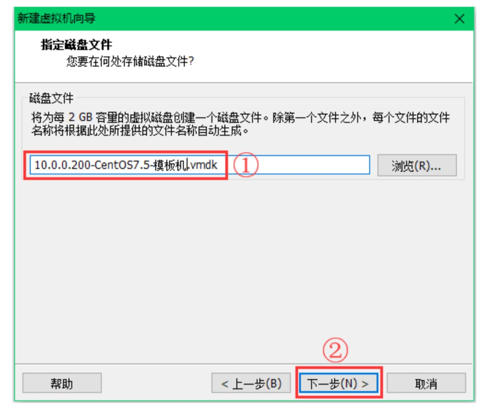

# 一、Linux运维基础

## 1、计算机硬件

> - CPU:中央处理器，类似人类的大脑，主要负责数学、逻辑运算
> - 内存：临时记忆，是硬盘恒与cpu的中间桥梁，cpu可处理计算机加载到内存的数据
> - 硬盘：数据永久存储的地方，
> - 显卡：处理计算机的图形相关工作
>
> - 主板：连接各个部件的骨架
>
> - 电源：为其他部件提供动力的地方
>
> - 网卡：能够解决上网功能的设备

## 2、云服务器与服务器介绍

> 1. 云服务器：是一种简单高效、安全可靠、处理能力可弹性伸缩的计算·服务。无需购买硬件，可迅速创建或释放多台服务器
> 2. 普通服务器：就是一台计算机，在计算机网络中，一个管理资源且能够为用户提供服务的计算机。主要有文件服务器、数据库服务器、应用程序服务器
>
> 3. 云服务器的优点：1.操作及升级更方便；2.访问速度更快；3.存储更便捷；4.更安全、稳定；5.	有更高的性价比
>
> 4. 普通服务器有点：相比普通PC，稳定性、安全性、性能、可扩展性、可管理性要求更高。

## 3、操作系统与计算机

> - 操作系统·：就是人与计算机硬件交互的中介，相当于应用程序运行及用户操作必备的一个基础运行环境。人输入指令给操作系统，它进行翻译，输出显示内容到屏幕的过程。作用是管理和控制计算中的硬件和各种软件资源，如检测cpu、内存的使用情况、磁盘空间大小等

## 2、linux发行版与哲学思想

> - 什么是linux?他是一套开放源代码，可自由传播（免费使用）、支持多用户同时操作，多任务、支持多CPU、多线程的操作系统
> - 应用领域：无人机、嵌入式开发、个人PC桌面、物流机器人、应用程序服务器等
>
> - 哲学思想：
> - 自由软件：核心就是没有商业化版权制约、源代码开放、可自由传播，强调的是权力自由，并不意味着使用完全免费。
>
> - FSF:自由软件基金会。
>
> - GNU:奴革计划。目的在于建立一套玩全自由和可移植的类unix操作系统dfsdfsfdsdfsfd
>
> - GPL:通用公共许可，即任何人可共享、修改自由软件，但在发布软件之后必须公布更改的代码。
>
> - linux发行版：CentOS、redhat、suse、Ubuntu、Debian、FreeBSD、国产红旗Liunx、麒麟Linux

## 3、虚拟机Vmware的安装与xshell远程连接

### （1）虚拟机vmware的安装

【安装之前的准备】

1.[下载vmware安装包](https://my.vmware.com/en/web/vmware/info/slug/desktop_end_user_computing/vmware_workstation_pro/15_0?wd=&eqid=daff990c000a086c000000035d8c2966)

根据机器配置，系统32/64位，xp/windows7/8/10 选择低/高版本VMware软件


2.配置VMware

- vmware系统服务必须开启

win键+r 输入services.msc


- 发现如果缺少虚拟网卡，vmnet1/8，可以选择重新安装vmware或是点击虚拟网卡修复


【安装CentOS 7操作系统】

**创建新的虚拟机(购买电脑)**

在 VMware 软件中，单击左上角的“文件”，在下拉菜单中选择“新建虚拟机”。


在弹出的“新建虚拟机向导”选项卡里面，选择“自定义(高级)”。

选择完毕后，点击“下一步”。

如下图所示。


**选择虚拟机硬件兼容性**===**购买主机箱**

“硬件兼容性”一项，选择最新的，我用的是 VMware12 版本，所以我能选到的最新的是Workstation12.0。

如果使用的是 VMware14 版本，那此处就选择 Workstation14.0。 选择完毕后，点击“下一步”。


**安装客户机操作系统**

我们后面要自己定制化安装 CentOS7 系统，所以此处选择“稍后安装操作系统”。

选择完毕后，点击“下一步”。


**选择客户机操作系统**===**安装什么样的系统**

我们要学习的是 linux 系统，CentOS 也属于 Linux 系统的一种，所以此处当然要选择“Linux”，版 本选择“CentOS 64 位”。

选择完毕后，点击“下一步”。

如下图所示。


**命名虚拟机**===**专业规范**

关于虚拟机名称，给一个建议，叫做所见即所得，或者叫见名知意，就是说打开 VMware 软件，不需要一台台的开启虚拟机去检查它是做什么用途的，只要看见每一台虚拟机的名字，就能够知道它是用来做什么的，这样能够增加规范性，也能够减少误操作的概率。

写这篇文档为例的虚拟机是用来作为以后学习时克隆使用的模板机，所以此处我给这台虚拟机起的名字直接就是它的 IP+用途，既“10.0.0.200-CentOS7.5-模板机”。

位置一项，点击“浏览”后选择 事先规划好的位置即可。

选择完毕后，点击“下一步”。如下图所示。


**虚拟机硬件配置**

我们学习的时候都是在自己的笔记本电脑上安装虚拟机，所以处理器(其实就是 CPU 的意思)都给1个就可以。

选择完毕后，点击“下一步”。


**内存配置**

内存这一项需要注意，安装系统的时候，最好选择2G 或更多，待安装完系统后，再改成1G 即可。

此处可以在左边的树状条直接用鼠标点击选择内存大小，也可以在右边的框内手动输入数字，需要注意单位是 MB，所以 2G 内存需要输入的数字是 2048，而不是2。

选择完毕后，点击“下一步”。


**选择网络类型**

为了方便学习，“网络类型”这项，必须选择“使用网络地址转换(**NAT**)”，想要尝试其余几种网络类型的话，等变成 linux老鸟之后，再自行研究。

选择完毕后，点击“下一步”。

如下图所示。


- VMware虚拟机常见的网络类型有`bridged(桥接)`、`**NAT**(地址转换`)、`host-only(仅主机)`3种，在分析如何选择之前，先要简单和大家介绍下这三种网络类型。
- 每家每户都有家庭住址号
- 服务器上也需要家庭住址号，叫ip地址。
- vmware 虚拟机里 centos 系统获取 ip 地址有 3 种方式。

**选择 I/O 控制类型**

“I/O 控制器类型”这一项，直接默认默认即可，不需要改动。

选择完毕后，点击“下一步”。

如下图所示。


**选择磁盘类型**

“磁盘类型”这一项，也直接默认即可，不需要改动。

选择完毕后，点击“下一步”。

如下图所示。


**选择磁盘**

“磁盘”这一项，选择“创建新虚拟机磁盘”，我们要安装新系统嘛，自然也创建一块空的新磁盘 是最好的。

**注意千万别选“使用物理磁盘”，如果选了此项，那你那块盘里的所有东西就都被格式 化没了，会哭的哦。**

选择完毕后，点击“下一步”。


**指定磁盘容量**

“磁盘容量”这一项，学习期间不会产生多少数据，所以磁盘大小只要至少给到 10G 就行，当然如果你的硬盘很大很任性要给个 1T 这也是完全没有问题的。

建议将磁盘存储为单个文件，比较方便，但这里不是硬性要求，看个人喜好。

选择完毕后，点击“下一步”。

如下图所示。


**指定磁盘文件===存放vwware虚拟机系统文件**

“磁盘文件”的名字，保持默认的即可。

选择完毕后，点击“下一步”。

如下图所示。



**挂载 CentOS 镜像====光驱放入了DVD系统光盘**

在“硬件”选项卡里面，还需要配置一下要使用的操作系统 iso 文件。

在左侧选中“新CD/DVD(IDE)”，在右侧选中“使用 ISO 映像文件”，点击“浏览”按钮，在弹出的窗口中找到本地的 CentOS 系统 iso文件。

选择完毕后，点击“关闭”。

如下图所示。


**完成创建虚拟机----完成配置准备付款购买**

此时，一台新虚拟机的硬件就全部配置完毕了，检查确认无误后，就可以开机装系统了。确认完毕后，点击“完成”。

如下图所示。


【开机操作】

开始安装CentOS 7.5操作系统

虚拟机开机后，选择“Install CentOS7”这一项。此时鼠标是不好用的，都是使用键盘的上下箭头来进行操作的，选好后按键盘上的回车键即可。


**修改CentOS7网卡命名规则，仍然以eth0命名**

开机后进入下面界面的时候 按↑键选择“**install CentOS**”，然后按下 **tab** 键，增加下面内容:

net.ifnames=0 biosdevname=0

输入完成后检查，并按下回车继续安装系统


**选择安装使用的语言**

作为一个 linux 的学习者，要适应英文环境，所以强烈建议此处选择英文，而不选择中文。 选择完毕后，点击“Continue”。


**设置时区**

配置时区，点击“DATE&TIME”。

如下图所示。


我们生活在中国嘛，所以时区选择“亚洲-上海”。时间不用管，待装完系统后，同步一下即可。 选择完毕后，点击“Done”。


**最小化安装系统**

选择需要安装的软件，点击“SOFTWARE SELECTION”。

如下图所示。


安装 linux 系统，一般都采用最小化安装的原则，在初始时，只选择必要的几个软件包即可。

学习期 间，请点击跟下图中的红色框里的选择一模一样。

选择完毕后，点击“Done”。


**关闭KDUMP**

配置“KDUMP”，这是一个内核崩溃时使用的东西，暂时不需要开启，把它关闭掉。


把“Enable kdump”的勾选去掉即可。

选择完毕后，点击“Done”。

如下图所示。


磁盘分区

**常规分区方案**

企业生产场景中 Linux 系统的分区方案:

如果根据Red Hat的建议，他们建议是分配RAM 20%的换空间，也就是RAM是8GB，分配1.6GB交换空间。

CentOS建议

如果RAM小于2GB，就分配和RAM同等大小的Swap交换空间。
如果RAM大于2GB，就分配2GB交换空间

Ubuntu考虑到系统需要休眠，

如果RAM小于1GB，Swap空间至少要和RAM一样大，甚至是要为RAM的两倍大小
如果RAM大于1GB，Swap交换空间应该至少等于RAM大小的平方根，并且最多为RAM大小的两倍
如果要休眠，Swap交换大小应该等于RAM的大小加上RAM大小的平方根


- 常见网络集群架构中的节点服务器（多个功能一样的服务器，服务器数据有多份）分区方案：
  - /boot分区：存放引导程序，centos-6 给200M
  - swap：虚拟内存
    - 物理内存 < 8G ，swap分配 内存*1.5数量
    - 物理内存 > 8G，swap就给8G
  - / 根目录，存放所有数据，剩余空间都给根目录（/usr，/home，/var等分区共用/目录，如同c盘下的系统文件夹）
- 数据库角色的服务器，有大量数据需要访问（重要数据单独分区，便于备份和管理）
  - /boot ：存放引导程序，CentOS6分配200M，centOS7分配200M
  - Swap：虚拟内存
    - 物理内存 < 8G ，swap分配 8*1.5数量
    - 物理内存 > 8G，swap就给8G
  - /：根目录，50-200G，只存放系统相关文件，不存放数据文件
  - /data：剩余硬盘空间全部给/data
- 大型门户网站，大型企业分区思路
  - /boot:存放引导程序，CentOS6 给 200M，CentOS7 给 200M
  - swap:虚拟内存，1.5 倍内存大小
    - 工作中:物理内存<8G，SWAP 就 1.5
    - 物理内存>8G，SWAP 就 8G
  - / 根目录，50-200G，放系统相关文件
  - 剩余磁盘空间，保留，由业务需求决定分区
- LVM性能差
- 操作系统自带软RAID不用，性能差、没有冗余，生产环境用硬件raid


配置磁盘，`点击“INSTALLATION DESTTINATION”。`


选中磁盘后，选择“I will configure partitioning”。

选择完毕后，点击“Done”。

如下图所示。


**分区方式**

在左侧中间的下拉菜单里面，选择“Standard Partition”。然后点击左下方的“+”号，添加/boot 分 区。


在弹出的对话框中，请按照下图中的内容配置。

选择完毕后，点击“Add mount point”。

如下图所示。


再次点击左下角的“+”号，添加 swap 分区。

如下图所示。


在弹出的对话框中，请按照下图中的内容配置。

选择完毕后，点击“Add mount point”。

如下图所示。


再次点击左下角的“+”号，添加根分区。

如下图所示。


在弹出的对话框中，请按照下图中的内容配置。

选择完毕后，点击“Add mount point”。

如下图所示。


/boot、/、swap 三个分区都添加完毕后，检查确认无误，就可以写入磁盘了。

确认完毕后，点击“Done”。


**最终结果**

再次确认分区无误后，选择同意更改，即可将分区设置写入磁盘了。

选择完毕后，点击“Accept Changes”。


提示 这里采用的是生产环境中集群节点下的节点服务器的分区方式，即系统坏掉后硬盘数据不需要保留。此分区方式也适合大多数生产环境的服务器，如果是数据库以及存储等有重要数据的特殊业务服务，一般会单独分存放数据的分区如 /data。

除了/boot、swap 和/三个分区外，还可以加/usr、/home、/var 等分区，具体要根据服务器的需求来决 定，一般情况下，只配置这三个分区足够了。

这种分区方案最大`优点`就是简单，使用方便，可批量安装部署，而且不会存在有的分区满了，有的 分区还剩余了很多空间又不能被利用的情况(LVM 的情况这里先不阐述)。

该分区方案的`缺点`是如果系统坏了，重新装系统时，因为数据都在/(根)分区，导致数据备份很麻 烦，如果设置了/usr、/home、/var 等分区，即使系统出了故障，也可以直接在/(根)分区装系统， 这样并不会破坏其他分区的数据。

当然，刚才也说了，如果是不存在备份数据的集群节点，那采用 这种分区方案是很明智的，不需要特别担心某个分区暴满的问题。


【设置主机名和ip】

配置网络，点击“NETWORK$HOSTNAME”。


**选择完毕后，点击“Begin Installation”。**

**设置root登录密码**

给 root 用户设置密码，点击“ROOT PASSWORD”。


学习期间为了练习方便，root 用户的密码简单的设置为 123456 即可。

但工作环境中，无论什么用 户，密码一定要设置得复杂些，增加安全性。

配置完毕后，点击“Done”。


提示:如果是生产环境，root 口令要尽量复杂。比如，设置 8 位以上包含数字字母大小写甚至是特殊字符的口令。在企业运维工作中安全是至关重要的一环，安全要从每一件小事做起。

**安装结束重启**

待软件安装完毕后，点击“Reboot”，系统就安装完毕啦。

### （2）系统安装后的基本配置

- 新安装完的 CentOS7.5 系统，登录界面如下图所示。
- 需要输入用户及其密码后，方可登录进入系统。
- 其中需要注意的一点是，输入密码时屏幕没有任何反应，这是正常现象，不要怀疑自己，勇敢的敲正确的密码即可，输入完密码之后按回车键。


### **（3）虚拟机无法开机的常见问题**


### （4）三种网络的连接方式

**NAT**(地址转换)

NAT(Network Address Translation)，网络地址转换，NAT模式是比较简单的实现虚拟机上网的方式，简单的理解，NAT模式的虚拟机就是通过宿主机(物理电脑)上网和交换数据的。

在NAT 模式下，`虚拟机的网卡`连接到`宿主机的 VMnet8` 上。

此时系统的 VMWare NAT Service 服务就充当了路由器， 负责将虚拟机发到 VMnet8 的包进行地址转换之后发到实际的网络上，再将实际网络上返回的包进行地址转换后通 过 VMnet8 发送给虚拟机。

VMWare DHCP Service 负责为虚拟机分配 IP 地址。NAT 网络类型的原理逻辑图如图所示。


NAT 网络特别适合于家庭里电脑直接连接网线的情况，当然办公室的局域网环境也是适合的，优势就是不会和其他物理主机 IP 冲突，且在没有路由器的环境下也可以通过 SSH NAT 连接虚拟机学习，换了网络环境虚拟机 IP 等不影响，这是推荐的选择。

**Bridged**(桥接模式)

- 桥接模式可以简单理解为通过物理主机网卡架设了一座桥，从而连入到了实际的网络中。
- 因此，虚拟机可以被分配与物理主机相同网段的独立IP，所有网络功能和网络中的真实机器几乎完全一样。
- 桥接模式下的虚拟机和网内真实计算机所处的位置是一样的。
- 在 Bridged 模式下，电脑设备创建的虚拟机就像一台真正的计算机一样，它会直接连接到实际的网络上，逻辑上网与宿主机(电脑设备)没有联系。
- Bridged 网络类型的原理逻辑图如图所示。


Bridged网络类型适合的场景:

- `特别适合于局域网环境`，优势是虚拟机像一台真正的主机一样
- 缺点是可能会和其他物理主机 IP 冲突，并且在和宿主机交换数据时，都会经过实际的路由器，当不考虑 NAT 模式的时候，就选这个桥接模式，桥接模式下换了网络环境后所有虚拟机的 IP 都会受影响。

**Host-only**(仅主机)**===自娱自乐**

- 在 Host-only 模式下，虚拟机的网卡会连接到宿主的 VMnet1上，但宿主系统并不为虚拟机提供任何路由服务，因此虚拟机只能和宿主机进行通信，不能连接到实际网络上，即无法上网。
- Host-only 网络类型的原理逻辑图如图所示。


## 3、linux文件、目录权限管理

（1）以下信息的含义

[root@localhost sbin]# 

- root：表示登录的用户、@：表示占位符、localhost：当前机器名字 、sbin：当前所在的工作目录

（2）目录分隔符

```shell
[root@localhost network-scripts]# pwd
/etc/sysconfig/network-scripts
```


- 第一个斜杆：根目录
- 第二个斜杆：目录分隔符

（3）linux的目录结构

- 倒装的树形结构     
- 可使用tree命令查看

```shell
[root@localhost data]# tree /data/
/data/
├── test11.txt -> /opt/test.txt
├── test1.txt -> /opt/test.txt
├── test2.txt
├── test3.txt
└── test.txt -> /opt/test.txt
```

（4）linux常用的目录结构

> - /dev：存放抽象硬件
> - /lib：存放系统库文件
> - /sbin：存放特权级二进制文件
> - /var：存放经常变化的文件
> - /home：普通用户目录
> - /etc：存放配置文件目录
> - /boot：存放内核与启动文件
> - /bin：存放二进制文件（可执行命令）
> - /usr：存放安装程序（软件默认路径）
> - /mnt：文件挂载目录（u盘、光驱）
> - /root：特权用户目录
> - /opt：大型软件存放目录
>
> 

（5）常用的配置文件

- /etc/sysconfig/network-scripts/ifcfg-ens33			网卡配文件
- 修改ip的方法

1. vim /etc/sysconfig/network-scripts/ifcfg-ens33 #编辑这个文件

2. 输入i，进入编辑模式，按以下配置

   ```shell
   TYPE=Ethernet
   PROXY_METHOD=none
   **BROWSER_ONLY=static**
   BOOTPROTO=dhcp
   DEFROUTE=yes
   IPV4_FAILURE_FATAL=no
   IPV6INIT=yes
   IPV6_AUTOCONF=yes
   IPV6_DEFROUTE=yes
   IPV6_FAILURE_FATAL=no
   IPV6_ADDR_GEN_MODE=stable-privacy
   NAME=ens33
   UUID=27adea28-e547-4fb8-bc89-8223820a7a6b
   DEVICE=ens33
   **ONBOOT=yes**
   **IPADDR=192.168.0.10**
   **NETMASK=255.255.255.0**
   **GATEWAY=192.168.0.1**
   **DNS1=192.168.0.1**
   ```

   3.配置完毕，按下“esc”,输入:wq!保存

   4.重启网卡服务，service network restart

/etc/resolv.conf				DNS客户端域名解析

/etc/hostnmae                 主机名的配置文件

/etc/motd                         存放开机显示的内容信息

/etc/reslease                    存放版本信息

/proc/cpuinfo                    cpu有关信息

/proc/cpuinfo                    内存条有关信息


/etc/host					      添加域名和对应网址的文件

```shell
[root@localhost network-scripts]# cat /etc/hosts
127.0.0.1   localhost localhost.localdomain localhost4 localhost4.localdomain4
::1         localhost localhost.localdomain localhost6 localhost6.localdomain

127.0.0.1    www.syh.con

[root@localhost network-scripts]# ping www.syh.com
PING www.syh.com (82.113.145.122) 56(84) bytes of data.
64 bytes from xen.zus.co.uk (82.113.145.122): icmp_seq=2 ttl=52 time=218 ms
```

（4）绝对路径、相对路径

- 绝对路径表现形式
- 以根目录开始的

```shell
[root@localhost network-scripts]# pwd
/etc/sysconfig/network-scripts
```


- 绝对路径表现形式

  不以根目录开头的

```shell
[root@localhost /]# cd ./opt
[root@localhost opt]# 
```

（5）基本命令的使用

**ls的基本使用**

- ls    #列出文件夹中的内容
- **语法：ls    参数（可写可不写）  文件、文件夹（可写可不写）**
- 参数
- -a  #显示所有文件及隐藏内容
- -l   #显示更详细的信息内容
- -h   #显示文件的信息大小以K、M形式
- --full-time   以完整的时间格式输出
- -i   #显示文件的indoe信息（文件身份证号、文件元信息、文件的大小、位置、权限等）

- 列出根目录下的详细信息

```shell
[root@localhost opt]# ls -alh --full-time /
总用量 16K
dr-xr-xr-x.  18 root root  236 2020-08-27 20:33:46.056387380 +0800 .
dr-xr-xr-x.  18 root root  236 2020-08-27 20:33:46.056387380 +0800 ..
lrwxrwxrwx.   1 root root    7 2020-08-13 04:54:09.466998917 +0800 bin -> usr/bin
dr-xr-xr-x.   5 root root 4.0K 2020-08-13 05:00:02.553070072 +0800 boot
drwxr-xr-x.   2 root root   91 2020-08-27 21:46:23.463381595 +0800 data
```

**cd**    **切换路径**

```shell
[root@localhost ~]# cd /opt
[root@localhost opt]# 
```


**whoami 	列出当前你是谁****

```shell
[root@localhost sbin]# whoami
root
```


- **hostname	打印当前主机名**

```shell
[root@localhost sbin]# hostname
localhost.localdomain
```


- **pwd		输出当前的所在的绝对路径**

```shell
[root@localhost sbin]# pwd
/sbin
```


- **ssh   远程连接**

```shell
ssh root@192.168.0.10    #以root身份远程连接
```


- **logout   退出当前用户**

  ```shell
  [root@localhost opt]# logout
  ```

  

- **mkdir   创建文件夹**

- 语法：mkdir  参数    文件名

- 参数

- -p      #递归创建文件夹

- 创建单个文件夹

  ```shell
  [root@localhost opt]# mkdir ll
  [root@localhost opt]# ls
  ll  test.txt
  ```

  

- 同时创建多个文件夹

```shell
[root@localhost opt]# mkdir {aa,bb,cc}
[root@localhost opt]# ls
aa  bb  cc  ll  test.txt
```


- 创建多级目录

```shell
[root@localhost opt]# mkdir -p ./syh/syh1/syh
```


- 创建100个syh文件夹

```shell
root@localhost opt]# mkdir syh{1..10}
[root@localhost opt]# ls
aa  bb  cc  ll  syh1  syh10  syh2  syh3  syh4  syh5  syh6  syh7  syh8  syh9
```

**touch命令**

1.创建文件

2.修改文件的时间

语法：touch 参数   文件名

参数

-t      #修改文件的时间

```shell
创建单个文件

[root@localhost syh]# touch test.txt
```


```shell
创建test1-test10的文件

[root@localhost syh]# touch test{1..10}.txt
[root@localhost syh]# ls
test10.txt  test2.txt  test4.txt  test6.txt  test8.txt
test1.txt   test3.txt  test5.txt  test7.txt  test9.txt
```

```shell
创建多个文件

[root@localhost syh]# touch aa.txt bb.txt
```

```shell
修改文件时间

[root@localhost syh]# touch -t 08302321 aa.txt 
[root@localhost syh]# ls -l --full-time aa.txt 
-rw-r--r--. 1 root root 0 2020-08-30 23:21:00.000000000 +0800 aa.txt
```

**cp命令**

rm

help、man、info

vim

cat

cut

sort

## 4、linux用户、组权限


