# 四、期末架构


## 第三章 期末架构之自动化装机系统

### 3.1、自动化装机介绍

#### **自动化装机系统**

**以前是怎么装系统的**

作为中小公司的运维，经常会遇到一些机械式的重复工作，例如：有时公司同时上线几十甚至上百台服务器，而且需要我们在短时间内完成系统安装。

常规的办法有什么？

- 光盘安装系统===>一个服务器DVD内置光驱百千块，百台服务器都配光驱就浪费了，因为一台服务器也就开始装系统能用的上，以后用的机会屈指可数。用USB外置光驱，插来插去也醉了。
- U盘安装系统===>还是同样的问题，要一台一台服务器插U盘。
- 网络安装系统(ftp,http,nfs) ===>这个方法不错，只要服务器能联网就可以装系统了，但还是需要一台台服务器去敲键盘点鼠标。时刻想偷懒的我们，有没有更好的方法！

高逼格的方法：

- Kickstart
- Cobbler

在进入主题前，首先会向大家介绍一下什么是pxe，pxe能干什么，Kickstart是什么，Cobbler又有什么特别。

#### 什么是PXE

- PXE，全名Pre-boot Execution Environment，预启动执行环境；
- 通过**网络接口**启动计算机，不依赖本地存储设备（如硬盘）或本地已安装的操作系统；
- 由Intel和Systemsoft公司于1999年9月20日公布的技术；
- Client/Server的工作模式；
- PXE客户端会调用网际协议(IP)、用户数据报协议(UDP)、动态主机设定协议(DHCP)、小型文件传输协议(TFTP)等网络协议；
- PXE客户端(client)这个术语是指机器在PXE启动过程中的角色。一个PXE客户端可以是一台服务器、笔记本电脑或者其他装有PXE启动代码的机器（我们电脑的网卡）。

#### PXE的工作过程


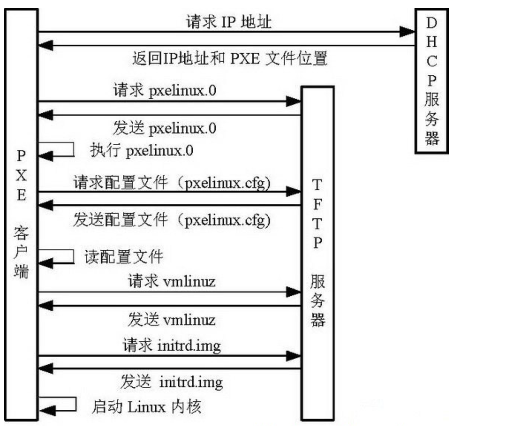

1. PXE Client向DHCP发送请求 PXE Client从自己的PXE网卡启动，通过PXE BootROM(自启动芯片)会以UDP(简单用户数据报协议)发送一个广播请求，向本网络中的DHCP服务器索取IP。
2. DHCP服务器提供信息 DHCP服务器收到客户端的请求，验证是否来至合法的PXE Client的请求，验证通过它将给客户端一个“提供”响应，这个“提供”响应中包含了为客户端分配的IP地址、pxelinux启动程序(TFTP)位置，以及配置文件所在位置。
3. PXE客户端请求下载启动文件 客户端收到服务器的“回应”后，会回应一个帧，以请求传送启动所需文件。这些启动文件包括：pxelinux.0、pxelinux.cfg/default、vmlinuz、initrd.img等文件。
4. Boot Server响应客户端请求并传送文件 当服务器收到客户端的请求后，他们之间之后将有更多的信息在客户端与服务器之间作应答, 用以决定启动参数。BootROM由TFTP通讯协议从Boot Server下载启动安装程序所必须的文件(pxelinux.0、pxelinux.cfg/default)。default文件下载完成后，会根据该文件中定义的引导顺序，启动Linux安装程序的引导内核。
5. 请求下载自动应答文件 客户端通过pxelinux.cfg/default文件成功的引导Linux安装内核后，安装程序首先必须确定你通过什么安装介质来安装linux，如果是通过网络安装(NFS, FTP, HTTP)，则会在这个时候初始化网络，并定位安装源位置。接着会读取default文件中指定的自动应答文件ks.cfg所在位置，根据该位置请求下载该文件。
6. 客户端安装操作系统 将ks.cfg文件下载回来后，通过该文件找到OS Server，并按照该文件的配置请求下载安装过程需要的软件包。OS Server和客户端建立连接后，将开始传输软件包，客户端将开始安装操作系统。安装完成后，将提示重新引导计算机。

#### 批量装机软件介绍

Redhat系主要有两种Kickstart和Cobbler。

Kickstart是一种无人值守的安装方式。它的工作原理是在安装过程中记录人工干预填写的各种参数，并生成一个名为ks.cfg的文件。如果在自动安装过程中出现要填写参数的情况，安装程序首先会去查找ks.cfg文件，如果找到合适的参数，就采用所找到的参数；如果没有找到合适的参数，便会弹出对话框让安装者手工填写。所以，如果ks.cfg文件涵盖了安装过程中所有需要填写的参数，那么安装者完全可以只告诉安装程序从何处下载ks.cfg文件，然后就去忙自己的事情。等安装完毕，安装程序会根据ks.cfg中的设置重启/关闭系统，并结束安装。

Cobbler集中和简化了通过网络安装操作系统需要使用到的DHCP、TFTP和DNS服务的配置。Cobbler不仅有一个命令行界面，还提供了一个Web界面，大大降低了使用者的入门水平。Cobbler内置了一个轻量级配置管理系统，但它也支持和其它配置管理系统集成，如Puppet，暂时不支持SaltStack。

**简单的说，Cobbler是对kickstart的封装，简化安装步骤、使用流程，降低使用者的门槛**


### 3.2、kiskstart服务器初始化准备

**环境准备**

准备好一台用于部署kickstart服务端的机器

**注意：虚拟机网卡连接方式，采用NAT模式，不要用桥接，且关闭VM网卡中的DHCP服务**

环境准备如下

```shell
1.安装基础软件，如果是最小化安装的话
yum install -y bash-completion vim lrzsz wget expect net-tools nc nmap tree dos2unix htop iftop iotop unzip telnet sl psmisc nethogs glances bc ntpdate 

2.配置yum源
wget -O /etc/yum.repos.d/CentOS-Base.repo http://mirrors.aliyun.com/repo/Centos-7.repo
wget -O /etc/yum.repos.d/epel.repo http://mirrors.aliyun.com/repo/epel-7.repo
yum clean all
yum makecache

3.关闭防火墙、selinux
[root@kiskstart yum.repos.d]#  systemctl stop firewalld
[root@kiskstart yum.repos.d]# systemctl disable firewalld
#替换内容且写入内存
[root@kiskstart yum.repos.d]# sed -i  's/enforcing/disabled/g' /etc/selinux/config 
#临时关闭selinux
[root@kiskstart ~]# setenforce 0
#重启重新读取配置文件
[root@kiskstart ~]# getenforce 
Disabled


4.关闭vmware的dhcp服务，设置linux静态ip
[root@kiskstart ~]# cat /etc/sysconfig/network-scripts/ifcfg-ens33 
TYPE=Ethernet
PROXY_METHOD=none
BROWSER_ONLY=no
BOOTPROTO=static		#改为静态
DEFROUTE=yes
IPV4_FAILURE_FATAL=yes
IPV6INIT=yes
IPV6_AUTOCONF=yes
IPV6_DEFROUTE=yes
IPV6_FAILURE_FATAL=no
IPV6_ADDR_GEN_MODE=stable-privacy
NAME=ens33
UUID=fd70cf6c-6ac2-4d1f-9272-86893cb8129e
DEVICE=ens33
ONBOOT=yes			#开机启用
IPADDR=192.168.37.20
PREFIX=24
GATEWAY=192.168.37.2
DNS1=223.5.5.5
IPV6_PRIVACY=no

5.系统检查
[root@kiskstart ~]# cat /etc/redhat-release
CentOS Linux release 7.5.1804 (Core) 

[root@kiskstart ~]# uname -r
3.10.0-862.el7.x86_64

[root@kiskstart ~]# iptables -L
Chain INPUT (policy ACCEPT)
target     prot opt source               destination         

Chain FORWARD (policy ACCEPT)
target     prot opt source               destination         

Chain OUTPUT (policy ACCEPT)
target     prot opt source               destination 

6.时间同步更新
[root@kiskstart ~]# ntpdate -u ntp.aliyun.com
29 Oct 16:04:19 ntpdate[1610]: adjust time server 203.107.6.88 offset 0.012766 sec

[root@kickstart ~]# ln -sf /usr/share/zoneinfo/Asia/Shanghai /etc/localtime 
[root@kickstart ~]# date
[root@kiskstart ~]# date
2020年 10月 29日 星期四 16:05:00 CST

```


### 3.3、DHCP通信原理

#### 主机IP设置方式

每一台主机的IP地址可以通过以下两种方法来设置：

1：手动输入、这种方式比较容易因为输入错误而影响到主机的网络通信，而且可能会因为占用其他主机的IP地址而干扰到该主机的运行，因为会加重系统管理员的负担。

2：自动向DHCP服务器申请、用户的计算机会自动向DHCP服务器申请IP地址，接收到此请求的DHCP服务器会分配IP地址给用户的计算机。他可以减轻管理负担，避免因手动输入错误而造成的困扰。

我们将手动输入的IP地址为静态IP地址（static IP address），而向DHCP服务器租用的IP地址为动态IP地址（dynamic IP address）。

#### 为什么用DHCP

DHCP（Dynamic Host Configuration Protocol）称为动态主机配置协议。

**①**DHCP服务器用于为客户机动态分配IP地址，避免了TCP/IP网络中地址的冲突，便于对网络的IP地址进行管理；

**②**在使用TCP/IP协议通信的网络中，每台计算机都必须至少有一个IP地址，这样才能与其他计算机通信。对于一个较大规模的网络来说，逐个地为每台计算机分配和设置IP地址，将是一件很麻烦的事情，也不便于管理和维护；

**③**对于像笔记本这样的移动用户，经常从一个子网移动到另一个子网，需要不断地手动更换IP地址，很不方便；

**④**DHCP服务器通过动态的IP地址分配还能解决IP地址资源不足的情况，因此DHCP产生了。


#### 提供的服务

1.提供IP地址和子网掩码 2.提供IP地址对应的网络地址和广播地址 3.默认网关地址 4.DNS服务器地址

#### 通俗的解释

你们寝室里有六个人（对应到客户机），每个人都需要用床（对应到IP地址）睡觉，所以每个人回到寝室都会需要一张床。这样的话每个人每次回到寝室的时候都需要宿管（对应到网络管理员）都需要给他分配一个床位，这样就很麻烦。 现在有一个“动态床位分配系统”（对应到DHCP服务器），你们每个人回到寝室的时候都会收到一张纸条，纸条上写了你可以使用哪个床位，这就简单多了。 再然后可能小明（对应到一个特定的客户机）有洁癖，他需要一个固定的床位（对应到一个需要固定IP的设备，比如打印机或者提供某些服务的服务器）。

所以“动态床位分配系统”可以添加一条规则`叫小明的人来了就分配给他三号床位`，就解决了这个问题。

#### DHCP的租约

 DHCP服务器利用租约机制，实现了对整个网络IP地址的自动统一分配和集中管理。当客户机向DHCP服务器请求分配IP地址时，DHCP服务器会自动从地址池中找出一个未使用的IP地址，分配给客户机。在分配IP地址给客户机的同时，还可以为客户机指定默认网关（路由）和DNS服务器等信息，便于客户机能与其他网段的计算机通信或者实现访问Internet网。当租约时间到的时候如果客户机还在使用这个IP那么就可以续约，继续使用当前IP而不是从新分配一个。

#### DHCP工作流程


网络中的DHCP客户端向DHCP服务器申请IP地址的过程是靠**RARP**`逆地址解析协议 (Reverse Address Resolution Protocol)`（知道MAC，找IP）协议来实现的。

DHCP租约过程就是DHCP客户机动态获取IP地址的过程。

DHCP租约过程分为4步：

**①**客户机请求IP（客户机发**DHCPDISCOVER**广播包）；

**②**服务器响应（服务器发**DHCPOFFER**广播包）；

**③**客户机选择IP（客户机发**DHCPREQUEST**广播包）；

**④**服务器确定租约（服务器发**DHCPACK/DHCPNAK**广播包）。


### 3.4、DHCP报文解释

#### DHCP报文

```shell
DHCP协议中的报文

DHCP报文共有一下几种：

DHCP DISCOVER ：客户端开始DHCP过程发送的包，是DHCP协议的开始

DHCP OFFER ：服务器接收到DHCP DISCOVER之后做出的响应，它包括了给予客户端的IP（yiaddr）、客户端的MAC地址、租约过期时间、服务器的识别符以及其他信息

DHCP REQUEST ：客户端对于服务器发出的DHCP OFFER所做出的响应。在续约租期的时候同样会使用。

DHCP ACK ：服务器在接收到客户端发来的DHCP REQUEST之后发出的成功确认的报文。在建立连接的时候，客户端在接收到这个报文之后才会确认分配给它的IP和其他信息可以被允许使用。

DHCP NAK ：DHCP ACK的相反的报文，表示服务器拒绝了客户端的请求。

DHCP RELEASE ：一般出现在客户端关机、下线等状况。这个报文将会使DHCP服务器释放发出此报文的客户端的IP地址

DHCP INFORM ：客户端发出的向服务器请求一些信息的报文

DHCP DECLINE :当客户端发现服务器分配的IP地址无法使用（如IP地址冲突时），将发出此报文，通知服务器禁止使用该IP地址。
```

#### DHCP的作用域

作用域是指DHCP服务器可分配租用给DHCP客户机的IP地址范围。DHCP服务器应该至少配置一个作用域，各作用域的IP地址范围（IP地址池）不能出现重叠。

#### **保留IP**

保留IP用于有特定服务的客户机，需要将保留的IP与客户机的MAC地址绑定。

#### IP租约的更新

当客户机重新启动或租期达50%时，就需要重新更新租约，客户机直接向提供租约的服务器发送请求DHCPREQUEST消息，要求更新现有的地址租约。如果DHCP服务器接收到请求，它将发送DHCP确认信息给客户机，更新客户机租约。如果客户机无法与提供租约的服务器取得联系，则客户机一直等到租期到达87.5%时，进入到一种重新申请的状态，它向网络上所有的服务器广播DHCPDISCOVER请求更新现有的IP租约。

#### IP租约的释放

使用ipconfig/release使DHCP客户机向DHCP服务器发送DHCPRELEASE消息并释放其租约。

如果客户机在租约时间内保持关闭并且不更新租约，在租约到期后DHCP服务器可能将客户机的IP地址分配给其他的客户机。如果客户机不发送DHCPRELEASE消息，那么它在重启后，将试图尝试继续使用上一次使用过的IP地址。


### 3.5、DHCPD服务服务端配置


#### 部署DHCP服务端

```shell
# 机器1 dhcp服务端
[root@kiskstart ~]# ifconfig ens33 | awk 'NR==2{print $2}'
192.168.37.20


[root@kiskstart ~]# hostname
kiskstart

```

#### 安装dhcp服务

```shell
#安装dhcp服务
[root@kiskstart ~]# yum install dhcp -y

#检查安装包
[root@kiskstart ~]# rpm -qa dhcp
dhcp-4.2.5-79.el7.centos.x86_64

```

#### 查看dhcp配置文件

```shell
[root@kiskstart ~]#  cat /etc/dhcp/dhcpd.conf
#
# DHCP Server Configuration file.
#   see /usr/share/doc/dhcp*/dhcpd.conf.example		可参看这个文件的例子语法
#   see dhcpd.conf(5) man page
#
```

#### 查看dhcp示例配置文件

```shell
#
# DHCP Server Configuration file.
#   see /usr/share/doc/dhcp*/dhcpd.conf.example
#   see dhcpd.conf(5) man page
#
# dhcpd.conf
#
# Sample configuration file for ISC dhcpd
#
# option定义选项
# option definitions common to all supported networks...
option domain-name "example.org";
option domain-name-servers ns1.example.org, ns2.example.org;

default-lease-time 600;         #默认租约时间单位秒
max-lease-time 7200;            #最大租约时间单位秒

# Use this to enble / disable dynamic dns updates globally.
#ddns-update-style none;

# If this DHCP server is the official DHCP server for the local
# network, the authoritative directive should be uncommented.
#authoritative;

# Use this to send dhcp log messages to a different log file (you also
# have to hack syslog.conf to complete the redirection).
log-facility local7;

# No service will be given on this subnet, but declaring it helps the 
# DHCP server to understand the network topology.

subnet 10.152.187.0 netmask 255.255.255.0 {       #定义子网
}

# This is a very basic subnet declaration.

subnet 10.254.239.0 netmask 255.255.255.224 {
  range 10.254.239.10 10.254.239.20;              #指定IP地址池
  # # 定义其他参数，如 dns,gateway
  option routers rtr-239-0-1.example.org, rtr-239-0-2.example.org;  
}

# This declaration allows BOOTP clients to get dynamic addresses,
# which we don't really recommend.

subnet 10.254.239.32 netmask 255.255.255.224 {
  range dynamic-bootp 10.254.239.40 10.254.239.60;
  option broadcast-address 10.254.239.31;
  option routers rtr-239-32-1.example.org;
}

# A slightly different configuration for an internal subnet.
# 选项可以写在子网内，优先级更高，全局优先级低
subnet 10.5.5.0 netmask 255.255.255.224 {
  range 10.5.5.26 10.5.5.30;
  option domain-name-servers ns1.internal.example.org;      #DNS服务器，最多三个
  option domain-name "internal.example.org";                #可选 设置默认搜索域
  option routers 10.5.5.1;                                  #网关
  option broadcast-address 10.5.5.31;                       #可选 备选广播地址
  default-lease-time 600;
  max-lease-time 7200;
}

# Hosts which require special configuration options can be listed in
# host statements.   If no address is specified, the address will be
# allocated dynamically (if possible), but the host-specific information
# will still come from the host declaration.

# host 用于区别不同的主机名
host passacaglia {                                
  hardware ethernet 0:0:c0:5d:bd:95;              
  filename "vmunix.passacaglia";
  server-name "toccata.fugue.com";
}

# Fixed IP addresses can also be specified for hosts.   These addresses
# should not also be listed as being available for dynamic assignment.
# Hosts for which fixed IP addresses have been specified can boot using
# BOOTP or DHCP.   Hosts for which no fixed address is specified can only
# be booted with DHCP, unless there is an address range on the subnet
# to which a BOOTP client is connected which has the dynamic-bootp flag
# set.
# host 用于区别不同的主机名，例如针对该MAC地址，设置固定IP，主机名
host fantasia {                                 #主机
  hardware ethernet 08:00:07:26:c0:a5;          #指定文件服务器MAC地址
  fixed-address fantasia.fugue.com;             #指定固定IP地址
}

# You can declare a class of clients and then do address allocation
# based on that.   The example below shows a case where all clients
# in a certain class get addresses on the 10.17.224/24 subnet, and all
# other clients get addresses on the 10.0.29/24 subnet.

class "foo" {
  match if substring (option vendor-class-identifier, 0, 4) = "SUNW";
}

shared-network 224-29 {
  subnet 10.17.224.0 netmask 255.255.255.0 {
    option routers rtr-224.example.org;
  }
  subnet 10.0.29.0 netmask 255.255.255.0 {
    option routers rtr-29.example.org;
  }
  pool {
    allow members of "foo";
    range 10.17.224.10 10.17.224.250;
  }
  pool {
    deny members of "foo";
    range 10.0.29.10 10.0.29.230;
  }
}
```

配置文件参数通常包括三部分，分别是声明（declarations）、参数(parameters)、选项(option)。

a、声明是用来描述dhcpd服务器中对网络布局的划分，是网络设置的逻辑范围。

B、参数用来表明如何执行任务，是否要执行任务或将哪些网络配置选项发送给客户。

c、选项是用来配置dhcp的可选参数，全部用option关键字作为开始。

**一个标准的DHCP配置文件应该包括全局配置参数、子网网段声明、地址配置选项以及地址配置参数：**

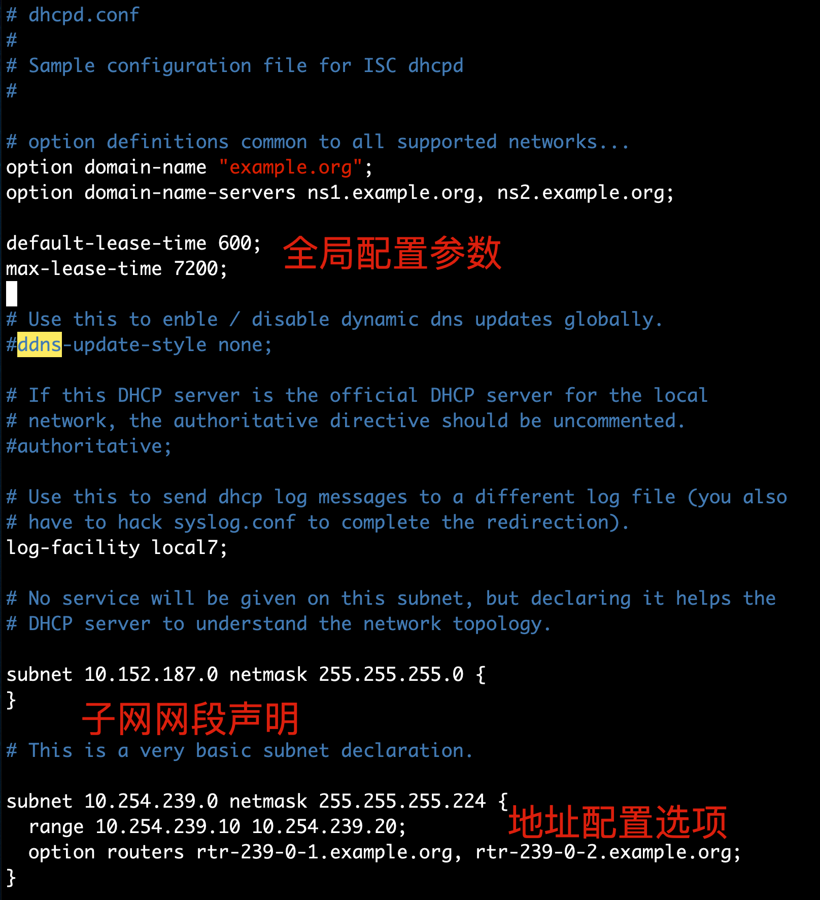

全局配置参数用于定义整个配置文件的全局参数，而子网网段声明用于配置整个子网段的地址属性


#### 服务端编写dhcpd.conf

查看当前网络环境，局域网段

```shell
[root@kiskstart ~]# ip a
1: lo: <LOOPBACK,UP,LOWER_UP> mtu 65536 qdisc noqueue state UNKNOWN group default qlen 1000
    link/loopback 00:00:00:00:00:00 brd 00:00:00:00:00:00
    inet 127.0.0.1/8 scope host lo
       valid_lft forever preferred_lft forever
    inet6 ::1/128 scope host 
       valid_lft forever preferred_lft forever
2: ens33: <BROADCAST,MULTICAST,UP,LOWER_UP> mtu 1500 qdisc pfifo_fast state UP group default qlen 1000
    link/ether 00:0c:29:96:ae:5a brd ff:ff:ff:ff:ff:ff
    inet 192.168.37.20/24 brd 192.168.37.255 scope global noprefixroute ens33
       valid_lft forever preferred_lft forever
    inet6 fe80::71b5:656d:25e0:90e9/64 scope link noprefixroute 
       valid_lft forever preferred_lft forever

```

设置dhcpd.conf配置文件

```shell
subnet 192.168.37.0 netmask 255.255.255.0 {
range 192.168.37.100 192.168.37.199;                # range设置起始，结束ip范围
option subnet-mask 255.255.255.0;                # 选项，设置掩码
option routers 192.168.37.2;                        # dhcp服务的网关设置，这里不写，客户端则无法上网
option domain-name-servers 1.2.4.8;              # 保证dhcp客户端可以域名解析
default-lease-time 21600;                        # 默认的IP租用期限
max-lease-time 43200;                                # 最大的IP租用期限
next-server 192.168.37.20;                        # 告知客户端tftp服务器的ip
filename "/pxelinux.0";                            # 指明引导文件，用于指定PXE的运行程序文件，放在TFTP服务器的目录下
}

```

配置文件解释

```shell
filename:指明引导文件名称，用于指定PXE的运行程序文件，一般是在TFTP服务器的工作目录下，这个是关于PXE启动的配置。流程如下：

        客户机通过网络启动，一般采用的就是intel的PXE来启动；

        PXE首先指定DHCP，获取自身IP地址、TFTP服务器或者NFS服务器的IP地址、PXE程序等内容；

        执行获取的PXE程序，获得详细配置内容，再获取linux虚拟系统和intrid等内容；

        最后加载整个linux系统到内核。

next-server server-name(一般是IP)：客户端启动后，获得了IP地址，会加载引导文件，这里就定义提供引导文件的服务器IP地址
```

启动dhcp服务，检查日志，状态

```shell
[root@kiskstart ~]# systemctl start dhcpd
Job for dhcpd.service failed because the control process exited with error code. See "systemctl status dhcpd.service" and "journalctl -xe" for details.
#发现有问题

[root@kiskstart ~]# systemctl is-enabled dhcpd
disabled


#检查问题
[root@kiskstart ~]# systemctl status dhcpd.service
● dhcpd.service - DHCPv4 Server Daemon
   Loaded: loaded (/usr/lib/systemd/system/dhcpd.service; disabled; vendor preset: disabled)
   Active: failed (Result: exit-code) since 四 2020-10-29 16:37:33 CST; 1min 41s ago
     Docs: man:dhcpd(8)			#发现配置文件第8行、第五行由问题
           man:dhcpd.conf(5)
  Process: 17458 ExecStart=/usr/sbin/dhcpd -f -cf /etc/dhcp/dhcpd.conf -user dhcpd -group dhcpd --no-pid (code=exited, status=1/FAILURE)
 Main PID: 17458 (code=exited, status=1/FAILURE)

10月 29 16:37:33 kiskstart systemd[1]: Starting DHCPv4 Server Daemon...
10月 29 16:37:33 kiskstart dhcpd[17458]: Internet Systems Consortium DHCP Server 4.2.5
10月 29 16:37:33 kiskstart dhcpd[17458]: Copyright 2004-2013 Internet Systems Consortium.
10月 29 16:37:33 kiskstart dhcpd[17458]: All rights reserved.
10月 29 16:37:33 kiskstart dhcpd[17458]: For info, please visit https://www.isc.org/software/dhcp/
10月 29 16:37:33 kiskstart systemd[1]: dhcpd.service: main process exited, code=exited, status=1/FAILURE
10月 29 16:37:33 kiskstart systemd[1]: Failed to start DHCPv4 Server Daemon.
10月 29 16:37:33 kiskstart systemd[1]: Unit dhcpd.service entered failed state.
10月 29 16:37:33 kiskstart systemd[1]: dhcpd.service failed.


#打开dhcpd配置文件、发现少了个字母s、修改后再次保存启动即可

[root@kiskstart ~]# systemctl start dhcpd

#检测服务是否运行
[root@kiskstart ~]# systemctl is-active dhcpd
active

#查看日志信息
[root@kiskstart ~]# tail -f /var/log/messages 
Oct 29 16:44:18 kiskstart dhcpd: Internet Systems Consortium DHCP Server 4.2.5
Oct 29 16:44:18 kiskstart dhcpd: Copyright 2004-2013 Internet Systems Consortium.
Oct 29 16:44:18 kiskstart dhcpd: All rights reserved.
Oct 29 16:44:18 kiskstart dhcpd: For info, please visit https://www.isc.org/software/dhcp/
Oct 29 16:44:18 kiskstart dhcpd: Not searching LDAP since ldap-server, ldap-port and ldap-base-dn were not specified in the config file
Oct 29 16:44:18 kiskstart dhcpd: Wrote 0 leases to leases file.
Oct 29 16:44:18 kiskstart dhcpd: Listening on LPF/ens33/00:0c:29:96:ae:5a/192.168.37.0/24
Oct 29 16:44:18 kiskstart dhcpd: Sending on   LPF/ens33/00:0c:29:96:ae:5a/192.168.37.0/24
Oct 29 16:44:18 kiskstart dhcpd: Sending on   Socket/fallback/fallback-net
Oct 29 16:44:18 kiskstart systemd: Started DHCPv4 Server Daemon.


```


错误点：

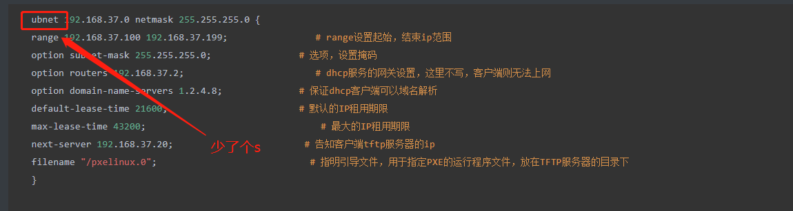

检查dhcp服务

```shell
#检查服务状态
[root@kiskstart ~]# systemctl status dhcpd
● dhcpd.service - DHCPv4 Server Daemon
   Loaded: loaded (/usr/lib/systemd/system/dhcpd.service; disabled; vendor preset: disabled)
   Active: active (running) since 四 2020-10-29 16:44:18 CST; 9min ago
     Docs: man:dhcpd(8)
           man:dhcpd.conf(5)
 Main PID: 17494 (dhcpd)
   Status: "Dispatching packets..."
   CGroup: /system.slice/dhcpd.service
           └─17494 /usr/sbin/dhcpd -f -cf /etc/dhcp/dhcpd.conf -user dhcpd -group dhcpd --no-pid

10月 29 16:44:18 kiskstart dhcpd[17494]: Internet Systems Consortium DHCP Server 4.2.5
10月 29 16:44:18 kiskstart dhcpd[17494]: Copyright 2004-2013 Internet Systems Consortium.
10月 29 16:44:18 kiskstart dhcpd[17494]: All rights reserved.
10月 29 16:44:18 kiskstart dhcpd[17494]: For info, please visit https://www.isc.org/software/dhcp/
10月 29 16:44:18 kiskstart dhcpd[17494]: Not searching LDAP since ldap-server, ldap-port and ldap-base-dn were not specified in the config file
10月 29 16:44:18 kiskstart dhcpd[17494]: Wrote 0 leases to leases file.
10月 29 16:44:18 kiskstart dhcpd[17494]: Listening on LPF/ens33/00:0c:29:96:ae:5a/192.168.37.0/24
10月 29 16:44:18 kiskstart dhcpd[17494]: Sending on   LPF/ens33/00:0c:29:96:ae:5a/192.168.37.0/24
10月 29 16:44:18 kiskstart dhcpd[17494]: Sending on   Socket/fallback/fallback-net
10月 29 16:44:18 kiskstart systemd[1]: Started DHCPv4 Server Daemon.
```

检查upd端口、进程

```shell
[root@kiskstart ~]# ss -unlp
State      Recv-Q Send-Q                                         Local Address:Port                                                        Peer Address:Port              
UNCONN     0      0                                                  127.0.0.1:323                                                                    *:*                   users:(("chronyd",pid=895,fd=1))
UNCONN     0      0                                                          *:67                                                                     *:*                   users:(("dhcpd",pid=17494,fd=7))
UNCONN     0      0                                                        ::1:323                                                                   :::*                   users:(("chronyd",pid=895,fd=2))

[root@kiskstart ~]# ps -ef|grep dhcp
dhcpd     17494      1  0 16:44 ?        00:00:00 /usr/sbin/dhcpd -f -cf /etc/dhcp/dhcpd.conf -user dhcpd -group dhcpd --no-pid
root      17533   1443  0 16:57 pts/0    00:00:00 grep --color=auto dhcp

[root@kiskstart ~]# netstat -unpl|grep dhcp
udp        0      0 0.0.0.0:67              0.0.0.0:*                           17494/dhcpd  
```

设置开机自启

```shell
设置的开机自启
[root@kiskstart ~]# systemctl enable dhcpd
Created symlink from /etc/systemd/system/multi-user.target.wants/dhcpd.service to /usr/lib/systemd/system/dhcpd.service.

#检查开机文件是否开机自启
[root@kiskstart ~]# systemctl is-enabled dhcpd
enabled

#检查是否存活
[root@kiskstart ~]# systemctl is-active  dhcpd
active

```

这里备注下，一般软件配置启动后，经常需要开机自启，但是Kickstart不能，且用完注意要关闭服务，因为你难道希望每次开机都重装系统吗？~~~~


### 3.6、TFTP原理与配置

#### PXE和tftp

这里注意，虚拟机的内存至少分配2G，PXE工作原理

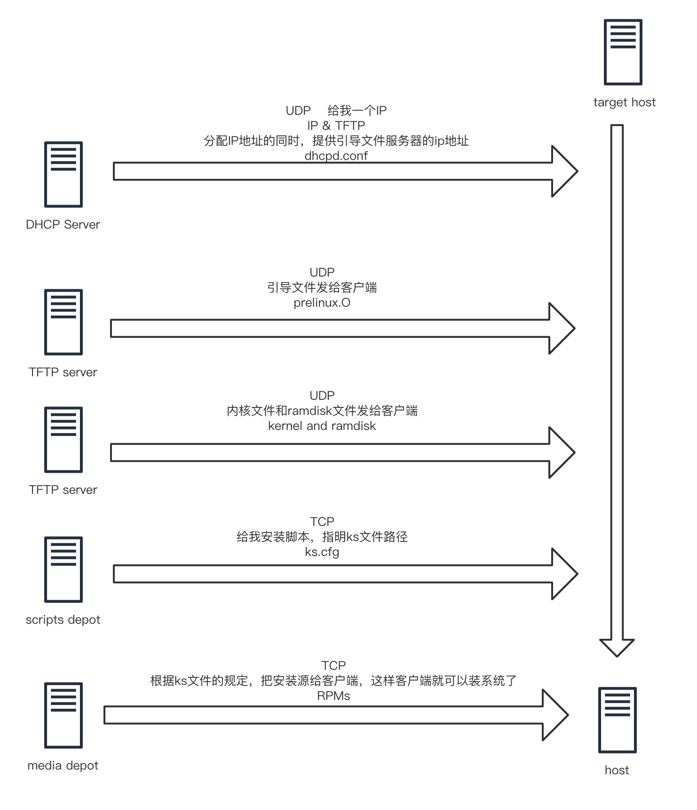

#### TFTP服务器

TFTP（Trivial File Transfer Protocol,简单文件传输协议）是TCP/IP协议族中的一个用来在客户机与服务器之间进行简单文件传输的协议，提供不复杂、开销不大的文件传输服务。端口号为69。

xinetd

inux服务器端tftp-server的配置

tftp服务器需要安装xinetd（守护tftp）、tftp和tftp-server 3个软件

```shell
[root@kickstart ~]# yum install tftp-server tftp xinetd -y
```

修改xinetd配置文件，管理tftp

```shell
[root@kickstart ~]# cat /etc/xinetd.d/tftp 
# default: off
# description: The tftp server serves files using the trivial file transfer \
#    protocol.  The tftp protocol is often used to boot diskless \
#    workstations, download configuration files to network-aware printers, \
#    and to start the installation process for some operating systems.
service tftp
{
    socket_type        = dgram
    protocol        = udp
    wait            = yes
    user            = root
    server            = /usr/sbin/in.tftpd
    server_args        = -s /var/lib/tftpboot
    disable            = no
    per_source        = 11
    cps            = 100 2
    flags            = IPv4
}
```

#### 启动xinetd服务

通过xinetd启动tftp服务即可

```shell
[root@kickstart ~]# systemctl start xinetd
[root@kickstart ~]# netstat -a | grep tftp
udp        0      0 0.0.0.0:tftp            0.0.0.0:*   

[root@kickstart ~]# lsof -i:69
COMMAND   PID USER   FD   TYPE DEVICE SIZE/OFF NODE NAME
xinetd  15519 root    5u  IPv4  67791      0t0  UDP *:tftp
```

连接tftp

```shell
[root@kickstart ~]# tftp 192.168.37.20
```

默认tftp工具的目录，可以创建测试文件

```shell
[root@kickstart ~]# cd /var/lib/tftpboot/
[root@kickstart tftpboot]# ls
[root@kickstart tftpboot]# touch test.cc
[root@kickstart tftpboot]# ls
test.cc
```

进入任意目录，测试下载tftp目录内容

```shell
[root@kickstart tftpboot]# cd /tmp/
[root@kickstart tmp]# tftp 192.168.37.20
tftp> ?
tftp-hpa 5.2
Commands may be abbreviated.  Commands are:

connect     connect to remote tftp
mode        set file transfer mode
put         send file
get         receive file
quit        exit tftp
verbose     toggle verbose mode
trace       toggle packet tracing
literal     toggle literal mode, ignore ':' in file name
status      show current status
binary      set mode to octet
ascii       set mode to netascii
rexmt       set per-packet transmission timeout
timeout     set total retransmission timeout
?           print help information
help        print help information
tftp> get test.cc
tftp> quit
[root@kickstart tmp]# ls
test.cc
```

清空测试数据

```shell
[root@kickstart tmp]# rm -rf /var/lib/tftpboot/test.cc
```

这里只需要把pxe引导文件放到tftp目录/var/lib/tftpboot/即可

### 3.7HTTP部署镜像目录


#### HTTP服务器部署网络镜像

既然是自动化装机系统，我们要想办法吧IOS系统镜像光盘的内容，发布出去，提供下载等，生产环境需要进行镜像复制，学习阶段为了节省时间，用HTTPD展示就好，是发布镜像源的一个步骤。

```shell
# 安装
[root@kickstart syslinux]# yum install httpd -y


# 插入一行配置
[root@kickstart syslinux]# sed -i "277i ServerName 127.0.0.1:80" /etc/httpd/conf/httpd.conf

# 启动
[root@kickstart syslinux]# systemctl start httpd


# 建立站点目录
 
# 通过vmware挂上centos7镜像文件，该步骤重要，如下的图片

# 挂载目录
[root@kickstart syslinux]# mount /dev/cdrom /var/www/html/CentOS-7/
mount: /dev/sr0 is write-protected, mounting read-only


# 查看挂载情况
[root@kickstart syslinux]# df -h |grep www
/dev/sr0                 4.2G  4.2G     0 100% /var/www/html/CentOS-7


# 访问站点，访问IOS镜像的内容,注意大小写，内容如下图
http://192.168.37.20/CentOS-7/
```

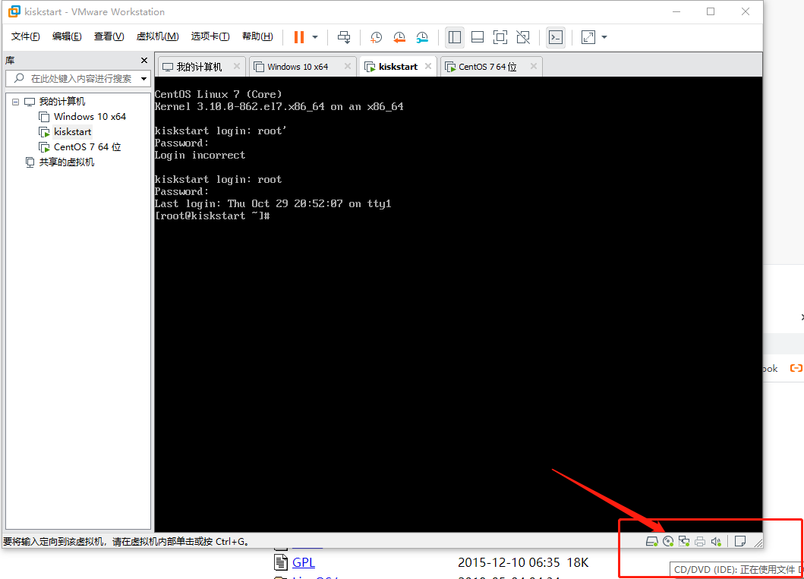

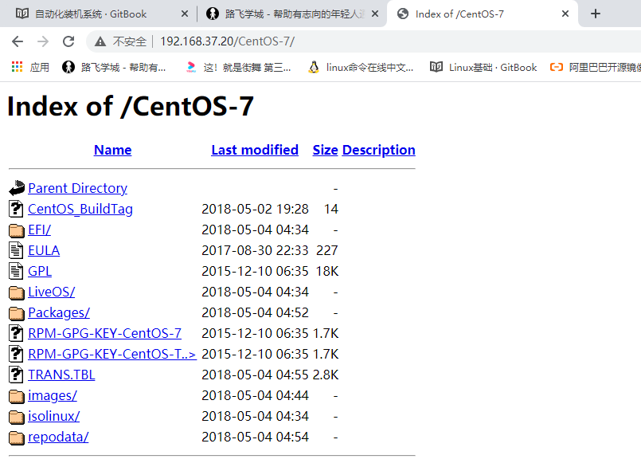


### 3.8、PXE引导文件详细配置


#### 部署PXE

syslinux是一个功能强大的引导加载程序，而且兼容各种介质。SYSLINUX是一个小型的Linux操作系统，它的目的是简化首次安装Linux的时间，并建立修护或其它特殊用途的启动盘。

如果没有找到pxelinux.0这个文件,可以安装一下。

```shell
[root@kickstart syslinux]# yum install syslinux -y
```

拷贝pxelinux.0该文件，放入tfpt目录，便于提供给客户端下载

```shell
# 把pxelinux.0文件 发给tftp目录，用于发给客户端
cp /usr/share/syslinux/pxelinux.0 /var/lib/tftpboot/

# 拷贝启动菜单程序文件
[root@kickstart syslinux]# cp -a /var/www/html/CentOS-7/isolinux/* /var/lib/tftpboot/

# 拷贝自动重启文件
[root@kickstart ~]# cp /usr/share/syslinux/reboot.c32 /var/lib/tftpboot/


# 新建一个pxelinux.cfg目录，用于存放客户端的配置文件
[root@kickstart syslinux]#  mkdir -p /var/lib/tftpboot/pxelinux.cfg


# 拷贝PXE配置文件，且改名
[root@kickstart syslinux]# cp /var/www/html/CentOS-7/isolinux/isolinux.cfg /var/lib/tftpboot/pxelinux.cfg/default

# 检查tftp目录下的启动菜单文件
[root@kickstart syslinux]# tree -F /var/lib/tftpboot/
/var/lib/tftpboot/
├── boot.cat
├── boot.msg
├── grub.conf
├── initrd.img   # 驱动文件
├── isolinux.bin
├── isolinux.cfg
├── memtest
├── pxelinux.0   # 启动代码
├── pxelinux.cfg/
│   └── default # 配置文件(开机界面图形定义文件)
├── reboot.c32  # 重启系统
├── splash.png
├── TRANS.TBL
├── vesamenu.c32  # 界面框架
└── vmlinuz*      # 内核文件

# 提升tftp目录权限
[root@kickstart tftpboot]# chmod 777 -R /var/lib/tftpboot/
```

配置文件了解

**这些文件内的参数，就是你开机安装系统看见的画面**

```shell
[root@kickstart tftpboot]# cat /var/lib/tftpboot/pxelinux.cfg/default
default vesamenu.c32  # 默认加载一个菜单
#prompt 1             # 开启会显示命令行'boot: '提示符。prompt值为0时则不提示，将会直接启动'default'参数中指定的内容。
timeout 600           # timeout时间是引导时等待用户手动选择的时间，设为1可直接引导，单位为1/10秒。
display boot.msg
# 菜单背景图片、标题、颜色。
menu background splash.jpg
menu title Welcome to CentOS 6.7!
menu color border 0 #ffffffff #00000000
menu color sel 7 #ffffffff #ff000000
menu color title 0 #ffffffff #00000000
menu color tabmsg 0 #ffffffff #00000000
menu color unsel 0 #ffffffff #00000000
menu color hotsel 0 #ff000000 #ffffffff
menu color hotkey 7 #ffffffff #ff000000
menu color scrollbar 0 #ffffffff #00000000
# label指定在boot:提示符下输入的关键字，比如boot:linux[ENTER]，这个会启动label linux下标记的kernel和initrd.img文件。
label linux       # 一个标签就是前面图片的一行选项。
  menu label ^Install or upgrade an existing system
  menu default
  kernel vmlinuz  # 指定要启动的内核。同样要注意路径，默认是/tftpboot目录。
  append initrd=initrd.img # 指定追加给内核的参数，initrd.img是一个最小的linux系统
label vesa
  menu label Install system with ^basic video driver
  kernel vmlinuz
  append initrd=initrd.img nomodeset
label rescue
  menu label ^Rescue installed system
  kernel vmlinuz
  append initrd=initrd.img rescue
label local
  menu label Boot from ^local drive
  localboot 0xffff
label memtest86
  menu label ^Memory test
  kernel memtest
  append -
```

#### 定制pxe网络安装文件

修改cfg文件，修改如下配置

```shell
1.修改第一行，让centos直接默认安装linux，不去手动再选择
default linux

2.制定apache的系统iso下载地址
 61 label linux
 62   menu label ^Install CentOS 7
 63   kernel vmlinuz
 64 # append initrd=initrd.img inst.stage2=hd:LABEL=CentOS\x207\x20x86_64 quiet
 65   append initrd=initrd.img inst.repo=http://192.168.37.20/CentOS-7/ net.ifnames=0 biosdevname=0 （加的写法）
 65   append initrd=initrd.img inst.repo=http://192.168.37.20/CentOS-7/  （不加的写法）
 
 #net.ifnames=0 biosdevname=0这两个参数、可写可不写、若你想而网卡名为etho则用这两个参数
```

到这里、就定义号开机启动的界面参数、默认自动安装linux、不用选择；指定去http仓库源找镜像文件、然后创建1个新的虚拟机测试


### 3.9、PXE网络安装系统全过程

#### DHCP客户端配置

再准备好一个linux虚拟机客户端，客户端注意网络连接选择，选择适配器，不要开启dhcp功能

**且不要选择默认的NAT网卡，因为已经关闭了DHCP服务，你也无法获取IP地址，选择我们自己创建的DHCP服务器**

#### VMWARE新建虚拟机

*新添加一块网络适配器**

**严格检查，你的配置，是否和我一样**

创建lan区段和dhcp服务端同一个局域网

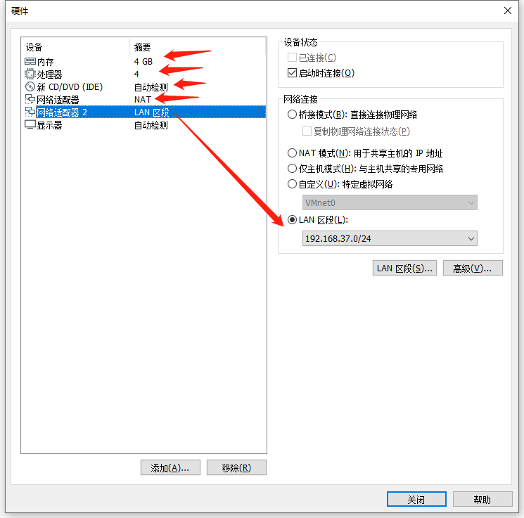

dhcp服务端检查

```shell
# 检查系统日志，有关信息
Oct 30 16:51:00 kiskstart dhcpd: DHCPDISCOVER from 00:0c:29:09:b6:cf via ens33
Oct 30 16:51:01 kiskstart dhcpd: DHCPOFFER on 192.168.37.100 to 00:0c:29:09:b6:cf via ens33
Oct 30 16:51:02 kiskstart dhcpd: Wrote 1 leases to leases file.
Oct 30 16:51:02 kiskstart dhcpd: DHCPREQUEST for 192.168.37.100 (192.168.37.20) from 00:0c:29:09:b6:cf via ens33
Oct 30 16:51:02 kiskstart dhcpd: DHCPACK on 192.168.37.100 to 00:0c:29:09:b6:cf via ens33
Oct 30 16:51:02 kiskstart xinetd[1675]: START: tftp pid=2464 from=192.168.37.100
Oct 30 16:51:02 kiskstart in.tftpd[2465]: Error code 0: TFTP Aborted
Oct 30 16:51:02 kiskstart in.tftpd[2466]: Client 192.168.37.100 finished /pxelinux.0
Oct 30 16:51:02 kiskstart in.tftpd[2477]: Client 192.168.37.100 finished /pxelinux.cfg/default
Oct 30 16:51:02 kiskstart in.tftpd[2478]: Client 192.168.37.100 finished /boot.msg
Oct 30 16:51:04 kiskstart in.tftpd[2480]: Client 192.168.37.100 finished /vmlinuz
Oct 30 16:51:20 kiskstart in.tftpd[2481]: Client 192.168.37.100 finished /initrd.img
Oct 30 16:52:29 kiskstart systemd: Started Session 10 of user root.
Oct 30 16:52:29 kiskstart systemd-logind: New session 10 of user root.
Oct 30 16:52:29 kiskstart systemd: Starting Session 10 of user root.

# 该文件存着客户端的动态分配信息，可以对比一下mac地址，也可以针对该mac地址，在dhcpd.conf中设置固定ip
[root@kickstart ~]# cat /var/lib/dhcpd/dhcpd.leases
```

直到你的客户端，出现如下界面，通过pxe网络安装系统成功

我们没有借助本地磁盘工具，通过网络，获取镜像源，直到系统开始安装界面

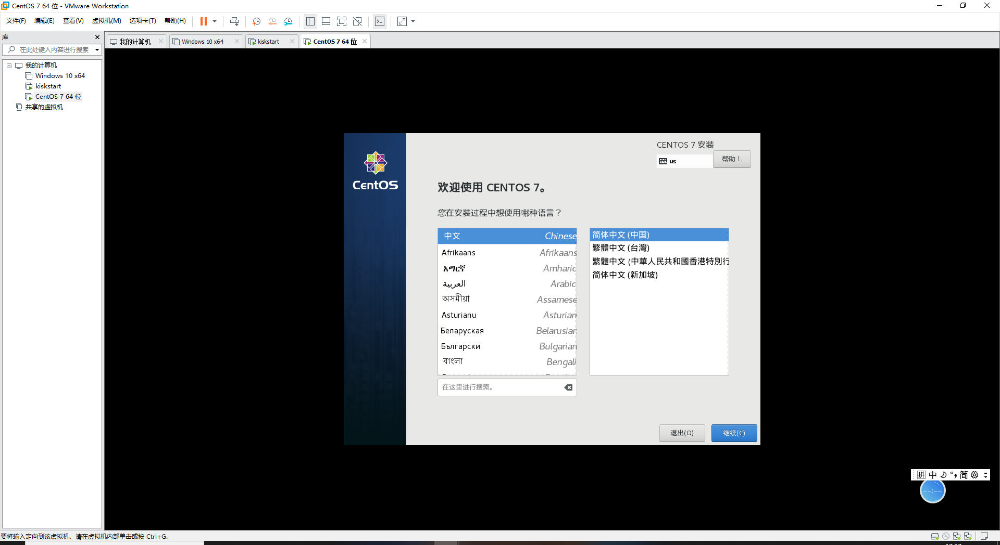

客户端机器通过网络，分配了dhcp地址

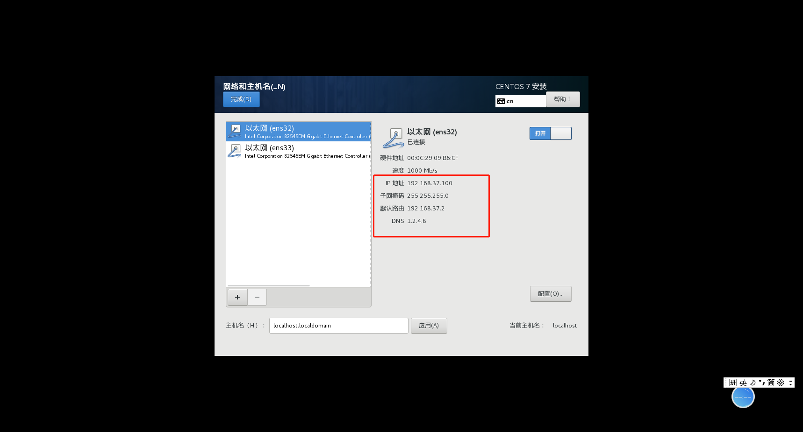

安装介质，是我们制定的apache站点目录，获取ISO镜像文件

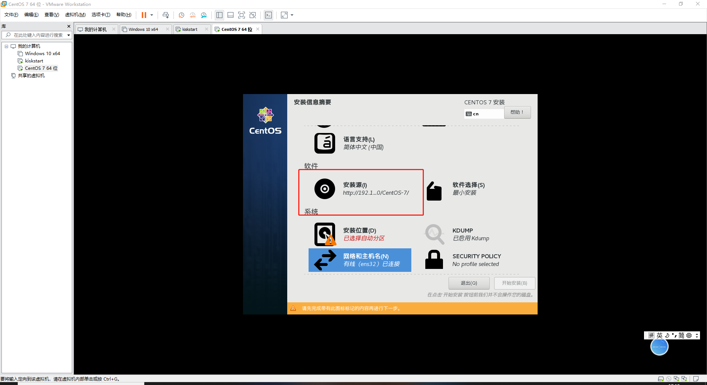

手动通过pxe远程安装，搞定，最终安装完毕系统，查看ip

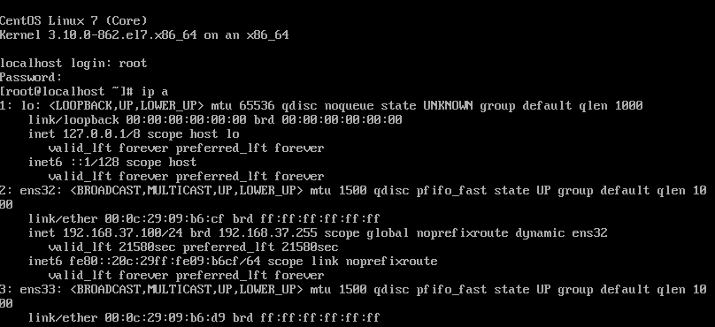

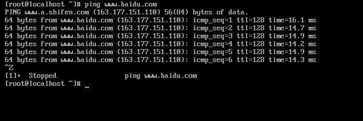


思路总结：

```shell
1.DHCP服务作用：定义租约IP、网关、子网掩码、DNS、租约时间等参数配置、用于分配参数给客户端（装系统的机子）；
2.TFTP服务作用：定义1个TFTP目录、用于存放一些引导文件pxelinux.0、菜单文件、开机文件、网络安装文件default
3.HTTP服务作用：将镜像资源挂载到apache的站点目录、使其能够在网络装机文件default识别到资源；
4.最后将这些资源发给pxe客户端

/var/lib/tftpboot/	
├── boot.cat
├── boot.msg
├── grub.conf
├── initrd.img   # 驱动文件
├── isolinux.bin
├── isolinux.cfg
├── memtest
├── pxelinux.0   # 启动代码						 从syslinux下载来的、	从/usr/share/syslinux/pxelinux.0	拷贝而来
├── pxelinux.cfg/
│   └── default # 配置文件(开机界面图形定义文件)		路径：从/var/www/html/CentOS-7/isolinux/isolinux.cfg拷贝而来
├── reboot.c32  # 重启系统
├── splash.png
├── TRANS.TBL
├── vesamenu.c32  # 界面框架					 从/usr/share/syslinux/reboot.c32拷贝而来
└── vmlinuz*      # 内核文件					剩余其它文件是从 /var/www/html/CentOS-7/isolinux/*拷贝而来
```


### 3.10、kickstart环境准备

#### kickstart自动应答装机

上述我们还是通过鼠标点击，进行装机，这些步骤，可以写成脚本文件，自动化装机。

通常，我们在安装操作系统的过程中，需要大量的和服务器交互操作，为了减少这个交互过程，kickstart就诞生了。使用这种kickstart，只需事先定义好一个Kickstart自动应答配置文件ks.cfg（通常存放在安装服务器上），并让安装程序知道该配置文件的位置，在安装过程中安装程序就可以自己从该文件中读取安装配置，这样就避免了在安装过程中多次的人机交互，从而实现无人值守的自动化安装。

**生成kickstart配置文件的三种方法：**

- 方法1、 每安装好一台Centos机器，Centos安装程序都会创建一个kickstart配置文件，记录你的真实安装配置。如果你希望实现和某系统类似的安装，可以基于该系统的kickstart配置文件来生成你自己的kickstart配置文件。（生成的文件名字叫anaconda-ks.cfg位于/root/anaconda-ks.cfg）
- 方法2、Centos提供了一个图形化的kickstart配置工具。在任何一个安装好的Linux系统上运行该工具，就可以很容易地创建你自己的kickstart配置文件。kickstart配置工具命令为redhat-config-kickstart（RHEL3）或system-config-kickstart（RHEL4，RHEL5）.网上有很多用CentOS桌面版生成ks文件的文章，如果有现成的系统就没什么可说。但没有现成的，也没有必要去用桌面版，命令行也很简单。
- 方法3、阅读kickstart配置文件的手册。用任何一个文本编辑器都可以创建你自己的kickstart配置文件。

### 3.11、ks文件语法练习


#### 学习ks文件语法

查看系统自动生成的anaconda-ks.cfg

```shell
[root@kickstart ~]# cat anaconda-ks.cfg 
#version=DEVEL
# System authorization information
auth --enableshadow --passalgo=sha512
# Use CDROM installation media  
cdrom
# Use graphical install
graphical
# Run the Setup Agent on first boot
firstboot --enable
ignoredisk --only-use=sda
# Keyboard layouts
keyboard --vckeymap=us --xlayouts='us'
# System language
lang en_US.UTF-8

# Network information
network  --bootproto=dhcp --device=ens33 --ipv6=auto --no-activate
network  --hostname=localhost.localdomain

# Root password
rootpw --iscrypted $6$ZKWLL9mzgiTsIKeR$UJkJsUmfX6REEv2v98NQ7F41.c9qbLaWilCo9MGN50dMmPNGu76cQM5AOIXl82ynnVVG6/UIou07Y0b2L6SsV1
# System services
services --enabled="chronyd"
# System timezone
timezone America/New_York --isUtc
# System bootloader configuration
bootloader --append=" crashkernel=auto" --location=mbr --boot-drive=sda
autopart --type=lvm
# Partition clearing information
clearpart --none --initlabel

%packages
@^minimal
@core
chrony
kexec-tools

%end

%addon com_redhat_kdump --enable --reserve-mb='auto'

%end

%anaconda
pwpolicy root --minlen=6 --minquality=1 --notstrict --nochanges --notempty
pwpolicy user --minlen=6 --minquality=1 --notstrict --nochanges --emptyok
pwpolicy luks --minlen=6 --minquality=1 --notstrict --nochanges --notempty
%end
```

#### ks文件语法

```shell
命令段
包组段  %packages开头，以%end结束
脚本段  以%post开头，以%end结束，在安装完系统之后，执行的linux命令，脚本
       以%pre开头，以%end结束，在安装完系统之前执行的linux命令，脚本
```

通过工具检查ks文件语法

```shell
yum install pykickstart -y
#检查本机的ks/cfg文件语法是否正常
[root@kiskstart ~]# ksvalidator anaconda-ks.cfg 

ksvalidator /var/www/htmltest_ks.cfg

该工具只是基本的对文件语法进行简单检测，并不能保证完全正确，还需人为检查

用python脚本对文件加密
[root@kickstart html]# python -c 'import crypt;print(crypt.crypt("syh666"))'
$6$.AB8EvQLxzV/sPR5$QFGXctOEKwWhDW9LXsNicsSmKDssnvOpzOMbxpFRs1DQHig3bW0n10fUy.xjqFJHdyTAZ42/Hgs6Ty6qx60Dx.

得到如下结果
$6$.AB8EvQLxzV/sPR5$QFGXctOEKwWhDW9LXsNicsSmKDssnvOpzOMbxpFRs1DQHig3bW0n10fUy.xjqFJHdyTAZ42/Hgs6Ty6qx60Dx.  该值对应ks.cfg上的rootwp的值
```

### 3.12、KIckstart安装全过程

超哥提供的模板ks.csg文件

创建在apache网络站点目录下

```shell
/var/www/html/test_ks.cfg
[root@kickstart html]# touch /var/www/html/test_ks.cfg	
```

创建如下文件

http://192.168.37.20/CentOS-7/

```shell
#platform=x86, AMD64, 或 Intel EM64T
#version=DEVEL
# Install OS instead of upgrade
install
# Keyboard layouts
# old format: keyboard us
# new format:
keyboard --vckeymap=us --xlayouts='us'
# Root password
rootpw --iscrypted $6$9XPa2qmRFYzBWDxE$gnK2atQ4or2y1BzFi.gnkH8nLtx7fjhQf8aaY52EJynXBBuLh6baPNo/rm/01adUpxMOVOI..pomP4NsE10Pp/
#这里密码是root、经过加密的

# Use network installation
url --url="http://192.168.37.20/CentOS-7"
# System language
lang en_US
# yum configuation
repo --name="Red Hat Enterprise Linux" --baseurl="http://192.168.37.20" --cost=100
# System authorization information
auth  --useshadow  --passalgo=sha512
# Use text mode install
text
firstboot --disable
# SELinux configuration
selinux --disabled

# System services
services --enabled="chronyd"
ignoredisk --only-use=sda
# Firewall configuration
firewall --disabled
# Network information
network  --bootproto=dhcp --device=ens33
# Reboot after installation
reboot
# System timezone
timezone America/New_York
# System bootloader configuration
bootloader --append="crashkernel=auto" --location=mbr --boot-drive=sda
#autopart --type=lvm
# Clear the Master Boot Record，清空分区，重新分区
zerombr
# Partition clearing information
clearpart --all --initlabel
# Disk partitioning information
part /boot --fstype="xfs" --size=500
part swap --fstype="swap" --size=2048
part / --fstype="xfs" --grow --size=1
# 安装系统软件包
%packages
@core
%end
```

超哥这一套东西哪里学的呢?

```shell
https://access.redhat.com/documentation/zh-cn/red_hat_enterprise_linux/7/html-single/installation_guide/index#chap-kickstart-installations 
请看红帽官网
```


#### 修改pxe配置文件

修改pxelinux.cfg/default文件

备份原有pxe配置文件

```
[root@kickstart pxelinux.cfg]# cp default{,.bak}
[root@kickstart pxelinux.cfg]# ls
default  default.bak
```

写入新的文件信息

```shell
[root@kickstart pxelinux.cfg]# >default
[root@kickstart pxelinux.cfg]# cat /var/lib/tftpboot/pxelinux.cfg/default
# 使用欢迎界面
default vesamenu.c32
#default menu.c32
#prompt 1
# 倒计时600毫秒
timeout 600

# 欢迎词
MENU TITLE welcome to centos.

# 如下三个驱动
# 启动本地设备
label local
  menu label Boot from ^local drive
  localboot 0xffff

# 启动来自于ks配置文件
MENU SEPARATOR
label linux
  menu label ^Install or upgrade an existing system for ks
  # 系统默认选ks
  menu default
  kernel vmlinuz
  append initrd=initrd.img ks=http://192.168.37.20/test_ks.cfg

# 安装基本驱动
MENU SEPARATOR
label vesa
  menu label Install system with ^basic video driver
  kernel vmlinuz
  append initrd=initrd.img xdriver=vesa nomodeset
```

#### 检验配置是否正确

1.检验iso文件是否可以获取

```shell
[root@kickstart pxelinux.cfg]# curl  http://192.168.37.20/CentOS-7/
```

2.检验pxe文件是否可以获取

```shell
[root@kickstart pxelinux.cfg]# curl  http://192.168.37.20/test_ks.cfg
```

至此，我们就部署好了如下

- dhcp服务器
- tftp服务器
- pxe配置文件
- kickstart配置文件

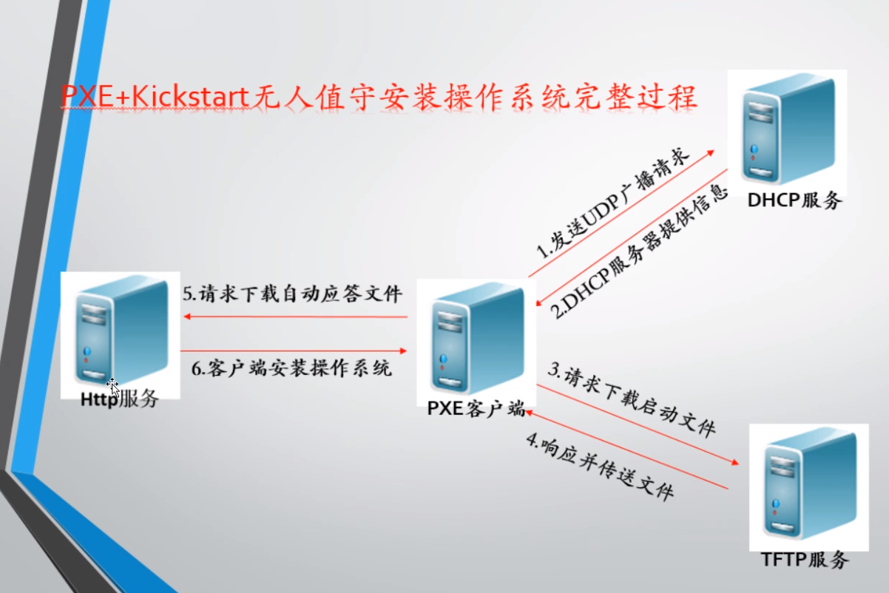

#### 开始ks自动化装机

上述准备工作，做好之后，开始装机

```shell
1.服务端可以观察日志
[root@kickstart pxelinux.cfg]# tail -f /var/log/messages
```

2.创建一个虚拟机,vmware，注意点如下

```
大于等于2G内存
添加网卡，选择lan区段
```

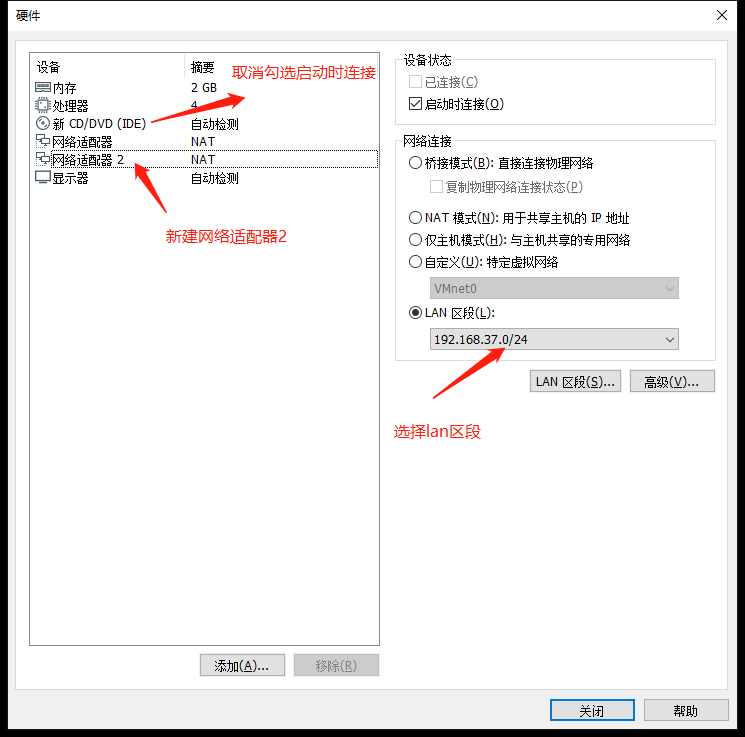

#### 自动化安装界面

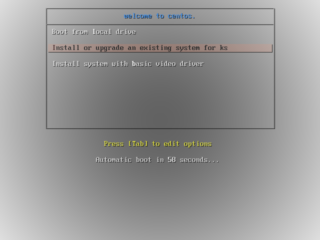

区别就是，本来这些选项都是图形化的，这里已经是黑屏的了

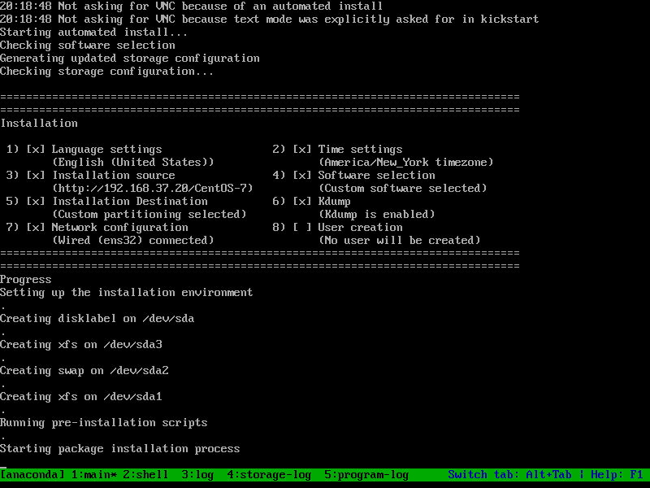


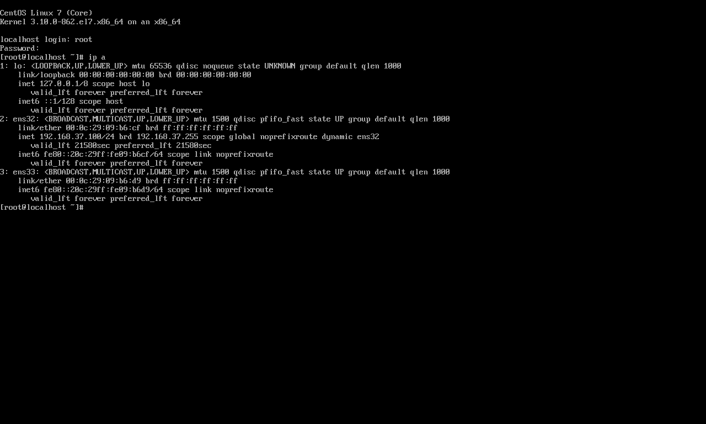

待自动装机完毕后，系统会自动重启，进入centos操作系统，大功告成

输入账号密码，登录，开始玩耍吧

```
root
syh666
```


### 3.13、Cobbler安装启动


#### cobbler

Cobbler是一个Linux系统安装的服务，可以通过网络启动(PXE)的方式来快速安装、重装物理服务器和虚拟机，同时还可以管理DHCP，DNS等。 Cobbler可以使用命令行方式管理，也提供了基于Web的界面管理工具(cobbler-web)，还提供了API接口，可以方便二次开发使用。 Cobbler是较早前的kickstart的升级版，优点是比较容易配置，还自带web界面比较易于管理。

通过点点点就可以创建系统以及ks文件。

官网：http://cobbler.github.io/

#### 环境准备

```shell
1.准备好linux机器，使用kickstart那台机器即可
[root@kiskstart pxelinux.cfg]# hostname
kiskstart


[root@kiskstart /]# ifconfig |awk 'NR==2{print $2}'
192.168.37.20


加上一个本地hosts解析
[root@kiskstart /]# echo '192.168.37.20 ks-cobbler'>>/etc/hosts
[root@kiskstart /]# tail -1 /etc/hosts
192.168.37.20 ks-cobbler
```

#### 安装coobler

```shell
1.yum自动化安装即可，提前配置好yum源
yum install cobbler cobbler-web dhcp tftp-server pykickstart httpd python-django -y

2.检查软件包
[root@ks-cobbler ~]# rpm -qa cobbler cobbler-web dhcp tftp-server pykickstart httpd python-djangotftp-server-5.2-22.el7.x86_64
pykickstart-1.99.66.21-1.el7.noarch
cobbler-2.8.5-0.3.el7.x86_64
dhcp-4.2.5-79.el7.centos.x86_64
httpd-2.4.6-93.el7.centos.x86_64
cobbler-web-2.8.5-0.3.el7.noarch

3.启动cobbler,与http
systemctl start cobblerd
systemctl start httpd

4.检查cobbler配置
[root@ks-cobbler ~]# cobbler check
```

#### 修改cobbler配置

```shell
1.修改配置文件/etc/cobbler/settings ，修改如下参数
# 备份配置文件
[root@ks-cobbler ~]# cp /etc/cobbler/settings{,.bak}

# 防止误重装
sed -i 's/pxe_just_once: 0/pxe_just_once: 1/' /etc/cobbler/settings

# 配置Cobbler统一管理DHCP
sed -i 's/manage_dhcp: 0/manage_dhcp: 1/' /etc/cobbler/settings

# 配置DHCP Cobbler模版，这里sed提供了备份功能
sed -i.ori 's#192.168.1#192.168.37#g;22d;23d' /etc/cobbler/dhcp.template


2.根据cobbler check依次修改配置文件，修改如下配置，注意改了之后要重启cobblerd服务,才可以生效
# 请注意,填写ip地址
# 修改/etc/cobbler/settings
server: 192.168.37.20
next_server: 192.168.37.20

# 修改xinetd配置文件, /etc/xinetd.d/tftp ，因为xinetd是管理tftp的，我们用cobbler去管理了
disable                 = no

# 需要安装驱动，cobbler要控制其他机器
cobbler get-loaders
[root@kiskstart ~]# cobbler get-loaders
task started: 2020-10-31_121713_get_loaders
task started (id=Download Bootloader Content, time=Sat Oct 31 12:17:13 2020)
path /var/lib/cobbler/loaders/README already exists, not overwriting existing content, use --force if you wish to update
path /var/lib/cobbler/loaders/COPYING.elilo already exists, not overwriting existing content, use --force if you wish to update
path /var/lib/cobbler/loaders/COPYING.yaboot already exists, not overwriting existing content, use --force if you wish to update
path /var/lib/cobbler/loaders/COPYING.syslinux already exists, not overwriting existing content, use --force if you wish to update
path /var/lib/cobbler/loaders/elilo-ia64.efi already exists, not overwriting existing content, use --force if you wish to update
path /var/lib/cobbler/loaders/yaboot already exists, not overwriting existing content, use --force if you wish to update
path /var/lib/cobbler/loaders/pxelinux.0 already exists, not overwriting existing content, use --force if you wish to update
path /var/lib/cobbler/loaders/menu.c32 already exists, not overwriting existing content, use --force if you wish to update
path /var/lib/cobbler/loaders/grub-x86.efi already exists, not overwriting existing content, use --force if you wish to update
path /var/lib/cobbler/loaders/grub-x86_64.efi already exists, not overwriting existing content, use --force if you wish to update
*** TASK COMPLETE ***


# 还需要用到rsync服务，开启该服务
systemctl restart  rsyncd
systemctl enable rsyncd

# 修改cobbler安装的系统，默认的密码是"cobbler",可以改下
[root@kiskstart cobbler]# openssl passwd -1
Password: 
Verifying - Password: 
$1$6j12tCa3$joYzkzkpav.ZchITtvvw81


# 修改默认root密码为，123456
default_password_crypted: "$1$6j12tCa3$joYzkzkpav.ZchITtvvw81"

#修改/etc/cobbler/settings配置文件、将上面修改的密码替换
default_password_crypted: "$1$6j12tCa3$joYzkzkpav.ZchITtvvw81"


# 修改有关cobbler脑裂配置，可以使用fencing tools


# 改完如上配置，重启cooblerd
systemctl restart cobblerd

# 再次检查，吧修改的配置，让其生效
cobbler sync  #配置更新同步
cobbler check

# 剩下的两条无所谓
[root@ks-cobbler ~]# cobbler check
The following are potential configuration items that you may want to fix:

1 : debmirror package is not installed, it will be required to manage debian deployments and repositories
2 : fencing tools were not found, and are required to use the (optional) power management features. install cman or fence-agents to use them

Restart cobblerd and then run 'cobbler sync' to apply changes.
```

#### 重启核心服务

```shell
systemctl restart cobblerd httpd tftp.socket rsyncd.service
[root@ks-cobbler ~]# systemctl is-active cobblerd httpd tftp.socket rsyncd.service
active
active
active
active
```

#### 访问cobbler web

访问站点是

```shell
# 必须用https协议
https://192.168.37.20/cobbler_web

账户密码都是cobbler
```

登录页面

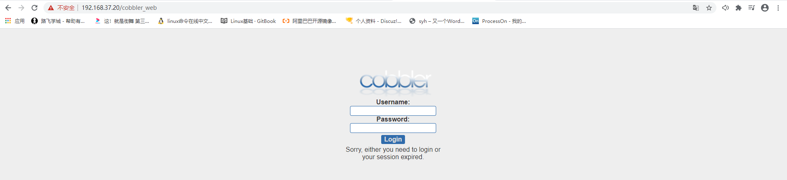

进入首页

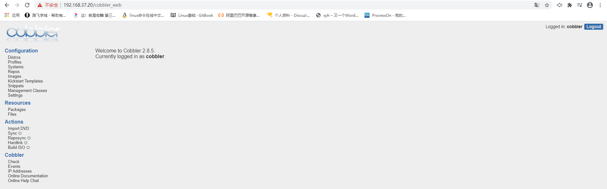


### 3.14、Cobbler自定义ks安装系统


#### 导入系统镜像

在cobbler web界面，导入dvd-iso镜像文件信息

cobbler web镜像存放点在

```shell
[root@ks-cobbler ks_mirror]# pwd
/var/www/cobbler/ks_mirror
```

在vmware里挂载好光盘，进行mount

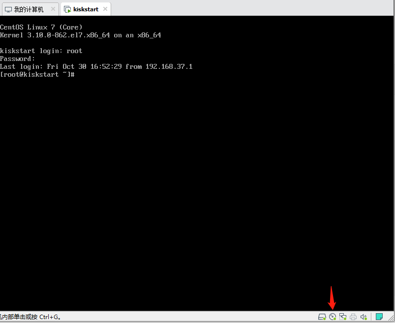

```shell
[root@ks-cobbler ks_mirror]# mount /dev/cdrom /mnt
mount: /dev/sr0 is write-protected, mounting read-only
[root@kiskstart cobbler]# df -h
文件系统                 容量  已用  可用 已用% 挂载点
/dev/mapper/centos-root  8.0G  2.0G  6.1G   25% /
devtmpfs                 980M     0  980M    0% /dev
tmpfs                    992M     0  992M    0% /dev/shm
tmpfs                    992M  9.6M  982M    1% /run
tmpfs                    992M     0  992M    0% /sys/fs/cgroup
/dev/sda1               1014M  130M  885M   13% /boot
tmpfs                    199M     0  199M    0% /run/user/0
/dev/sr0                 4.2G  4.2G     0  100% /mnt

```

配置如图所示

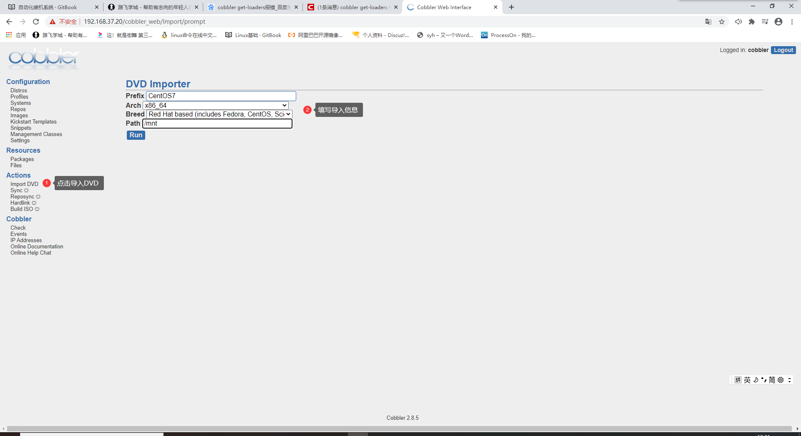

导入镜像的任务

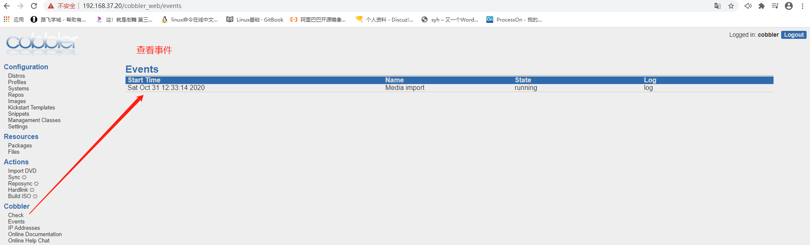

在linux中检查cobbler导入操作

```
[root@ks-cobbler ks_mirror]# cd /var/www/cobbler/
[root@ks-cobbler cobbler]# ls
images  ks_mirror  links  localmirror  misc  pub  rendered  repo_mirror  svc
[root@ks-cobbler cobbler]# du -sh .
4.2G    .

# cobbler默认是调用rsync进行同步数据
```

导入结束

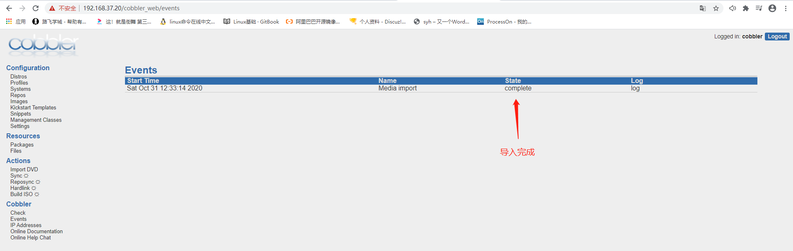

##### apache显示cobbler镜像站点

http://192.168.37.20/cobbler/

#### cobbler-web

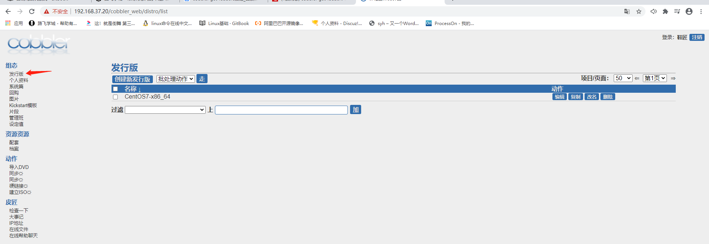

#### 新建vmware虚拟机

测试用cobbler自动装机，创建方式和手动安装方式一样，注意：

- 内存大小
- 添加网络适配器
- 删除usb
- 关闭dvd开机链接

出现如下页面，正常

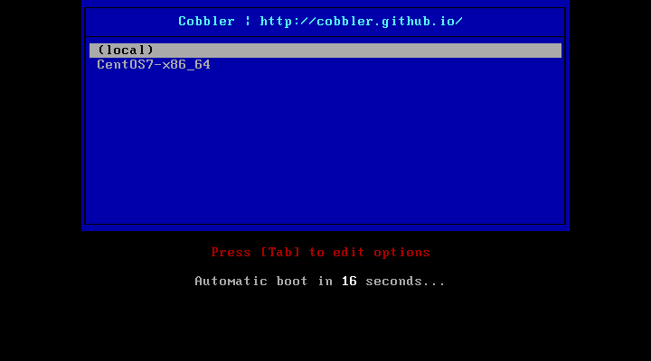

该界面由pxe启动文件控制

```shell
[root@ks-cobbler cobbler]# cat /var/lib/tftpboot/pxelinux.cfg/default 
DEFAULT menu
PROMPT 0
MENU TITLE Cobbler | http://cobbler.github.io/
TIMEOUT 200
TOTALTIMEOUT 6000
ONTIMEOUT local

LABEL local
        MENU LABEL (local)
        MENU DEFAULT
        LOCALBOOT -1

LABEL CentOS7-x86_64
        kernel /images/CentOS7-x86_64/vmlinuz
        MENU LABEL CentOS7-x86_64
        append initrd=/images/CentOS7-x86_64/initrd.img ksdevice=bootif lang=  kssendmac text  ks=http://172.18.41.133/cblr/svc/op/ks/profile/CentOS7-x86_64
        ipappend 2


MENU end
```

自动安装，选择第二个


装机使用的ks文件在这，cobbler生成的

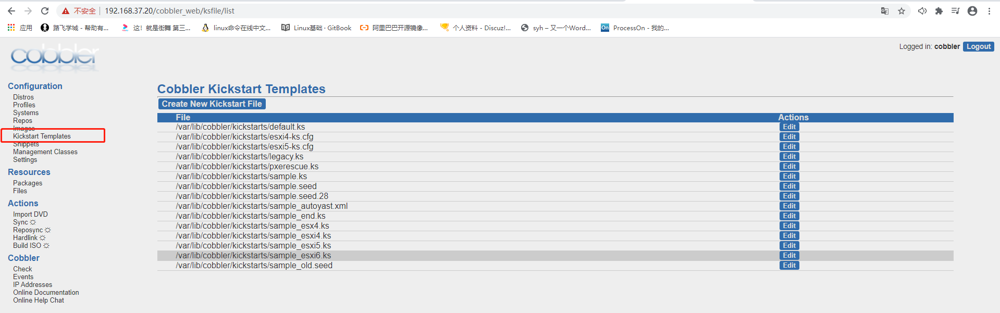


以上是使用centos自身ks文件、这里就可以进行全自动化根据default.ks文件进行自动化装机；若想自动化定制装机则需要自定义编写ks文件


#### 创建自定义系统ks文件

创建新的ks文件

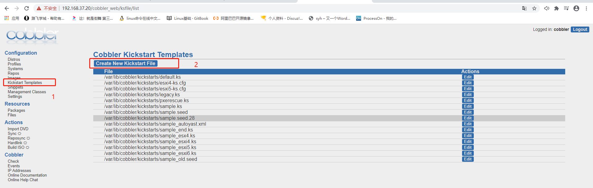


将下面代码复制填入、注意注释不要填入

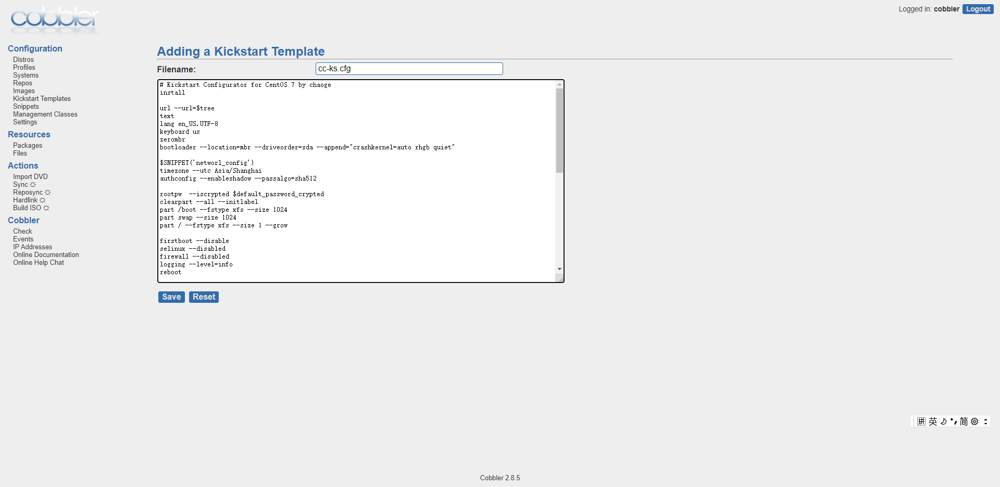


超哥就是那么贴心啊，都给你准备好

```shell
# Kickstart Configurator for CentOS 7 by chaoge
install
# $tree 是在cobbler-web中Distros配置中Kickstart Metadata定义的变量，在超哥这个电脑上，地址就是
http://172.18.41.133/cblr/links/CentOS7-x86_64/
url --url=$tree
text
lang en_US.UTF-8
keyboard us
zerombr
bootloader --location=mbr --driveorder=sda --append="crashkernel=auto rhgb quiet"
# 有关自定义的网络配置，设置静态ip
# network  --bootproto=static --device=eth0 --gateway=10.0.0.254 --ip=10.0.0.202 --nameserver=223.5.5.5 --netmask=255.255.255.0 --activate
# network  --bootproto=static --device=eth1 --ip=172.16.1.202 --netmask=255.255.255.0 --activate
# network  --hostname=Cobbler
# network --bootproto=dhcp --device=eth1 --onboot=yes --noipv6 --hostname=CentOS7
# cobbler网络配置，这里的配置目录在
$SNIPPET('networl_config')
timezone --utc Asia/Shanghai
authconfig --enableshadow --passalgo=sha512

# 设置root密码，用变量替换，该变量在cobbler-web的setting中
rootpw  --iscrypted $default_password_crypted
clearpart --all --initlabel
part /boot --fstype xfs --size 1024
part swap --size 1024
part / --fstype xfs --size 1 --grow

# 服务配置
firstboot --disable
selinux --disabled
firewall --disabled
logging --level=info
reboot

#定义安装前的工作
%pre
$SNIPPET('log_ks_pre')
$SNIPPET('kickstart_start')
$SNIPPET('pre_install_network_config')
# 监控系统安装过程
$SNIPPET('pre_anamon')
%end

# 安装软件包
%packages
@base
@compat-libraries
@debugging
@development
tree
nmap
sysstat
lrzsz
dos2unix
telnet 
wget 
vim 
bash-completion
%end

%post
systemctl disable postfix.service
%end
```

此时可以去cobbler-web添加我们定义的ks文件模板，

复制粘贴即可，但是注意，不支持中文，所以中文注释都给删掉吧

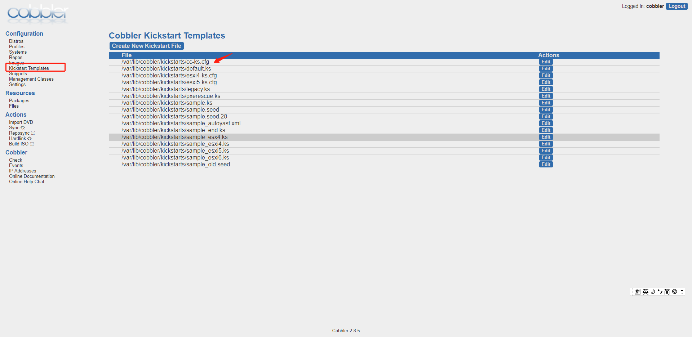

该文件存放在linux上

```
[root@ks-cobbler kickstarts]# ll
total 68
-rw-r--r-- 1 root root 1211 Jul 29 16:54 CentOS-7.4-X86_64.ks
-rw-r--r-- 1 root root  115 Aug 30  2019 default.ks
-rw-r--r-- 1 root root   22 Aug 30  2019 esxi4-ks.cfg
-rw-r--r-- 1 root root   22 Aug 30  2019 esxi5-ks.cfg
drwxr-xr-x 2 root root   56 Jul 29 14:04 install_profiles
-rw-r--r-- 1 root root 1424 Aug 30  2019 legacy.ks
-rw-r--r-- 1 root root  292 Aug 30  2019 pxerescue.ks
-rw-r--r-- 1 root root 2825 Aug 30  2019 sample_autoyast.xml
-rw-r--r-- 1 root root 1856 Aug 30  2019 sample_end.ks
-rw-r--r-- 1 root root    0 Aug 30  2019 sample_esx4.ks
-rw-r--r-- 1 root root  324 Aug 30  2019 sample_esxi4.ks
-rw-r--r-- 1 root root  386 Aug 30  2019 sample_esxi5.ks
-rw-r--r-- 1 root root  386 Aug 30  2019 sample_esxi6.ks
-rw-r--r-- 1 root root 1913 Aug 30  2019 sample.ks
-rw-r--r-- 1 root root 3419 Aug 30  2019 sample_old.seed
-rw-r--r-- 1 root root 6694 Aug 30  2019 sample.seed
-rw-r--r-- 1 root root 6706 Jun 18  2019 sample.seed.28
[root@ks-cobbler kickstarts]#
```

配置cobbler读取自定义的ks文件

cobbler默认读取的是

```
sample_end.ks 
改为
CentOS-7.4-X86_64.ks
```


最后还得修改cobbler-web的system选项，定义好模板

点击create创建系统模板


自定义虚拟机网络


可以再创建个ens34


最后点击save保存

最后点击cobbler-web的sync按钮，等同于命令行执行cobbler sync


最后，点击开机虚拟机，查看自动安装系统吧~~跟着超哥学习linux，奥力给