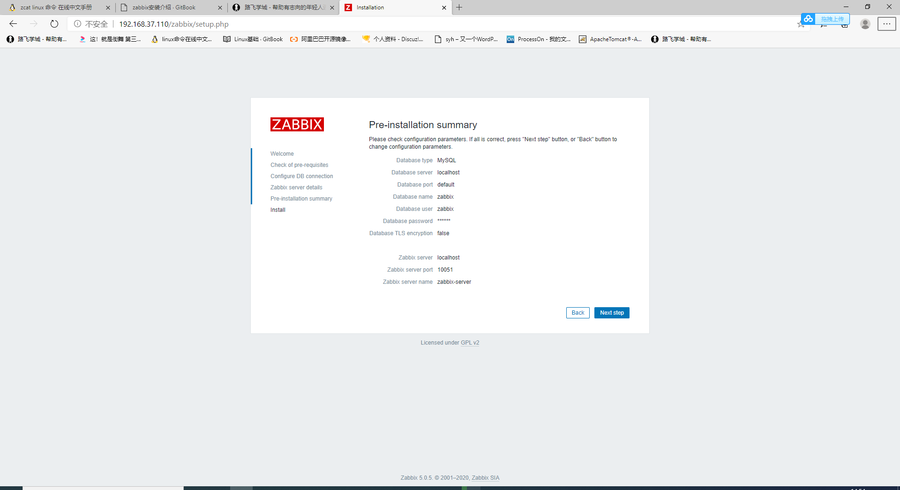
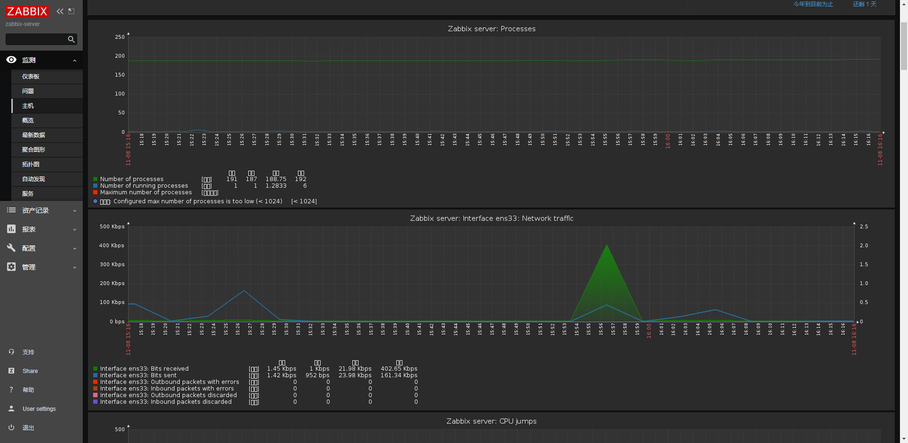
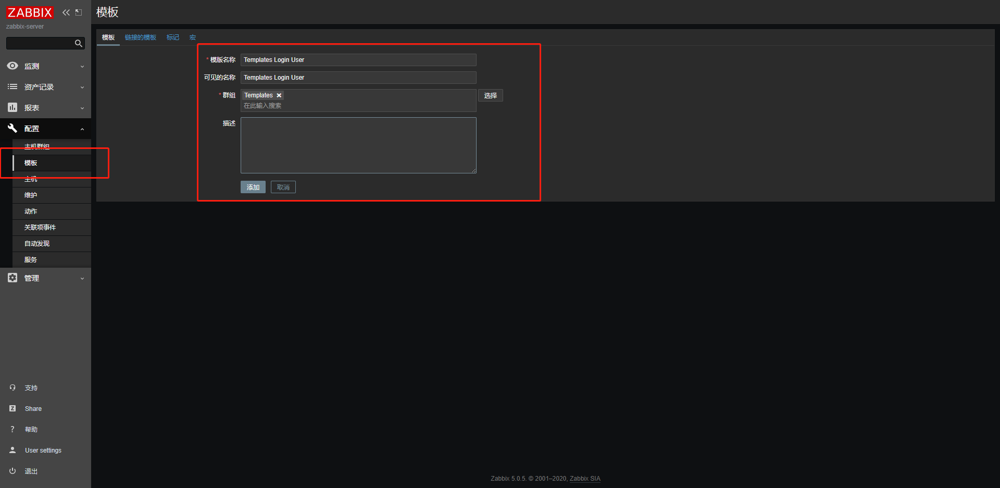
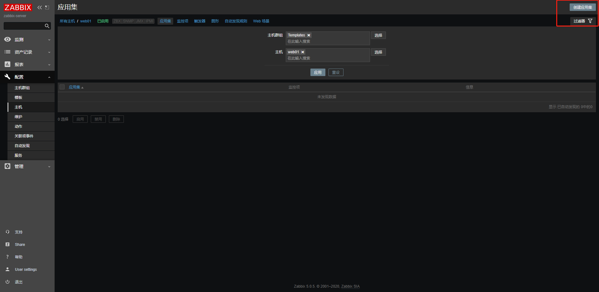
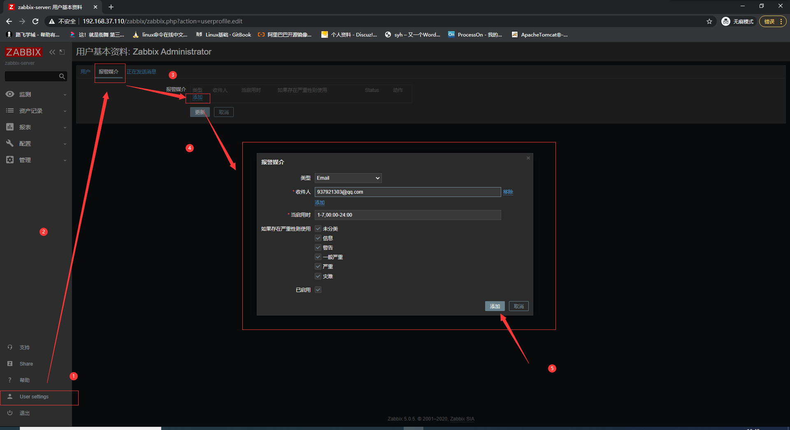

# 期末架构

## 第7章 Zabbix全网监控


### **7.1、为什么要监控、监控的作用？**

#### zabbix

#### 什么是监控


我们的生活里，离不开监控，监控能够最大程度上，发挥如下作用

- 实时监测，即使你不在电脑前，也能实时掌握监控区域情况，提高工作效率
- 事后录像查询，如果不法事件未能即使发现制止，可以调取录像，让不法分子无处遁形。
- 给与不法分子震慑作用，当不法分子意识到自己暴露在监控内，就不敢使坏。
- 远程查看，远程操控，只需要联网，即可在任何设备上，试试查看监控。

#### 服务器监控


#### 为什么会有监控

#### 运维的职责

```shell
1.保障企业数据的安全可靠。

2.为客户提供7*24小时服务。

3.不断提升用户的体验。

在关键时刻，提前提醒我们服务器要出问题了。

当出问题之后，可以便于找到问题的根源。
```

在有监控系统之前，运维人员需要登录服务器手动敲打命令来获取系统数据，例如前面超哥交给大家的iotop，glances，htop，free，ps等查看服务器状态的命令。

运维人员通过系统管理的命令来获取服务器数据，为了分析问题，可能会把数据复制到本地机器，通过excel等工具进行制表，画图分析服务器性能动态。

这种手动管理服务器的麻烦在于，服务器出现问题的时候，运维无法即使的发现，可能服务器内存满了，网站应用挂了，用户过来投诉才能发现，那此时老板可能会训斥运维同学一小时以上。。多么可怕。


#### 有了监控软件之后

超哥作为一个运维，会使用监控系统查看服务器状态以及网站流量指标，利用监控系统的数据去了解上线发布的结果，和网站的健康状态。

利用一个优秀的监控软件，我们可以：

- 通过一个友好的界面进行浏览整个网站所有的服务器状态
- 可以在web前端方便的查看监控数据
- 可以回溯寻找事故发生时系统的问题和报警情况

有了一套完善的监控体系，你就可以悠闲的喝着咖啡干活，而不用提心吊胆。

监控系统是整个运维自动化体系中非常重要的环节，从服务器上架到机房，到最后下架回收，整个过程都应该有监控的存在。

- 服务器上架的硬件监控，检测线路，服务器接口状态
- 服务器运行时的监控，系统指标监控，且在出现异常的时候发出报警通知对应的人员
- 在服务器回收的时候，要取消硬件，软件的监控

并且大型公司还会对监控系统进行开发，确保有API能够方便的和其他部门同事进行协同工作。


### **7.2、运维的职责**

#### 互联网公司里的运维

一般公司里的运维，大致可以分为基础运维、应用运维、运维开发、监控组四大部分。

- 基础运维，负责IDC运维，服务器上下架，网络设备等
- 应用运维，也就是system administrator，系统管理员
- 运维开发，负责运维工具的开发，系统开发等，例如开发监控系统，代码发布系统
- 监控组，也就是24小时值班的人员，需要时刻关注服务器，网站的状况，出现问题后，第一时间联系相关运维以及研发人员。

#### 运维的难处

国内的互联网大厂，拥有几百，几千台服务器是很常见的，因此运维工程师的招聘需求量很大，且工作量也很大，每天在几千台服务器上敲命令，查看系统状态，发布代码，任务是非常繁琐的。

国内常见的运维新闻就是：

- 又是一年一度的双十一，今晚又是一个不眠之夜，对于程序员，运维，整个IT团队都要熬夜了（但是他们的收益也是巨大的）
- 新浪某男星又被爆出丑闻，微博又瘫痪啦！

从这样的新闻就可以看出运维人员的难处，超哥也曾彻夜不眠的维护服务器，心塞呀。

超哥也还遇见过一些难事：

- 服务器崩溃，网站后台500挂了，由于没有监控，大伙都还不知道，直到其他部门的同事打来电话一顿凶
- 代码发布太过于繁琐，每一台机器都要自己手动执行部署，一台一台的检查
- 机器之间环境不统一，代码一样，但是这台能行，另一台就不行
- 分析问题困难，比如想要知道服务器历史状态，就比较麻烦
- 资产统计困难，作为运维新人，都不清晰公司的服务器架构，资产状况，那那能行？

#### 所谓运维自动化


如上的这些问题，几乎所有的运维同学都会遇见过，那么成长之后的运维，如何解决这些问题？

- 硬件标准化，包括服务器所有的硬件指标
- 软件标准化，软件版本，系统环境一致性等
- 运维自动化，监控体系，代码发布体系，CMDB。

监控体系，部署如zabbix等系统实现：

- 系统状态监控
- 应用状态监控
- 出错时即使告警

发布系统，部署CI/CD运维体系：

- 代码发布
- 代码检查
- 代码回滚，发布

服务器标准化，部署如cobbler+pxe实现自动化装机，ansible实现工程自动化配置，做到硬件，软件的标准化。

CMDB系统，也读作配置管理数据库，存储了所有的运维数据，包括服务器硬件信息，网络设备信息，属于运维的心脏。

#### 监控系统

监控系统是所有运维人的天眼，能够帮助你盯着服务器且在第一时间发现网站的问题，发出告警，通知运维同学解决问题。

#### 监控生命周期

服务器上架机柜

进行基础设施监控

- 服务器温度，风扇转速（ipmitool命令对服务器进行远程管理，注意只能用在物理机，vmware不行）
- 存储的容量，性能（df，fdisk，dd，iotop）
- CPU性能好坏（lscpu，uptime，top，htop，glances）
- 内存容量（free）
- 网络情况（iftop,nethogs）

应用监控

- 数据库mysql,redis
- nginx
- php-fpm
- python

若是服务器在维护中，还得暂停监控指标，否则监控会不停的报警。

监控系统在运维自动化系统中，实现如下功能

- 监控数据收集，可视化展示（图表展示，柱状图，曲线图，折线图）
- 异常数据报警
- 结合如CMDB等系统协同工作

### **7.3、监控的指标**

#### 理想化的运维监控利器


一个完善且理想的监控系统，得有如下特点

- 监控系统能够自定义监控的内容，自己通过脚本采集所需的数据
- 数据需要存入到数据库，日后对该数据进行分析计算
- 监控系统可以简易，快速的部署到服务器
- 数据可视化直观清晰

异常告警通知：

- 可以定义复杂度告警逻辑，做到监控项之间的关联告警，例如程序之间的依赖检测，而不是只单独检测某一个指标
- 告警可以确认响应，让运维组内的人知道已经有人在处理告警问题了
- 报警方式可以自定义，如短信，邮件，以及微信，钉钉等
- 告警内容可以自定义，能够写入一些简单的分析，便于运维人员直观了解数据，否则还得去服务器查看
- 报警后，可以预处理一些任务，如自我修复，重启，采集数据等

协同工作：

- 监控系统有强大的API，提供给研发同学调用，其他系统调用。
- 监控数据是开放性，数据结构主流，便于解析。
- 监控可视化可以简易的插件使用，而非复杂的js文件


### **7.4、zabbix的介绍**

#### zabbix介绍

Zabbix 是由 Alexei Vladishev 开发的一种网络监视、管理系统，基于 Server-Client 架构。可用于监视各种网络服务、服务器和网络机器等状态。

使用各种 Database-end 如 MySQL, PostgreSQL, SQLite, Oracle 或 IBM DB2 储存资料。Server 端基于 C语言、Web 管理端 frontend 则是基于 PHP 所制作的。

Zabbix 可以使用多种方式监视。可以只使用 Simple Check 不需要安装 Client 端，亦可基于 SMTP 或 HTTP ... 各种协议定制监视。

　　在客户端如 UNIX, Windows 中安装 Zabbix Agent 之后，可监视 CPU Load、网络使用状况、硬盘容量等各种状态。而就算没有安装 Agent 在监视对象中，Zabbix 也可以经由 SNMP、TCP、ICMP、利用 IPMI、SSH、telnet 对目标进行监视。

Zabbbix自带的Item足够满足普通小公司的监控需求，对于大公司也可以设定自定义的Item，自动生成报表，也有API可以和其他系统集成。

#### 为何是zabbix不是其他监控

zabbix就是可以满足理想化的监控系统需求

- 支持自定义监控脚本，提供需要输出的值即可
- zabbix存储的数据库表结构稍有复杂但是逻辑清晰
- zabbix存在模板的概念，可以方便的将一组监控项进行部署
- zabbix每一个item也就是监控项，都可以看到历史记录，且web界面友好
- zabbix有强大的Trigger(触发器)定义规则，可以定义复杂的报警逻辑
- zabbix提供了ack报警确认机制
- zabbix支持邮件，短信，微信等告警
- zabbix在触发告警后，可以远程执行系统命令
- zabbix有原生的PHP绘图模块

#### zabbix专有词汇

对于英文的掌握，是IT人员必须学习的技能，以下是使用zabbix必须掌握的一些关键词

- zabbix server，服务端，收集数据，写入数据
- zabbix agent，部署在被监控的机器上，是一个进程，和zabbix server进行交互，以及负责执行命令
- Host，服务器的概念，指zabbix监控的实体，服务器，交换机等
- Hosts，主机组
- Applications，应用
- Events，事件
- Media，发送通知的通道
- Remote command，远程命令
- Template，模板
- Item，对于某一个指标的监控，称之为Items，如某台服务器的内存使用状况，就是一个item监控项
- Trigger，触发器，定义报警的逻辑，有正常，异常，未知三个状态
- Action，当Trigger符合设定值后，zabbix指定的动作，如发个邮件给超哥，说服务器有问题了

#### zabbix程序组件

- Zabbix_server，服务端守护进程
- Zabbix_agentd，agent守护进程
- zabbix_proxy，代理服务器
- zabbix_database，存储系统，mysql，pgsql
- Zabbix_web，web GUI图形化界面
- Zabbix_get，命令行工具，测试向agent发起数据采集请求
- Zabbix_sender，命令行工具，测试向server发送数据
- Zabbix_java_gateway，java网关


### 7.5、zabbix5.0服务端部署

#### 安装zabbix5.0

5.0 版本对基础环境的要求有大的变化，最大的就是对 php 版本的要求，最低要求 7.2.0 版本,对 php 扩展组件版本也有要求，详见官网文档

```shell
https://www.zabbix.com/documentation/current/manual/installation/requirements
```

准备好一台linux服务器，ip地址，设置

```shell
[syh@zabbix-server ~]$ hostname
zabbix-server

[syh@zabbix-server ~]$ ifconfig ens33 |awk 'NR==2{print $2}'
192.168.37.110


# 关闭防火墙，selinux
sed -i 's/SELINUX=enforcing/SELINUX=disabled/' /etc/selinux/config
systemctl disable --now firewalld
reboot

[root@zabbix-server01 ~]# free -m
              total        used        free      shared  buff/cache   available
Mem:           3773         106        3516          11         149        3454
Swap:          2047           0        2047
```

安装zabbix服务端配置

官网安装文档

```shell
https://www.zabbix.com/download?zabbix=5.0&os_distribution=red_hat_enterprise_linux&os_version=7&db=mysql&ws=apache
```

超哥的安装步骤

```shell
1.获取zabbix官方源
rpm -Uvh https://mirrors.aliyun.com/zabbix/zabbix/5.0/rhel/7/x86_64/zabbix-release-5.0-1.el7.noarch.rpm

# 这一步很重要
sed -i 's#http://repo.zabbix.com#https://mirrors.aliyun.com/zabbix#' /etc/yum.repos.d/zabbix.repo

yum clean all


2.安装zabbix server和agent
yum install zabbix-server-mysql zabbix-agent -y

3.安装 Software Collections，便于后续安装高版本的 php，默认 yum 安装的 php 版本为 5.4 过低。
SCL(Software Collections)可以让你在同一个操作系统上安装和使用多个版本的软件，而不会影响整个系统的安装包。
软件包会安装在/opt/rh目录下
为了避免系统广泛冲突，/opt/rh包安装在目录中，例如，这允许你在CentOS 7机器上安装Python 3.5，而不会删除或干扰Python 2.7.
/etc/opt/rh/软件包的所有配置文件都存储在目录中相应的目录中，SCL包提供了定义使用所包含应用程序所需的环境变量的shell脚本，例如，PATH，LD_LIBRARY_PATH和MANPATH ，这些脚本存储在文件系统中，作为 /opt/rh/package-name/enable 。

yum install centos-release-scl -y


4.修改zabbix前端源
vim /etc/yum.repos.d/zabbix.repo  
[zabbix-frontend]
name=Zabbix Official Repository frontend - $basearch
baseurl=https://mirrors.aliyun.com/zabbix/zabbix/5.0/rhel/7/$basearch/frontend
enabled=1        # 修改这里
gpgcheck=1
gpgkey=file:///etc/pki/rpm-gpg/RPM-GPG-KEY-ZABBIX-A14FE591

5.安装zabbix前端环境
yum install zabbix-web-mysql-scl zabbix-apache-conf-scl -y

6.安装zabbix所需的数据库，直接用centos7自带的mariadb
yum install mariadb-server -y

7.启动数据库，且配置开机启动
[root@zabbix-server01 opt]# systemctl enable --now mariadb
Created symlink from /etc/systemd/system/multi-user.target.wants/mariadb.service to /usr/lib/systemd/system/mariadb.service.
[root@z

8.初始化mariadb，设置root密码，syh666
mysql_secure_installation

9.使用root用户登录mariadb，建立zabbix数据库，这里的编码设置，非常重要，否则zabbix无法安装
create database zabbix character set utf8 collate utf8_bin;
create user zabbix@localhost identified by 'syh666';
grant all privileges on zabbix.* to zabbix@localhost;
flush privileges;
quit;

10.使用以下命令导入 zabbix 数据库，zabbix 数据库用户为 zabbix，密码为syh666
zcat /usr/share/doc/zabbix-server-mysql*/create.sql.gz | mysql -uzabbix -p zabbix

11.修改 zabbix server 配置文件/etc/zabbix/zabbix_server.conf 里的数据库密码
[root@zabbix-server01 data]# grep '^DBPassword' /etc/zabbix/zabbix_server.conf
DBPassword=syh666

12.修改 zabbix 的 php 配置文件 /etc/opt/rh/rh-php72/php-fpm.d/zabbix.conf 里的时区
[root@zabbix-server /]# grep 'timezone' /etc/opt/rh/rh-php72/php-fpm.d/zabbix.conf
php_value[date.timezone] = Asia/Shanghai


13.启动相关服务
systemctl restart zabbix-server zabbix-agent httpd rh-php72-php-fpm
systemctl enable zabbix-server zabbix-agent httpd rh-php72-php-fpm

14.访问zabbix入口
192.168.37.110/zabbix/setup.php

```


检查各组件是否正常


输入配置数据库 zabbix 用户的密码，syh666


安装信息细节




安装成功


登录账号为 Admin，密码：zabbix，注意大小写

#### zabbix首页


修改语言


### 7.6、zabbix客户端部署


#### 部署zabbix客户端

Zabbix 5.0 版本推出了使用 go 语言重写的 Agent2，也是 5.0 版本新特性，Agent2 有如下特性：

- 完成的插件框架支持，可扩张服务及应用监控
- 支持灵活的采集周期调度
- 更高效的数据采集及传输
- 可完全替换先有的 agent
- …..

特性较多，建议使用。

由于使用 go 语言编写,编译安装与之前版本有所区别。

Agent2 默认使用的 10050 端口，与 Zabbix Agent 端口一样，不修改端口情况下，同一台机器不能同时启动 Zabbix Agent 与 Zabbix Agent2。

#### yum安装

再准备一台linux虚拟机，且配置好专有的yum源，参考超哥部署zabbix-server的yum源配置

```shell
# 信息
192.168.37.105
zbz-agent01

# yum源配置，防火墙关闭

# 注意时间正确
yum install ntpdate -y
ntpdate -u ntp.aliyun.com

mv /etc/localtime{,.bak}
ln -s /usr/share/zoneinfo/Asia/Shanghai /etc/localtime
```

安装步骤

```shell
#这里要先配置zabbixyum源才能下载，则需要参考server配置yum源
1.安装agent2
yum install zabbix-agent2 -y


2.配置文件了解
默认配置文件为 /etc/zabbix/zabbix_agent2.conf

默认二进制文件为 /usr/sbin/zabbix_agent2

3.启动agent2且开机自启
systemctl enable --now zabbix-agent2

4.检查端口
[root@zbz-agent01 ~]# netstat -tunlp|grep zabbix
tcp6       0      0 :::10050                :::*                    LISTEN      1236/zabbix_agent2

5.查看systemctl管理的单元文件
[root@zbz-agent01 ~]# cat /lib/systemd/system/zabbix-agent2.service
```

修改agent1配置文件，修改如下，填写zabbix-server主机ip和主机名

```shell
[root@zabbix-agent1 ~]# grep -Ev '^#|^$' /etc/zabbix/zabbix_agent2.conf
PidFile=/var/run/zabbix/zabbix_agent2.pid
LogFile=/var/log/zabbix/zabbix_agent2.log
LogFileSize=0
Server=192.168.37.110
ServerActive=192.168.37.110						#注意是服务器的ip和主机名
Hostname=zabbix-server
Include=/etc/zabbix/zabbix_agent2.d/*.conf
ControlSocket=/tmp/agent.sock


#zabbix配置文件语法检测功能
zabbix_server -c 指定配置文件
zabbix_agent -c 指定配置文件
```

Server 和 ServerActive 配置为 zabibx server 或 zabbix proxy 地址，Hostname 配置为主机名即可。

Agent2 没有组件依赖，可直接拷贝编译好的二进制文件和配置文件在其他主机上运行即可。

改了配置文件，注意重启agent2

```shell
[root@zbz-agent01 ~]# systemctl restart zabbix-agent2
```


#### 检测server-client连通性

zabbix-server

```shell
[root@zabbix-server01 alternatives]# yum install zabbix-get -y

[root@zabbix-server /]# zabbix_get -s '192.168.37.105' -p 10050 -k "agent.ping"
1

[root@zabbix-server /]# zabbix_get -s '192.168.37.105' -p 10050 -k "system.hostname"
zabbix-agent2
```


### 7.7、zabbix的基本使用

#### zabbix-server监控主机

默认zabbix5.0已经监控了自己


#### 服务器可视化指标

点击对应主机的【图形】即可看见



#### 解决zabbix乱码问题

上述的图标数据，下面的小白框表示乱码含义，是因为我们改了zabbix的语言为中文

服务器需要安装字体

zabbix-server

```shell
[root@zabbix-server /]#  yum -y install wqy-microhei-fonts
[root@zabbix-server /]# \cp /usr/share/fonts/wqy-microhei/wqy-microhei.ttc /usr/share/fonts/dejavu/DejaVuSans.ttf

此时zabbix已然正确展示中文数据
```


#### 添加agent主机

选择创建主机


添加了1个主机


添加监控模板


添加客户端主机01

稍微等待会，结果如下，zabbix即正确的监控了agent01机器


#### 查看监控内容

在最新数据中，可以进行筛选，输入ip或者主机名都可以搜索出来


#### 可视化监控agent的cpu动态

```shell
在agent01机器上，执行程序，消耗cpu
利用shell或者python皆可
```


### 7.8.自定义制作监控模板

#### 自定义监控（制作模板）

zabbix自带模板`Template OS Linux (Template App Zabbix Agent)`提供CPU、内存、磁盘、网卡等常规监控，只要新加主机关联此模板，就可自动添加这些监控项。

#### 制作模板(监控登录人数)

**需求：限制登录人数不超过三个，超过三人则发出报警**

服务器不希望有太多人在操作，除了管理员以外的人，人数超了，我就怀疑有问题，需要看看是谁，防止他乱操作服务器，给我们运维背锅呀。

#### 自定义key

```shell
# zabbix自带的key
[root@zabbix-server01 ~]# zabbix_get -s 10.0.1.51 -p 10050 -k "system.uname"
Linux zbz-agent01 3.10.0-862.el7.x86_64 #1 SMP Fri Apr 20 16:44:24 UTC 2018 x86_64
[root@zabbix-server01 ~]#
[root@zabbix-server01 ~]#
[root@zabbix-server01 ~]# zabbix_get -s 10.0.1.51 -p 10050 -k "system.hostname"
zbz-agent01

# 若是写错了key，则报错，未知的指标
[root@zabbix-server01 ~]# zabbix_get -s 10.0.1.51 -p 10050 -k "system.hostname1"
ZBX_NOTSUPPORTED: Unknown metric system.hostname1

# 未登记，自定义的key，一样，位置的指标
[root@zabbix-server01 ~]# zabbix_get -s 10.0.1.51 -p 10050 -k "login.user"
ZBX_NOTSUPPORTED: Unknown metric login.user
```

我们需要自定义监控项、下面所选中的就是监控内容


```shell
监控项里的 【键值】
就是zabbix-get 使用的key

例如 ，检测客户端存活
[root@zabbix-server01 ~]# zabbix_get -s 192.168.37.105 -p 10050 -k "agent.ping"
1

# 检根文件系统空间大小
[root@zabbix-server ~]# zabbix_get -s 192.168.37.105 -p 10050 -k "vfs.fs.size[/,used]"
4279775232
[[A^C[root@zabbix-server ~]# zabbix_get -s 192.168.37.105 -p 10050 -k "vfs.fs.size[/,total]"
18238930944

```

#### 自定义监控项语法

当zabbix自带模板，以及监控项，无法满足我们需求，我们就可以自定义监控项

自定义监控其实就是添加监控的key，监控的命令

```shell
# 首先显示用户登录命令
who
who |wc -l  # 显示登录人数
```

需要添加监控项配置文件，路径

```shell
/etc/zabbix/zabbix_agent2.d/

# zabbix配置文件，大多数软件配置都会使用include形式来优化配置文件
[root@zabbix-agent2 ~]# grep -i '^include' /etc/zabbix/zabbix_agent2.conf
Include=/etc/zabbix/zabbix_agent2.d/*.conf


# 自定义的配置文件，语法是
UserParameter=<key>,<shell command>
UserParameter=login-user,who|wc -l
UserParameter=login-user,/bin/sh /server/scripts/login.sh


# 超哥定义的配置文件，要注意的是key名要唯一，可以写入多个key
[root@zabbix-agent2 zabbix_agent2.d]# cat /etc/zabbix/zabbix_agent2.d/userparameter_login.conf
UserParameter=login.user2,who|wc -l

# 重启agent
[root@zabbix-agent2 zabbix_agent2.d]# systemctl restart zabbix-agent2.service 
```

在服务端zabbix，用命令检测自定义的key

```shell
[root@zabbix-server ~]# zabbix_get -s 192.168.37.105 -p 10050 -k 'login.user2'
3

# 客户端
[root@zabbix-agent2 zabbix_agent2.d]# who
root     pts/0        2020-11-08 20:24 (192.168.37.1)
root     pts/1        2020-11-08 21:17 (192.168.37.1)
root     pts/2        2020-11-08 21:17 (192.168.37.1)
```


### 7.9、自定义监控之web页面操作

#### zabbix-server注册模板(页面操作)

上述是在命令行添加配置，下面就是页面操作了

整个流程是

- 创建模板
- 创建应用集：对监控项分类
- 创建监控项：定义item，监控的内容
- 创建触发器：当监控项获取到值，且达到触发条件就会告警
- 创建图形
- 主机进行模板关联


#### 创建模板



找到自己添加的模板


#### 创建应用集

应用集作用好比文件夹分类一样，作用是给监控项分类。





#### 添加监控项


#### 创建触发器

创建触发器，当监控项获取的值，到达一定条件，就触发报警


#### 创建图形

以图形的方式展示监控的信息


#### 主机关联模板

上述所有配置都是吧登录用户监控的模板添加好了，以及图形展示，但是还未绑定具体的服务器，那检测谁呢是不是


一个主机可以关联多个监控模板

#### 查看最新数据-图形

查看zabbix监控中的用户登录数

我们可以多登录些用户，超过3个，查看是否告警

```shell
[root@zabbix-server ~]# zabbix_get -s 192.168.37.105 -p 10050 -k 'login.user2'
4
```

#### 最新仪表盘数据


#### 确认问题

管理员可以在线确认该问题，修改描述，也可以修复问题，如踢出多余登录的用户等。

如果想要手动关闭该问题，可以在`触发器`里设置，允许手动关闭该问题。


### 7.10、添加报警

#### 创建媒体介质


#### 设置收件人邮箱



#### 点击更新生效


#### 设定动作


此时主机出现问题时，会发送邮件给指定的用户


### 7.11、聚合图形

#### 添加聚合图形


编辑聚合图形


### 7.12、全网监控


#### 全网监控服务器

如何利用zabbix去监控我们整个的web集群，假如我们有50台，100台机器，该怎么去监控，手动的挨个添加？肯定不行。

#### 监控方案

问题：如何快速添加100台机器

思路：

- 克隆监控模板
- 自动注册和自动发现
- 使用zabbix和api接口，利用curl，或者python进行开发自己的运维监控平台

```shell
接口指的就是，好比笔记本提供的一个USB接口，我们无论使用金士顿的U盘，还是其他厂家的U盘，只要是符合这个接口的U盘规格，都可以插入且使用U盘，读写U盘或者笔记本里的数据。

我们所使用的各种软件也是一样，也提供了API接口给与开发人员使用，便于获取数据。
[root@zabbix-server01 ~]# curl -i -X POST -H 'Content-Type:application/json' -d'{"jsonrpc": "2.0","method":"user.login","params":{"user":"Admin","password":"zabbix"},"auth": null,"id":0}' "http://10.0.1.50/zabbix/api_jsonrpc.php"
HTTP/1.1 200 OK
Date: Wed, 12 Aug 2020 01:29:46 GMT
Server: Apache/2.4.6 (CentOS)
X-Powered-By: PHP/7.2.24
Access-Control-Allow-Origin: *
Access-Control-Allow-Headers: Content-Type
Access-Control-Allow-Methods: POST
Access-Control-Max-Age: 1000
Transfer-Encoding: chunked
Content-Type: application/json

{"jsonrpc":"2.0","result":"43fb04aa42fb8c9f7cf2248fbeb77498","id":0}
```


#### 应用服务监控

1.rsync备份服务器监控，监控rsync端口

```shell
1.监控873端口存活  net.tcp.port[,873]
2.模拟推拉文件，查看结果
```

2.监控NFS服务器

```shell
1.监控端口111的存活，  net.tcp.port[,111]
2.通过nfs命令查看，showmount -e ip|wc -l
```

3.监控mysql服务器

```shell
1.监控3306端口， net.tcp.port[,3006]
2.进行登录测试，mysql -uroot -p -h
3.zabbix-agent自定义的模板
```

4.监控web服务器

```shell
1.监控80端口，net.tcp.port[,80]
2.通过状态码查看，如zabbix自带的web监控
```

5.通过url地址监控

```shell
zabbix自带web检测
```

6.监控代理服务器

```shell
检测nginx代理端口
```

#### 监控服务通用方法

1.端口监控

```shell
使用netstat
ss
lsof
等命令
结合grep查看是否有结果
```

2.进程监控

```
通过ps命令结合grep查看
```

3.模拟客户端连接

```
web服务，通过curl命令访问
mysql，SQL语句验证
memcached，set写入，get获取，查看结果
```


### 7.13自动发现与自动注册

#### 客户端提前部署好

看下超哥前面的部署文档

```shell
[root@zbz-agent01 ~]# systemctl is-active  zabbix-agent2
active
```

可以再开一个机器，用于我们练习`自动发现、自动注册`

```shell
下载rpm环境
http://repo.zabbix.com/zabbix/5.0/rhel/7/x86_64/zabbix-agent2-5.0.2-1.el7.x86_64.rpm
安装
[root@vpn_server opt]# yum localinstall zabbix-agent2-5.0.2-1.el7.x86_64.rpm  -y


# 修改配置文件，启动zabbix-agent2
```

在zabbix-server服务端验证

```shell
[root@zabbix-server01 ~]# zabbix_get -s 10.0.1.63 -p 10050 -k 'agent.ping'
1
```


#### 自动发现/自动注册

***自动发现：\***

```shell
zabbix Server主动发现所有客户端，然后将客户端登记自己的小本本上，缺点zabbix server压力山大（网段大，客户端多），时间消耗多。
```

***自动注册：\***

```shell
zabbix agent主动到zabbix Server上报到，登记；缺点agent有可能找不到Server（配置出错）
```

#### 两种模式

```shell
被动模式：默认  agent被server抓取数据 （都是在agent的立场上说）
主动模式：agent主动将数据发到server端 （都是在agent的立场上说）
```

**注意：** **两种模式都是在agent**上进行配置

#### hosts解析设置

客户端，服务端都给准备好

```shell
cat /etc/hosts

192.168.37.110 zabbix-server
192.168.37.105 web01
192.168.37.106 web02

```

#### 自动发现-被动模式

- 准备好zabbix-server
- zabbix-agent2
  - 192.168.37.105
  - 192.168.37.106

#### 自动发现创建

**注意，提前启动好`zabbix-agent2`**

创建自动发现


#### 创建发现动作


动作设置


自动发现--操作设置


#### 等待客户端自动出现

这里要注意、主机迟迟不显示、可能是存在网络延迟问题、因为搜索的客户端多、压力较大


#### 自动注册-主动模式

1.配置安装好zabbix-server

2.安装配置好zabbix-agent2，还得添加额外的配置

```shell
1.在准备一台linux机器，安装配置zabbix-agent2

2.修改相关配置如下

web01
[root@web01 ~]# grep -Ev '^#|^$' /etc/zabbix/zabbix_agent2.conf
PidFile=/var/run/zabbix/zabbix_agent2.pid
LogFile=/var/log/zabbix/zabbix_agent2.log
LogFileSize=0
Server=192.168.37.110
ServerActive=192.168.37.110
Hostname=web01
HostnameItem=system.hostname		# 比之前多了一行这个配置
Include=/etc/zabbix/zabbix_agent2.d/*.conf
ControlSocket=/tmp/agent.sock

web02
[root@web02 /]# grep -Ev '^#|^$' /etc/zabbix/zabbix_agent2.conf
PidFile=/var/run/zabbix/zabbix_agent2.pid
LogFile=/var/log/zabbix/zabbix_agent2.log
LogFileSize=0
Server=192.168.37.110
ServerActive=192.168.37.110
Hostname=web02
HostnameItem=system.hostname
Include=/etc/zabbix/zabbix_agent2.d/*.conf
ControlSocket=/tmp/agent.sock


3.启动
systemctl start zabbix-agent2

4.去服务端验证
[root@zabbix-server zabbix]# zabbix_get -s 192.168.37.105 -p 10050 -k 'agent.ping'
1
[root@zabbix-server zabbix]# zabbix_get -s 192.168.37.106 -p 10050 -k 'agent.ping'
1
```


#### 在zabbix-server上配置

创建动作


自动注册--动作添加


自动注册--操作设置


最后等待客户端，自动被添加即可


注意：如果主机列表未显示、可以停止zabbix-agent2服务、再重新启动、刷新界面即可


### 7.14、分布式监控与SNMP

#### 分布式监控与SNMP


我们看如上的场景，我们使用zabbix，如果是在一个局域网内中，监控agent没有任何问题，但是如果夸数据中心，跨越机房了，zabbix-server和zabbix-agent之间的延迟，可能会高到服务端认为客户端机器挂掉了。

那么这里我们就得使用zabbix支持的`分布式架构`功能。

zabbix支持proxy模式分布式，部署较为简单，proxy和zabbix-server一样，能够从被监控的主机上获取数据，且保存在本地数据库，达到一定条件之后，会吧这些数据发给zabbix-server，再进行后续的操作，例如执行触发器，发送报警等。

zabbix-server会定期将自己的配置，发送给proxy，这样保证配置都是在server上然后同步给proxy，保证分布式架构的一致性。


proxy也主要用来解决网络问题，比如公司一般会有多个IDC机房，由于网络地域原因，机房之间的互通性不太好，又可能有防火墙的问题导致zabbix-server和zabbix-server之间的连通性不好。

上图就是企业常见用法，在每个IDC机房里防止一个zabbix-proxy代理服务器用来检测本机房，这样我们只需要解决proxy和server之间的连通问题就好，zabbix-server和proxy之间的数据传输可靠性可以完全放心，proxy也会有缓存，保证数据的完整性。

```shell
分布式监控的作用
```

- 分担压力，降低server负载
  - Agent > Proxy > Server
- 多机房监控
  - 上海IDC > Proxy > Server


#### 部署分布式监控

环境准备

```shell
zabbix-server       zabbix-server01      192.168.37.110 
zabbix-proxy        zbx-proxy       192.168.37.106
zabbix-agent        web_server01    192.168.37.105


确保三台机器的防火墙关闭
192.168.37.110 zabbix-server01
192.168.37.105  web01-agent
192.168.37.106  zbx-proxy
```

部署

```shell
1.确保zabbix-server配置的自动发现和自动注册都给关闭了，【注意】


2.zabbix-server 服务端无须变动，运行着就可以

3.准备vpn_server机器，部署数据库，存储agent的监控数据，最终发给server
# 确保准备好了zabbix的源
# 安装使用了mysql的proxy
1.获取zabbix官方源
rpm -Uvh https://mirrors.aliyun.com/zabbix/zabbix/5.0/rhel/7/x86_64/zabbix-release-5.0-1.el7.noarch.rpm

# 这一步很重要
sed -i 's#http://repo.zabbix.com#https://mirrors.aliyun.com/zabbix#' /etc/yum.repos.d/zabbix.repo

#安装
[root@zbx-proxy01 ~]# yum install zabbix-proxy-mysql zabbix-get -y


4.安装部署数据库
[root@zbx-proxy01 ~]# yum install mariadb-server mariadb -y
[root@vpn_server ~]# systemctl start mariadb

5.建立数据库用户
mysql
create database zabbix_proxy character set utf8 collate utf8_bin;
grant all privileges on zabbix_proxy.* to zabbix@'localhost' identified by 'zabbix';
flush privileges;
exit;

6.导入zabbix-proxy数据文件
[root@zbx-proxy01 ~]# rpm -ql zabbix-proxy-mysql
/etc/logrotate.d/zabbix-proxy
/etc/zabbix/zabbix_proxy.conf
/usr/lib/systemd/system/zabbix-proxy.service
/usr/lib/tmpfiles.d/zabbix-proxy.conf
/usr/lib/zabbix/externalscripts
/usr/sbin/zabbix_proxy_mysql
/usr/share/doc/zabbix-proxy-mysql-5.0.5
/usr/share/doc/zabbix-proxy-mysql-5.0.5/AUTHORS
/usr/share/doc/zabbix-proxy-mysql-5.0.5/COPYING
/usr/share/doc/zabbix-proxy-mysql-5.0.5/ChangeLog
/usr/share/doc/zabbix-proxy-mysql-5.0.5/NEWS
/usr/share/doc/zabbix-proxy-mysql-5.0.5/README
/usr/share/doc/zabbix-proxy-mysql-5.0.5/schema.sql.gz
/usr/share/man/man8/zabbix_proxy.8.gz
/var/log/zabbix
/var/run/zabbix

# 导入数据
zcat /usr/share/doc/zabbix-proxy-mysql-5.0.2/schema.sql.gz |mysql -uzabbix -pzabbix zabbix_proxy

7.修改proxy配置，连接数据库
sed -i.ori '162a DBPassword=zabbix' /etc/zabbix/zabbix_proxy.conf
sed -i 's#Server=127.0.0.1#Server=192.168.37.106#' /etc/zabbix/zabbix_proxy.conf
sed -i 's#Hostname=Zabbix proxy#Hostname=zbx-proxy01#' /etc/zabbix/zabbix_proxy.conf

解释：
.ori--是指替换内容后产生一个后缀为ori的备份文件

8.检查zabbix-proxy配置

[root@zbx-proxy01 zabbix]# grep '^[a-Z]' /etc/zabbix/zabbix_proxy.conf
[root@zbx-proxy01 etc]# grep '^[a-Z]' /etc/zabbix/zabbix_proxy.conf
Server=192.168.37.110			#注意这个事zabbix服务器的ip
ServerPort=10051
Hostname=zbx-proxy01
LogFile=/var/log/zabbix/zabbix_proxy.log
LogFileSize=0
PidFile=/var/run/zabbix/zabbix_proxy.pid
SocketDir=/var/run/zabbix
DBHost=localhost
DBName=zabbix_proxy
DBUser=zabbix
DBPassword=zabbix
SNMPTrapperFile=/var/log/snmptrap/snmptrap.log
Timeout=4
ExternalScripts=/usr/lib/zabbix/externalscripts


9.启动zabbix-proxy服务
systemctl restart zabbix-proxy.service
```

此时日志应该会报错，还得再web界面操作，添加proxy信息，才能正常通信。


创建代理


```shell
从日志中，我们可以看出，发生了什么
[root@zabbix-server ~]# tail -f /var/log/zabbix/zabbix_server.log 
  3909:20201111:150354.162 cannot send list of active checks to "192.168.37.105": host [web01] not found
  3910:20201111:150414.139 cannot send list of active checks to "127.0.0.1": host [Zabbix server] not found
  3910:20201111:150555.161 cannot send list of active checks to "192.168.37.105": host [web01] not found
  3906:20201111:150614.186 cannot send list of active checks to "127.0.0.1": host [Zabbix server] not found
  3906:20201111:150756.161 cannot send list of active checks to "192.168.37.105": host [web01] not found
  3906:20201111:150814.230 cannot send list of active checks to "127.0.0.1": host [Zabbix server] not found
  3910:20201111:150957.165 cannot send list of active checks to "192.168.37.105": host [web01] not found
  3906:20201111:151014.287 cannot send list of active checks to "127.0.0.1": host [Zabbix server] not found
  3909:20201111:151141.054 sending configuration data to proxy "zbx-proxy01" at "192.168.37.106", datalen 3662 #注意这个
  3907:20201111:151158.161 cannot send list of active checks to "192.168.37.105": host [web01] not found
  3910:20201111:151214.341 cannot send list of active checks to "127.0.0.1": host [Zabbix server] not found

```

此时proxy和server已经正确可以通信了


#### Agent客户端配置

```shell
1.修改agent配置，指向proxy


# 检查配置

[root@web01 ~]# egrep -i '^server|^hostname' /etc/zabbix/zabbix_agent2.conf
Server=192.168.37.106					#指向代理服务器
ServerActive=192.168.37.106				#指向代理服务器
Hostname=web01

# 重启agent
[root@web01 ~]# systemctl restart zabbix-agent2
```


查看结果


```shell
[root@zbx-proxy01 etc]# tail -f /var/log/zabbix/zabbix_proxy.log 
  3103:20201111:154928.680 proxy #20 started [poller #3]
  3104:20201111:154928.691 proxy #21 started [poller #4]
  3105:20201111:154928.702 proxy #22 started [poller #5]
  3106:20201111:154928.713 proxy #23 started [unreachable poller #1]
  3107:20201111:154928.724 proxy #24 started [icmp pinger #1]
  3108:20201111:154928.724 proxy #25 started [preprocessing manager #1]
  3109:20201111:154928.725 proxy #26 started [preprocessing worker #1]
  3110:20201111:154928.726 proxy #27 started [preprocessing worker #2]
  3111:20201111:154928.726 proxy #28 started [preprocessing worker #3]
  3101:20201111:154929.752 enabling Zabbix agent checks on host "web01": host became available #这里已经能够通过代理检测web01了
```


#### SNMP监控

如果我们需要监控打印机、路由器等设备,肯定不能使用 zabbix agentd,因为他们不能安装软件

还好他们一般都支持SNMP协议,这样我可以使用SNMP来监控他们.如果你希望使用SNMP-agent来获取这些设备的信息

那么在安装 zabbix server 的时候你需要增加 snmp 的支持，备注:SNMP 检查基于 UDP 协议。

```shell
　snmp simple network manager protocol 简单网络管理协议
　很多无法安装zabbix-agent的设备，都可以通过snmp协议监控
```

部署

```shell
1.服务端安装snmp程序
[root@zabbix-server ~]# yum -y install net-snmp net-snmp-utils

2.配置snmp程序
# 开启snmp的配置
sed -i.ori '57a view systemview   included  .1' /etc/snmp/snmpd.conf
systemctl start snmpd.service

#检查端口
[root@zabbix-server snmp]# netstat -tunpl|grep 161
udp        0      0 0.0.0.0:161             0.0.0.0:*                           6233/snmpd   

3.测试snmp命令
snmpwalk -v 2c -c public 127.0.0.1 sysname

# 参数解释
# snmpwalk 类似 zabbix_get
# -v 2c  指定使用snmp协议的版本  snmp分为v1 v2 v3
# -c public  指定暗号
# sysname  类似zabbix的key

[root@zabbix-server snmp]# snmpwalk -v 2c -c public 127.0.0.1 sysname
SNMPv2-MIB::sysName.0 = STRING: zabbix-server


```


#### snmp-OID

Zabbix的snmp监控还没开始讲，不过先给大家列一些snmp常用的一些OID，比如cpu、内存、硬盘什么的。

先了解这些，再使用snmp监控服务器。

SNMP代理提供大量的对象标识符（OID－Object Identifiers）。一个OID是一个唯一的键值对。该代理存放这些值并让它们可用。

用法

```shell
[root@zabbix-server snmp]#  snmpwalk -v 2c -c public 127.0.0.1 .1.3.6.1.2.1.1.5.0
SNMPv2-MIB::sysName.0 = STRING: zabbix-server


[root@zabbix-server snmp]# snmpwalk -v 2c -c public 127.0.0.1 .1.3.6.1.2.1.1.1.0
SNMPv2-MIB::sysDescr.0 = STRING: Linux zabbix-server 3.10.0-862.el7.x86_64 #1 SMP Fri Apr 20 16:44:24 UTC 2018 x86_64

```

| 系统参数（1.3.6.1.2.1.1） |                    |                   |          |
| ------------------------- | ------------------ | ----------------- | -------- |
| OID                       | 描述               | 备注              | 请求方式 |
| .1.3.6.1.2.1.1.1.0        | 获取系统基本信息   | SysDesc           | GET      |
| .1.3.6.1.2.1.1.3.0        | 监控时间           | sysUptime         | GET      |
| .1.3.6.1.2.1.1.4.0        | 系统联系人         | sysContact        | GET      |
| .1.3.6.1.2.1.1.5.0        | 获取机器名         | SysName           | GET      |
| .1.3.6.1.2.1.1.6.0        | 机器坐在位置       | SysLocation       | GET      |
| .1.3.6.1.2.1.1.7.0        | 机器提供的服务     | SysService        | GET      |
| .1.3.6.1.2.1.25.4.2.1.2   | 系统运行的进程列表 | hrSWRunName       | WALK     |
| .1.3.6.1.2.1.25.6.3.1.2   | 系统安装的软件列表 | hrSWInstalledName | WALK     |

| 网络接口（1.3.6.1.2.1.2） |                                    |                |              |      |
| ------------------------- | ---------------------------------- | -------------- | ------------ | ---- |
| OID                       | 描述                               | 备注           | 请求方式     |      |
| .1.3.6.1.2.1.2.1.0        | 网络接口的数目                     | IfNumber       | GET          |      |
| .1.3.6.1.2.1.2.2.1.2      | 网络接口信息描述                   | IfDescr        | WALK         |      |
| .1.3.6.1.2.1.2.2.1.3      | 网络接口类型                       | IfType         | WALK         |      |
| .1.3.6.1.2.1.2.2.1.4      | 接口发送和接收的最大IP数据报[BYTE] | IfMTU          | WALK         |      |
| .1.3.6.1.2.1.2.2.1.5      | 接口当前带宽[bps]                  | IfSpeed        | WALK         |      |
| .1.3.6.1.2.1.2.2.1.6      | 接口的物理地址                     | IfPhysAddress  | WALK         |      |
| .1.3.6.1.2.1.2.2.1.8      | 接口当前操作状态[up\               | down]          | IfOperStatus | WALK |
| .1.3.6.1.2.1.2.2.1.10     | 接口收到的字节数                   | IfInOctet      | WALK         |      |
| .1.3.6.1.2.1.2.2.1.16     | 接口发送的字节数                   | IfOutOctet     | WALK         |      |
| .1.3.6.1.2.1.2.2.1.11     | 接口收到的数据包个数               | IfInUcastPkts  | WALK         |      |
| .1.3.6.1.2.1.2.2.1.17     | 接口发送的数据包个数               | IfOutUcastPkts | WALK         |      |

| CPU及负载                  |                                 |                 |          |
| -------------------------- | ------------------------------- | --------------- | -------- |
| OID                        | 描述                            | 备注            | 请求方式 |
| . 1.3.6.1.4.1.2021.11.9.0  | 用户CPU百分比                   | ssCpuUser       | GET      |
| . 1.3.6.1.4.1.2021.11.10.0 | 系统CPU百分比                   | ssCpuSystem     | GET      |
| . 1.3.6.1.4.1.2021.11.11.0 | 空闲CPU百分比                   | ssCpuIdle       | GET      |
| . 1.3.6.1.4.1.2021.11.50.0 | 原始用户CPU使用时间             | ssCpuRawUser    | GET      |
| .1.3.6.1.4.1.2021.11.51.0  | 原始nice占用时间                | ssCpuRawNice    | GET      |
| . 1.3.6.1.4.1.2021.11.52.0 | 原始系统CPU使用时间             | ssCpuRawSystem. | GET      |
| . 1.3.6.1.4.1.2021.11.53.0 | 原始CPU空闲时间                 | ssCpuRawIdle    | GET      |
| . 1.3.6.1.2.1.25.3.3.1.2   | CPU的当前负载，N个核就有N个负载 | hrProcessorLoad | WALK     |
| . 1.3.6.1.4.1.2021.11.3.0  | ssSwapIn                        | GET             |          |
| . 1.3.6.1.4.1.2021.11.4.0  | SsSwapOut                       | GET             |          |
| . 1.3.6.1.4.1.2021.11.5.0  | ssIOSent                        | GET             |          |
| . 1.3.6.1.4.1.2021.11.6.0  | ssIOReceive                     | GET             |          |
| . 1.3.6.1.4.1.2021.11.7.0  | ssSysInterrupts                 | GET             |          |
| . 1.3.6.1.4.1.2021.11.8.0  | ssSysContext                    | GET             |          |
| . 1.3.6.1.4.1.2021.11.54.0 | ssCpuRawWait                    | GET             |          |
| . 1.3.6.1.4.1.2021.11.56.0 | ssCpuRawInterrupt               | GET             |          |
| . 1.3.6.1.4.1.2021.11.57.0 | ssIORawSent                     | GET             |          |
| . 1.3.6.1.4.1.2021.11.58.0 | ssIORawReceived                 | GET             |          |
| . 1.3.6.1.4.1.2021.11.59.0 | ssRawInterrupts                 | GET             |          |
| . 1.3.6.1.4.1.2021.11.60.0 | ssRawContexts                   | GET             |          |
| . 1.3.6.1.4.1.2021.11.61.0 | ssCpuRawSoftIRQ                 | GET             |          |
| . 1.3.6.1.4.1.2021.11.62.0 | ssRawSwapIn.                    | GET             |          |
| . 1.3.6.1.4.1.2021.11.63.0 | ssRawSwapOut                    | GET             |          |
| .1.3.6.1.4.1.2021.10.1.3.1 | Load5                           | GET             |          |
| .1.3.6.1.4.1.2021.10.1.3.2 | Load10                          | GET             |          |
| .1.3.6.1.4.1.2021.10.1.3.3 | Load15                          | GET             |          |

| 内存及磁盘（1.3.6.1.2.1.25） |                                         |                          |          |
| ---------------------------- | --------------------------------------- | ------------------------ | -------- |
| OID                          | 描述                                    | 备注                     | 请求方式 |
| .1.3.6.1.2.1.25.2.2.0        | 获取内存大小                            | hrMemorySize             | GET      |
| .1.3.6.1.2.1.25.2.3.1.1      | 存储设备编号                            | hrStorageIndex           | WALK     |
| .1.3.6.1.2.1.25.2.3.1.2      | 存储设备类型                            | hrStorageType[OID]       | WALK     |
| .1.3.6.1.2.1.25.2.3.1.3      | 存储设备描述                            | hrStorageDescr           | WALK     |
| .1.3.6.1.2.1.25.2.3.1.4      | 簇的大小                                | hrStorageAllocationUnits | WALK     |
| .1.3.6.1.2.1.25.2.3.1.5      | 簇的的数目                              | hrStorageSize            | WALK     |
| .1.3.6.1.2.1.25.2.3.1.6      | 使用多少，跟总容量相除就是占用率        | hrStorageUsed            | WALK     |
| .1.3.6.1.4.1.2021.4.3.0      | Total Swap Size(虚拟内存)               | memTotalSwap             | GET      |
| .1.3.6.1.4.1.2021.4.4.0      | Available Swap Space                    | memAvailSwap             | GET      |
| .1.3.6.1.4.1.2021.4.5.0      | Total RAM in machine                    | memTotalReal             | GET      |
| .1.3.6.1.4.1.2021.4.6.0      | Total RAM used                          | memAvailReal             | GET      |
| .1.3.6.1.4.1.2021.4.11.0     | Total RAM Free                          | memTotalFree             | GET      |
| .1.3.6.1.4.1.2021.4.13.0     | Total RAM Shared                        | memShared                | GET      |
| .1.3.6.1.4.1.2021.4.14.0     | Total RAM Buffered                      | memBuffer                | GET      |
| .1.3.6.1.4.1.2021.4.15.0     | Total Cached Memory                     | Memcached                | GET      |
| .1.3.6.1.4.1.2021.9.1.2      | Path where the disk is mounted          | dskPath                  | WALK     |
| .1.3.6.1.4.1.2021.9.1.3      | Path of the device for the partition    | dskDevice                | WALK     |
| .1.3.6.1.4.1.2021.9.1.6      | Total size of the disk/partion (kBytes) | dskTotal                 | WALK     |
| .1.3.6.1.4.1.2021.9.1.7      | Available space on the disk             | dskAvail                 | WALK     |
| .1.3.6.1.4.1.2021.9.1.8      | Used space on the disk                  | dskUsed                  | WALK     |
| .1.3.6.1.4.1.2021.9.1.9      | Percentage of space used on disk        | dskPercent               | WALK     |
| .1.3.6.1.4.1.2021.9.1.10     | Percentage of inodes used on disk       | dskPercentNode           | WAL      |


#### 添加主机-snmp


取消原有的主机模板，重新添加

注意点击原有的模板，【取消并清理】否则有些监控项冲突


添加snmp模板


稍微等待会，zabbix-server已然改为snmp监控了


#### Zabbix自定义监控Nginx

zabbix本身有监控nginx的模板，可以直接使用该模板，我们再针对nginx做一些自定义的监控，主要是结合nginx的status模块添加监控。

zabbix自带的Nginx监控模板，这个我们先不用


#### zabbix-agent部署好nginx

```shell
1.直接yum快速安装
yum install nginx -y

2.添加nginx的status状态功能
vim /etc/nginx/nginx.conf
   server {
        listen       90 default_server;
        server_name  _;
        
        location /status {
            stub_status on;
            access_log off;
}

3.启动nginx，查看状态页
[root@zabbix-server status]# curl http://192.168.37.105:90/status/
Active connections: 3 
server accepts handled requests
 9 9 19 
Reading: 0 Writing: 1 Waiting: 2 


4.监控内容解释
Active  connections：当前所有处于打开状态的活动连接数(TCP连接数，即三次握手四次挥手次数)
accepts ：                        已经接收连接数
handled ：                      已经处理过的连接数
requests ：                已经处理过的请求数，在保持连接模式下，请求数量可能会大于连接数量
Reading:                          正处于接收请求的连接数
Writing:                          请求已经接收完成，处于响应过程的连接数
Waiting :                      保持连接模式，处于活动状态的连接数

5.添加nginx的监控项，需要我们自定义了
[root@zabbix-server status]# cd /etc/zabbix/zabbix_agentd.d/


# 作用主要是，格式化输出，取出每个指标的值
[root@zbz-agent01 zabbix_agent2.d]# cat userparameter_nginx.conf
UserParameter=nginx.active,curl -s http://127.0.0.1:90/status  2>/dev/null| grep 'Active' | awk '{print $NF}'
UserParameter=nginx.reading,curl -s http://127.0.0.1:90/status 2>/dev/null| grep 'Reading' | awk '{print $2}'
UserParameter=nginx.writing,curl -s http://127.0.0.1:90/status 2>/dev/null| grep 'Writing' | awk '{print $4}'
UserParameter=nginx.waiting,curl -s http://127.0.0.1:90/status 2>/dev/null| grep 'Waiting' | awk '{print $6}'
UserParameter=nginx.accepts,curl -s http://127.0.0.1:90/status 2>/dev/null| awk NR==3 | awk '{print $1}'
UserParameter=nginx.handled,curl -s http://127.0.0.1:90/status 2>/dev/null| awk NR==3 | awk '{print $2}'
UserParameter=nginx.requests,curl -s http://127.0.0.1:90/status 2>/dev/null| awk NR==3 | awk '{print $3}'


6.启动nginx和zabbix-agent服务
[root@zbz-agent01 zabbix_agent2.d]# systemctl start zabbix-agent
```

#### zabbix-server配置

注意可能要关闭之前超哥讲解的snmp配置，还原为zbx默认agent形式

#### 添加新的模板、并关联主机


#### 添加应用集


#### 添加监控项，依次添加7个


注意，关闭proxy代理，还要更改zabbix-agent的配置文件,重启服务

可以在添加好监控项之后，【测试】一下，看是否正确。


#### 创建图形


#### 查看图形效果


可以用ab压测命令，增大网站压力，查看zabbix图形监控

```shell
[root@zabbix-server /]# yum install httpd-tools -y

ab -c 100 -n 100000 http://127.0.0.1:90
```

