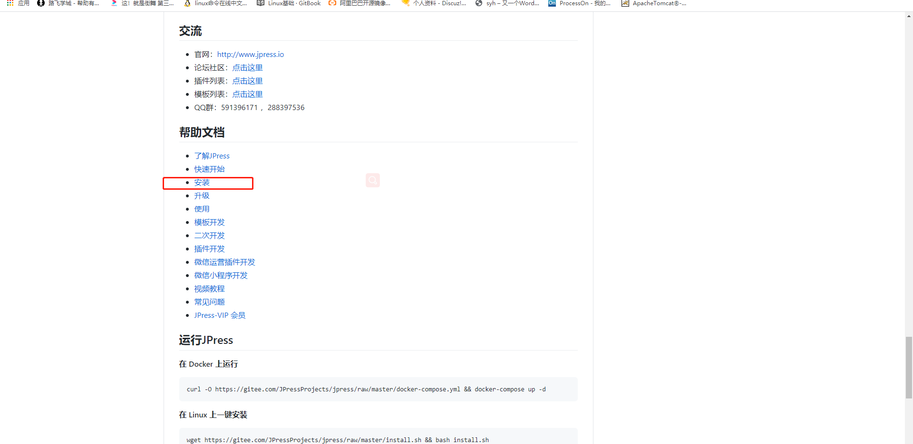

# 期末架构

## 第8章 Java和Tamcat


### 8.1、tomcat及tomcat架构

#### Tomcat与JavaWeb开发


Tomcat是Apache软件基金会（Apache Software Foundation）项目中的一个核心项目，由Apache、Sun和其他一些公司及个人共同开发而成。

Tomcat服务器是一个免费的开放源代码的Web应用服务器，属于轻量级应用服务器，在中小型系统和并发访问用户不是很多的场合下被普遍使用，是开发和调试JSP程序的首选。

Tomcat和Nginx、Apache(httpd)、lighttpd等Web服务器一样，具有处理HTML页面的功能，另外它还是一个Servlet和JSP容器，独立的Servlet容器是Tomcat的默认模式。

Tomcat处理静态HTML的能力不如Nginx/Apache服务器。

Java容器还有resin、weblogic等。

#### Web运行原理

学了LNMP之后，对于Web网站的解析过程，相比各位已经有所了解，当超哥在浏览器中输入一个URL之后，经过DNS解析之后对应的服务器就会吧该URL对应的网页，通过远程Web服务器发送到客户端，且由客户端的浏览器将其展示出来。


Web服务器上存放了各种静态文件，如HTML，图片，音视频等，这些信息通过超文本技术相互连接，也就是HTML文件，且采用HTTP协议和Web服务器通信，这样就能拿到Web服务器上的各种资料。


#### Tomcat架构


Tomcat本身完全用Java语言开发，Tomcat目前可以和大部分Web服务器（IIS，Apache，Nginx）一起工作，且Tomcat是运行Java代码等容器。

常见用法是，nginx+tomcat，实现动静态请求分离。


Tomcat本身由一系列可配置等组件构成，核心组件是Servlet容器组件，Servlet就是一个用java语言开发，运行在服务器上的插件，用于解析动态的用户请求。

在使用java开发的公司，进行代码部署，常见做法是：

- 将Tomcat作为独立的Web服务器单独运行，Tomcat的运行必须依赖于Java虚拟机进程（Java Virtual Machine，JNM）进程。
- JVM虚拟机解决了JAVA程序，可以运行在任何平台上，解决了可移植性。


### 8.2、部署jdk与tomcat

#### JDK

Tomcat运行必须得有java环境，这个JDK是：

```shell
Java Development Kit（JDK）sun公司对Java开发人员发布的免费软件开发工具包（SDK，Software development kit）
```

JDK是 Java 语言的软件开发工具包，主要用于移动设备、嵌入式设备上的java应用程序。JDK是整个java开发的核心，它包含了JAVA的运行环境（JVM+Java系统类库）和JAVA工具。

JDK包含了一批用于Java开发的组件，其中包括：

```shell
javac：编译器，将后缀名为.java的源代码编译成后缀名为“.class”的字节码
java：运行工具，运行.class的字节码
jar：打包工具，将相关的类文件打包成一个文件
javadoc：文档生成器，从源码注释中提取文档，注释需匹配规范
jdb debugger：调试工具
jps：显示当前java程序运行的进程状态
javap：反编译程序
appletviewer：运行和调试applet程序的工具，不需要使用浏览器
javah：从Java类生成C头文件和C源文件。这些文件提供了连接胶合，使Java和C代码可进行交互。
javaws：运行JNLP程序
extcheck：一个检测jar包冲突的工具
apt：注释处理工具 
jhat：java堆分析工具
jstack：栈跟踪程序
jstat：JVM检测统计工具
jstatd：jstat守护进程
jinfo：获取正在运行或崩溃的java程序配置信息
jmap：获取java进程内存映射信息
idlj：IDL-to-Java编译器。将IDL语言转化为java文件 
policytool：一个GUI的策略文件创建和管理工具
jrunscript：命令行脚本运行
```


JDK下载页面

```
http://www.oracle.com/technetwork/java/javase/downloads/index.html
```

apache-tomcat下载页面

```
https://tomcat.apache.org/download-90.cgi
```


#### 安装Tomcat&JDK

```shell
安装时候选择tomcat软件版本要与程序开发使用的版本一致。jdk版本要进行与tomcat保持一致。

准备2个linux虚拟机，
一个运行nginx进行负载均衡
一个用来运行tomcat

nginx机器：192.168.37.120
tomcat机器：192.168.37.121
jdk版本：
tomcat版本：

```

系统环境说明

```shell
[root@tomcat-server /]# cat /etc/redhat-release
CentOS Linux release 7.5.1804 (Core) 


[root@tomcat-server /]# uname -a
Linux tomcat-server 3.10.0-862.el7.x86_64 #1 SMP Fri Apr 20 16:44:24 UTC 2018 x86_64 x86_64 x86_64 GNU/Linux

sed -i 's#SELINUX=enforcing#SELINUX=disabled#g' /etc/selinux/config 
[root@tomcat01 ~]# getenforce
Disabled

[root@tomcat-server /]# systemctl status firewalld
● firewalld.service - firewalld - dynamic firewall daemon
   Loaded: loaded (/usr/lib/systemd/system/firewalld.service; enabled; vendor preset: enabled)
   Active: inactive (dead) since 四 2020-11-12 15:12:48 CST; 4s ago
     Docs: man:firewalld(1)
  Process: 1050 ExecStart=/usr/sbin/firewalld --nofork --nopid $FIREWALLD_ARGS (code=exited, status=0/SUCCESS)
 Main PID: 1050 (code=exited, status=0/SUCCESS)

[root@tomcat01 ~]#
[root@tomcat-server /]# iptables -L
Chain INPUT (policy ACCEPT)
target     prot opt source               destination         

Chain FORWARD (policy ACCEPT)
target     prot opt source               destination         

Chain OUTPUT (policy ACCEPT)
target     prot opt source               destination 
```


安装JDK

```shell
#拖动文件到linxu
yum install lrzsz -y 


[root@tomcat-server app]# ls
jdk-8u60-linux-x64.tar.gz


#解压缩
[root@tomcat-server app]# tar -zxf jdk-8u60-linux-x64.tar.gz 
[root@tomcat-server app]# ls
jdk1.8.0_60  jdk-8u60-linux-x64.tar.gz


# 创建软连接
[root@tomcat-server app]# ln -s /app/jdk1.8.0_60 jdk1.8


# 替换配置文件
sed -i.ori '$a export JAVA_HOME=/app/jdk1.8\nexport PATH=$JAVA_HOME/bin:$JAVA_HOME/jre/bin:$PATH\nexport CLASSPATH=.:$JAVA_HOME/lib:$JAVA_HOME/jre/lib:$JAVA_HOME/lib/tools.jar' /etc/profile

解释：$表示再结尾
	 a --表示追加后面的内容
	 -n --表示换行

# 读取配置文件
source /etc/profile

# 检查配置
[root@tomcat-server jdk1.8]# echo $PATH
/app/jdk1.8/bin:/app/jdk1.8/jre/bin:/usr/local/sbin:/usr/local/bin:/usr/sbin:/usr/bin:/root/bin


# 测试JDK是否安装好

[root@tomcat-server jdk1.8]# java -version
java version "1.8.0_60"
Java(TM) SE Runtime Environment (build 1.8.0_60-b27)
Java HotSpot(TM) 64-Bit Server VM (build 25.60-b23, mixed mode)

```

部署Tomcat

```shell
#获取tomcat软件包
cd app \
wget https://mirror.bit.edu.cn/apache/tomcat/tomcat-8/v8.5.59/bin/apache-tomcat-8.5.59.tar.gz

[root@tomcat-server app]# ls
apache-tomcat-8.5.59.tar.gz  jdk1.8  jdk1.8.0_60  jdk-8u60-linux-x64.tar.gz


#解压缩
[root@tomcat-server app]# tar -zxf apache-tomcat-8.5.59.tar.gz 
[root@tomcat-server app]# ls
apache-tomcat-8.5.59  apache-tomcat-8.5.59.tar.gz  jdk1.8  jdk1.8.0_60  jdk-8u60-linux-x64.tar.gz


#创建软链接
[root@tomcat-server app]# ln -s /app/apache-tomcat-8.5.59  /app/tomcat8.5


#配置环境变量
echo 'export TOMCAT_HOME=/app/tomcat8.5' >> /etc/profile


#读取生效
source /etc/profile


#修改属组、属主
chown -R root.root /app/jdk1.8 /app/tomcat8.5/


#检查tomcat是否安装正确
[root@tomcat-server app]# /app/tomcat8.5/bin/version.sh 
Using CATALINA_BASE:   /app/tomcat8.5
Using CATALINA_HOME:   /app/tomcat8.5
Using CATALINA_TMPDIR: /app/tomcat8.5/temp
Using JRE_HOME:        /app/jdk1.8
Using CLASSPATH:       /app/tomcat8.5/bin/bootstrap.jar:/app/tomcat8.5/bin/tomcat-juli.jar
Using CATALINA_OPTS:   
Server version: Apache Tomcat/8.5.59
Server built:   Oct 6 2020 16:57:18 UTC
Server number:  8.5.59.0
OS Name:        Linux
OS Version:     3.10.0-862.el7.x86_64
Architecture:   amd64
JVM Version:    1.8.0_60-b27
JVM Vendor:     Oracle Corporation

```


### 8.3、运行启动及tomcat日志说明


#### Tomcat目录介绍

```shell
# 目录解释

[root@tomcat-server work]# tree /app/tomcat8.5/ -L 1
/app/tomcat8.5/
├── bin						 # 存放tomcat管理脚本
├── BUILDING.txt
├── conf					 # tomcat 配置文件存放目录
├── CONTRIBUTING.md
├── lib						 # web应用调用的jar包存放路径
├── LICENSE
├── logs					 # tomcat 日志存放目录，catalina.out 为主要输出日志
├── NOTICE
├── README.md
├── RELEASE-NOTES
├── RUNNING.txt
├── temp					  # 存放临时文件
├── webapps				 	  # web程序存放目录
└── work					  # 存放编译产生的.java 与 .class文件


# 日志说明
```


#### webapps目录介绍

```shell

[root@tomcat-server work]# tree /app/tomcat8.5/webapps/ -L 1
/app/tomcat8.5/webapps/
├── docs			# tomcat 帮助文档
├── examples		 # web应用实例
├── host-manager	 # 主机管理
├── manager			 # 管理
└── ROOT			 # 默认站点根目录


5 directories, 0 files
```


#### Tomcat配置文件

```shell

[root@tomcat-server tomcat8.5]# tree /app/tomcat8.5/conf/ -L 1
/app/tomcat8.5/conf/
├── catalina.policy
├── catalina.properties
├── context.xml
├── jaspic-providers.xml
├── jaspic-providers.xsd
├── logging.properties
├── server.xml					 # tomcat主配置，例如更改端口等
├── tomcat-users.xml				# tomcat管理用户配置
├── tomcat-users.xsd
└── web.xml

```


#### Tomcat管理

```
启动，关闭程序
/app/tomcat8.5/bin/startup.sh 
/opt/tomcat/bin/shutdown.sh
```

启动关闭

```shell
[root@tomcat-server app]# /app/tomcat8.5/bin/startup.sh 
Using CATALINA_BASE:   /app/tomcat8.5
Using CATALINA_HOME:   /app/tomcat8.5
Using CATALINA_TMPDIR: /app/tomcat8.5/temp
Using JRE_HOME:        /app/jdk1.8
Using CLASSPATH:       /app/tomcat8.5/bin/bootstrap.jar:/app/tomcat8.5/bin/tomcat-juli.jar
Using CATALINA_OPTS:   
Tomcat started.
[root@tomcat-server app]# 
[root@tomcat-server app]# 
[root@tomcat-server app]# netstat -tunpl
Active Internet connections (only servers)
Proto Recv-Q Send-Q Local Address           Foreign Address         State       PID/Program name    
tcp        0      0 0.0.0.0:22              0.0.0.0:*               LISTEN      1425/sshd           
tcp        0      0 127.0.0.1:25            0.0.0.0:*               LISTEN      1563/master         
tcp6       0      0 127.0.0.1:8005          :::*                    LISTEN      17233/java          
tcp6       0      0 :::8080                 :::*                    LISTEN      17233/java          
tcp6       0      0 :::22                   :::*                    LISTEN      1425/sshd           
tcp6       0      0 ::1:25                  :::*                    LISTEN      1563/master         
udp        0      0 127.0.0.1:323           0.0.0.0:*                           1014/chronyd        
udp6       0      0 ::1:323                 :::*                                1014/chronyd  

# 关闭
[root@tomcat-server app]# /app/tomcat8.5/bin/shutdown.sh 
Using CATALINA_BASE:   /app/tomcat8.5
Using CATALINA_HOME:   /app/tomcat8.5
Using CATALINA_TMPDIR: /app/tomcat8.5/temp
Using JRE_HOME:        /app/jdk1.8
Using CLASSPATH:       /app/tomcat8.5/bin/bootstrap.jar:/app/tomcat8.5/bin/tomcat-juli.jar
Using CATALINA_OPTS:   
[root@tomcat-server app]# netstat -tunpl
Active Internet connections (only servers)
Proto Recv-Q Send-Q Local Address           Foreign Address         State       PID/Program name    
tcp        0      0 0.0.0.0:22              0.0.0.0:*               LISTEN      1425/sshd           
tcp        0      0 127.0.0.1:25            0.0.0.0:*               LISTEN      1563/master         
tcp6       0      0 :::22                   :::*                    LISTEN      1425/sshd           
tcp6       0      0 ::1:25                  :::*                    LISTEN      1563/master         
udp        0      0 127.0.0.1:323           0.0.0.0:*                           1014/chronyd        
udp6       0      0 ::1:323                 :::*                                1014/chronyd  
```


#### 启动tomcat访问

```shell
[root@tomcat-server app]# /app/tomcat8.5/bin/startup.sh 
Using CATALINA_BASE:   /app/tomcat8.5
Using CATALINA_HOME:   /app/tomcat8.5
Using CATALINA_TMPDIR: /app/tomcat8.5/temp
Using JRE_HOME:        /app/jdk1.8
Using CLASSPATH:       /app/tomcat8.5/bin/bootstrap.jar:/app/tomcat8.5/bin/tomcat-juli.jar
Using CATALINA_OPTS:   
Tomcat started.

```


日志检查

```shell
[root@tomcat-server ~]# tail -f /app/tomcat8.5/logs/catalina.out 
12-Nov-2020 16:12:07.239 信息 [localhost-startStop-1] org.apache.catalina.startup.HostConfig.deployDirectory 把web 应用程序部署到目录 [/app/apache-tomcat-8.5.59/webapps/docs]
12-Nov-2020 16:12:07.261 信息 [localhost-startStop-1] org.apache.catalina.startup.HostConfig.deployDirectory Web应用程序目录[/app/apache-tomcat-8.5.59/webapps/docs]的部署已在[22]毫秒内完成
12-Nov-2020 16:12:07.261 信息 [localhost-startStop-1] org.apache.catalina.startup.HostConfig.deployDirectory 把web 应用程序部署到目录 [/app/apache-tomcat-8.5.59/webapps/examples]
12-Nov-2020 16:12:07.558 信息 [localhost-startStop-1] org.apache.catalina.startup.HostConfig.deployDirectory Web应用程序目录[/app/apache-tomcat-8.5.59/webapps/examples]的部署已在[296]毫秒内完成
12-Nov-2020 16:12:07.558 信息 [localhost-startStop-1] org.apache.catalina.startup.HostConfig.deployDirectory 把web 应用程序部署到目录 [/app/apache-tomcat-8.5.59/webapps/host-manager]
12-Nov-2020 16:12:07.597 信息 [localhost-startStop-1] org.apache.catalina.startup.HostConfig.deployDirectory Web应用程序目录[/app/apache-tomcat-8.5.59/webapps/host-manager]的部署已在[39]毫秒内完成
12-Nov-2020 16:12:07.597 信息 [localhost-startStop-1] org.apache.catalina.startup.HostConfig.deployDirectory 把web 应用程序部署到目录 [/app/apache-tomcat-8.5.59/webapps/manager]
12-Nov-2020 16:12:07.625 信息 [localhost-startStop-1] org.apache.catalina.startup.HostConfig.deployDirectory Web应用程序目录[/app/apache-tomcat-8.5.59/webapps/manager]的部署已在[28]毫秒内完成
12-Nov-2020 16:12:07.641 信息 [main] org.apache.coyote.AbstractProtocol.start 开始协议处理句柄["http-nio-8080"]
12-Nov-2020 16:12:07.693 信息 [main] org.apache.catalina.startup.Catalina.start Server startup in 847 ms
```


#### 设定tomcat开机自启

```shell
[root@tomcat-server ~]# tail -3 /etc/rc.local 
export JAVA_HOME=/app/jdk1.8
/app/tomcat8.5/bin/startup.sh
chmod +x /etc/rc.local
```


### 8.4、tomcat管理功能

#### Tomcat管理功能

生产环境一般禁用，或者设置访问权限。

Tomcat管理功能用于对Tomcat自身以及部署在Tomcat上的应用进行管理的web应用。在默认情况下是处于禁用状态的。

默认访问不了,没有账户密码


如果需要开启这个功能，就需要配置管理用户，即配置tomcat-users.xml 文件。

```shell
# 配置文件
[root@tomcat-server /]# tail -4  /app/tomcat8.5/conf/tomcat-users.xml
 <role rolename="manager-gui"/>
 <role rolename="admin-gui"/>
 <user username="tomcat" password="tomcat" roles="manager-gui,admin-gui"/>
</tomcat-users>


# 修改配置文件，重启服务
[root@tomcat-server /]# /opt/tomcat/bin/shutdown.sh
Using CATALINA_BASE:   /opt/tomcat
Using CATALINA_HOME:   /opt/tomcat
Using CATALINA_TMPDIR: /opt/tomcat/temp
Using JRE_HOME:        /opt/jdk
Using CLASSPATH:       /opt/tomcat/bin/bootstrap.jar:/opt/tomcat/bin/tomcat-juli.jar
[root@tomcat-server /]# /opt/tomcat/bin/startup.sh
Using CATALINA_BASE:   /opt/tomcat
Using CATALINA_HOME:   /opt/tomcat
Using CATALINA_TMPDIR: /opt/tomcat/temp
Using JRE_HOME:        /opt/jdk
Using CLASSPATH:       /opt/tomcat/bin/bootstrap.jar:/opt/tomcat/bin/tomcat-juli.jar
Tomcat started.
```

查看管理后台页面


这里发现还是不能进入、提示403无权限、解决方法如下：

```shell
#由于/app/tomcat8.5/conf/Catalina/localhost没有manager.xml文件、添加并修改成以下内容即可：
[root@tomcat-server localhost]# cat manager.xml 
<Context privileged="true" antiResourceLocking="false"
         docBase="${catalina.home}/webapps/manager">
    <Valve className="org.apache.catalina.valves.RemoteAddrValve" allow="^.*$" />
</Context>

```

此时再次访问、就能成功访问以下界面


当点击HostManager时出现403权限不足；解决办法如下：

```shell
分别在/app/tomcat8.5/webapps/manager/META-INF和/app/tomcat8.5/webapps/host-manager/META-INF目录下修改context.xml

#修改之前做好备份
cp /app/tomcat8.5/webapps/manager/META-INF/context.xml{,.bak}
cp /app/tomcat8.5/webapps/host-manager/META-INF/context.xml{,.bak}


[root@tomcat-server META-INF]# tail -6 context.xml
<Context antiResourceLocking="false" privileged="true" >
  <CookieProcessor className="org.apache.tomcat.util.http.Rfc6265CookieProcessor"
                   sameSiteCookies="strict" />
  <Valve className="org.apache.catalina.valves.RemoteAddrValve" allow="^.*$"/>		#主要更改这里、allow允许所有机器访问
  <Manager sessionAttributeValueClassNameFilter="java\.lang\.(?:Boolean|Integer|Long|Number|String)|org\.apache\.catalina\.filters\.CsrfPreventionFilter\$LruCache(?:\$1)?|java\.util\.(?:Linked)?HashMap"/>
</Context>


#然后停止tomcat服务、在重启即可
/app/tomcat8.5/bin/shutdown.sh 
/app/tomcat8.5/bin/startup.sh 
```

再次访问hostmanager


### 8.5、tomcat的主要配置文件

#### Tomcat配置文件解析

```shell
/app/tomcat8.5/conf/server.xml

# 默认配置内容很多
[root@tomcat-server /]# grep -Ev  '^#|^$' /app/tomcat8.5/conf/server.xml


# 主要的标签部分，通过如下的缩进关系，了解他们的关系
<server>                                    # 顶级组件，在配置的顶层，运行一个JVM中的tomcat实例
     <service>                        # 容器类组件，可以包含其他组件，如engine，host，context
         <connector />        # 连接类组件，连接用户请求到tomcat,如connector，类似listen监听端口
               <engine>        # 核心容器组件，通过connector接受用户请求，处理请求，转发给虚拟主机host
                     <host>    # 类似于nginx的虚拟主机
                         <context>  </context>  # 最内层的组件，不得嵌套，配置web站点，webapp目录，类似于nginx配置的alias定义的目录。
                             </host>
                             <host>
                         <context></context>
                     </host>
               </engine>
         </service>
</server>
```


#### 组件名称

| **组件名称**          | **功能介绍**                                                 |
| --------------------- | ------------------------------------------------------------ |
| **engine**            | 核心容器组件，catalina引擎，负责通过connector接收用户请求，并处理请求，将请求转至对应的虚拟主机host。 |
| **host**              | 类似于httpd中的虚拟主机，一般而言支持基于FQDN的虚拟主机。    |
| **context**           | 定义一个应用程序，是一个最内层的容器类组件（不能再嵌套）。配置context的主要目的指定对应对的webapp的根目录，类似于httpd的alias，其还能为webapp指定额外的属性，如部署方式等。 |
| **connector**         | 接收用户请求，类似于httpd的listen配置监听端口的。            |
| **service（服务）**   | 将connector关联至engine，因此一个service内部可以有多个connector，但只能有一个引擎engine。service内部有两个connector，一个engine。因此，一般情况下一个server内部只有一个service，一个service内部只有一个engine，但一个service内部可以有多个connector。 |
| **server**            | 表示一个运行于JVM中的tomcat实例。                            |
| **Valve**             | 阀门，拦截请求并在将其转至对应的webapp前进行某种处理操作，可以用于任何容器中，比如记录日志(access log valve)、基于IP做访问控制(remote address filter valve)。 |
| **logger**            | 日志记录器，用于记录组件内部的状态信息，可以用于除context外的任何容器中。 |
| **realm**             | 可以用于任意容器类的组件中，关联一个用户认证库，实现认证和授权。可以关联的认证库有两种：UserDatabaseRealm、MemoryRealm和JDBCRealm。 |
| **UserDatabaseRealm** | 使用JNDI自定义的用户认证库。                                 |
| **MemoryRealm**       | 认证信息定义在tomcat-users.xml中。                           |
| **JDBCRealm**         | 认证信息定义在数据库中，并通过JDBC连接至数据库中查找认证用户。 |


#### server.xml注释版

```shell
<?xml version='1.0' encoding='utf-8'?>
<!--
<Server>元素代表整个容器,是Tomcat实例的顶层元素.由org.apache.catalina.Server接口来定义.它包含一个<Service>元素.并且它不能做为任何元素的子元素.
    port指定Tomcat监听shutdown命令端口.终止服务器运行时,必须在Tomcat服务器所在的机器上发出shutdown命令.该属性是必须的.
    shutdown指定终止Tomcat服务器运行时,发给Tomcat服务器的shutdown监听端口的字符串.该属性必须设置
-->
<Server port="8005" shutdown="SHUTDOWN">
  <Listener className="org.apache.catalina.startup.VersionLoggerListener" />
  <Listener className="org.apache.catalina.core.AprLifecycleListener" SSLEngine="on" />
  <Listener className="org.apache.catalina.core.JreMemoryLeakPreventionListener" />
  <Listener className="org.apache.catalina.mbeans.GlobalResourcesLifecycleListener" />
  <Listener className="org.apache.catalina.core.ThreadLocalLeakPreventionListener" />
  <GlobalNamingResources>
    <Resource name="UserDatabase" auth="Container"
              type="org.apache.catalina.UserDatabase"
              description="User database that can be updated and saved"
              factory="org.apache.catalina.users.MemoryUserDatabaseFactory"
              pathname="conf/tomcat-users.xml" />
  </GlobalNamingResources>
  <!--service服务组件-->
  <Service name="Catalina">
    <!-- Connector主要参数说明（见下表） -->
    <Connector port="8080" protocol="HTTP/1.1"
               connectionTimeout="20000"
               redirectPort="8443" />
    <Connector port="8009" protocol="AJP/1.3" redirectPort="8443" />
    <!--engine,核心容器组件,catalina引擎,负责通过connector接收用户请求,并处理请求,将请求转至对应的虚拟主机host
        defaultHost指定缺省的处理请求的主机名，它至少与其中的一个host元素的name属性值是一样的
    -->
    <Engine name="Catalina" defaultHost="localhost">
      <!--Realm表示存放用户名，密码及role的数据库-->
      <Realm className="org.apache.catalina.realm.LockOutRealm">
        <Realm className="org.apache.catalina.realm.UserDatabaseRealm"
               resourceName="UserDatabase"/>
      </Realm>
      <!-- 详情常见下表（host参数详解）-->
      <Host name="localhost"  appBase="webapps"
            unpackWARs="true" autoDeploy="true">
        <!-- 详情常见下表（Context参数说明 ）-->
        <Context path="" docBase="" debug=""/>
        <Valve className="org.apache.catalina.valves.AccessLogValve" directory="logs"
               prefix="localhost_access_log" suffix=".txt"
               pattern="%h %l %u %t &quot;%r&quot; %s %b" />
      </Host>
    </Engine>
  </Service>
</Server>
```

#### Context参数说明

| **参数**       | **参数说明**                                                 |
| -------------- | ------------------------------------------------------------ |
| **Context**    | 表示一个web应用程序，通常为WAR文件                           |
| **docBase**    | 应用程序的路径或者是WAR文件存放的路径,也可以使用相对路径，起始路径为此Context所属Host中appBase定义的路径。 |
| **path**       | 表示此web应用程序的url的前缀，这样请求的url为http://localhost:8080/path/**** |
| **reloadable** | 这个属性非常重要，如果为true，则tomcat会自动检测应用程序的/WEB-INF/lib 和/WEB-INF/classes目录的变化，自动装载新的应用程序，可以在不重启tomcat的情况下改变应用程序 |


### 8.6、部署jpress

#### Tomcat部署jpress

tomcat部署代码的方式有两种：

- 开发打包好的代码，直接放在webapps目录下
- 使用开发工具将程序打包成war包，再传到webapps目录下

jpress官网：[http://jpress.io](http://jpress.io/)

下载地址：https://github.com/JpressProjects/jpress

下载教程：





```shell
JPress，一个专业的建站神器。
部署：

1.安装配置数据库
yum install mariadb-server mariadb -y
systemctl start mariadb.service

2.配置数据库信息
mysql
create database jpress DEFAULT CHARACTER SET utf8;
grant all on jpress.* to jpress@'localhost' identified by '123456';
exit

3.上线jpress代码,上传代码至webapps目录即可,tomcat会自动解压war包
[root@tomcat-server webapps]# ll
总用量 70008
drwxr-x---. 15 root root     4096 11月 12 15:49 docs
drwxr-x---.  6 root root       83 11月 12 15:49 examples
drwxr-x---.  5 root root       87 11月 12 18:00 host-manager
drwxr-x---.  6 root root       86 11月 12 20:59 jpress-v3.3.0				#自动解压的目录
-rw-r--r--.  1 root root 71677863 11月 12 20:54 jpress-v3.3.0.war
drwxr-x---.  6 root root      114 11月 12 15:49 manager
drwxr-x---.  3 root root     4096 11月 12 15:49 ROOT


4.此时我门可以直接访问该站点
http://192.168.37.121:8080/jpress-v3.3.0/install
```


通过指引、一步一步部署


重启tomcat

```shell
[root@tomcat-server /]# /app/tomcat8.5/bin/shutdown.sh 
Using CATALINA_BASE:   /app/tomcat8.5
Using CATALINA_HOME:   /app/tomcat8.5
Using CATALINA_TMPDIR: /app/tomcat8.5/temp
Using JRE_HOME:        /app/jdk1.8
Using CLASSPATH:       /app/tomcat8.5/bin/bootstrap.jar:/app/tomcat8.5/bin/tomcat-juli.jar
Using CATALINA_OPTS: 


[root@tomcat-server /]# /app/tomcat8.5/bin/startup.sh 
Using CATALINA_BASE:   /app/tomcat8.5
Using CATALINA_HOME:   /app/tomcat8.5
Using CATALINA_TMPDIR: /app/tomcat8.5/temp
Using JRE_HOME:        /app/jdk1.8
Using CLASSPATH:       /app/tomcat8.5/bin/bootstrap.jar:/app/tomcat8.5/bin/tomcat-juli.jar
Using CATALINA_OPTS:   
Tomcat started.

```


再次访问jpress站点

```
http://192.168.37.121:8080/jpress-v3.3.0/
```


#### 访问jpress管理后台

http://192.168.37.121:8080/jpress-v3.3.0/admin/login


写文章


查看编写的文章


#### 指定url访问

类似nginx的localtion、能够指定访问url和实际寻找的地址资源

```shell
     
     [root@tomcat-server /]# vim /app/tomcat8.5/conf/server.xml 
     
      <Host name="localhost"  appBase="webapps"
            unpackWARs="true" autoDeploy="true">

      <Context path="/jpress" docBase="/app/tomcat8.5/webapps/jpress-v3.3.0" 
               debug="0" reloadable="false" crossContext="true"/>
               ...

      </Host>


path="/jpress"--表示url访问，如192.168.37.121/jpress
docBase="/app/tomcat8.5/webapps/jpress-v3.3.0"  --实际它去这里寻找站点
```


### 8.7、tomcat多实例

#### Tomcat多实例

多实例指的是，同一个服务，基于不同的端口，运行多个实例（进程），例如

- mysql多实例，一台机器，可以运行多个独立的数据库，端口分别是3306,3307,3308
- nginx多虚拟主机，基于不同的ip，域名，端口

多实例的作用是，如：

- 一个服务器可以运行多个站点，如www.chaoge_linux.com，如www.chaoge_python.com，属于独立的服务
- 一个机器运行一个站点多个实例，进行负载均衡，不过这种形式还是分机器为好


#### 多实例配置

```shell
1.拷贝多份程序文件，修改端口，以区分多实例，准备2份tomcat代码
[root@tomcat-server app]# pwd
/app

#复制两份代码目录
[root@tomcat-server app]# cp -a apache-tomcat-8.5.59 tomcat1
[root@tomcat-server app]# cp -a apache-tomcat-8.5.59 tomcat2


[root@tomcat-server app]# ls
apache-tomcat-8.5.59  apache-tomcat-8.5.59.tar.gz  jdk1.8  jdk1.8.0_60  jdk-8u60-linux-x64.tar.gz  tomcat1  tomcat2  tomcat8.5


2.修改配置文件，修改端口，以启动多实例
[root@tomcat-server app]# sed -i 's#8005#8011#;s#8080#8081#' /app/tomcat1/conf/server.xml 
[root@tomcat-server app]# sed -i 's#8005#8012#;s#8080#8082#' /app/tomcat2/conf/server.xml 


3.可以比较下配置文件
[root@tomcat-server app]# diff /app/tomcat1/conf/server.xml /app/tomcat2/conf/server.xml 
22c22
< <Server port="8011" shutdown="SHUTDOWN">
---
> <Server port="8012" shutdown="SHUTDOWN">
67c67
<          Define a non-SSL/TLS HTTP/1.1 Connector on port 8081
---
>          Define a non-SSL/TLS HTTP/1.1 Connector on port 8082
69c69
<     <Connector port="8081" protocol="HTTP/1.1"
---
>     <Connector port="8082" protocol="HTTP/1.1"
75c75
<                port="8081" protocol="HTTP/1.1"
---
>                port="8082" protocol="HTTP/1.1"


4.启动2个实例tomcat
[root@tomcat-server app]# /app/tomcat1/bin/startup.sh 
Using CATALINA_BASE:   /app/tomcat1
Using CATALINA_HOME:   /app/tomcat1
Using CATALINA_TMPDIR: /app/tomcat1/temp
Using JRE_HOME:        /app/jdk1.8
Using CLASSPATH:       /app/tomcat1/bin/bootstrap.jar:/app/tomcat1/bin/tomcat-juli.jar
Using CATALINA_OPTS:   
Tomcat started.
[root@tomcat-server app]# 
[root@tomcat-server app]# 
[root@tomcat-server app]# /app/tomcat2/bin/startup.sh 
Using CATALINA_BASE:   /app/tomcat2
Using CATALINA_HOME:   /app/tomcat2
Using CATALINA_TMPDIR: /app/tomcat2/temp
Using JRE_HOME:        /app/jdk1.8
Using CLASSPATH:       /app/tomcat2/bin/bootstrap.jar:/app/tomcat2/bin/tomcat-juli.jar
Using CATALINA_OPTS:   
Tomcat started.

#多实例的进程
[root@tomcat-server app]# !ps
ps -ef|grep java
root       2720      1 25 13:54 pts/0    00:00:15 /app/jdk1.8/bin/java -Djava.util.logging.config.file=/app/tomcat1/conf/logging.properties -Djava.util.logging.manager=org.apache.juli.ClassLoaderLogManager -Djdk.tls.ephemeralDHKeySize=2048 -Djava.protocol.handler.pkgs=org.apache.catalina.webresources -Dorg.apache.catalina.security.SecurityListener.UMASK=0027 -Dignore.endorsed.dirs= -classpath /app/tomcat1/bin/bootstrap.jar:/app/tomcat1/bin/tomcat-juli.jar -Dcatalina.base=/app/tomcat1 -Dcatalina.home=/app/tomcat1 -Djava.io.tmpdir=/app/tomcat1/temp org.apache.catalina.startup.Bootstrap start
root       2743      1 29 13:54 pts/0    00:00:17 /app/jdk1.8/bin/java -Djava.util.logging.config.file=/app/tomcat2/conf/logging.properties -Djava.util.logging.manager=org.apache.juli.ClassLoaderLogManager -Djdk.tls.ephemeralDHKeySize=2048 -Djava.protocol.handler.pkgs=org.apache.catalina.webresources -Dorg.apache.catalina.security.SecurityListener.UMASK=0027 -Dignore.endorsed.dirs= -classpath /app/tomcat2/bin/bootstrap.jar:/app/tomcat2/bin/tomcat-juli.jar -Dcatalina.base=/app/tomcat2 -Dcatalina.home=/app/tomcat2 -Djava.io.tmpdir=/app/tomcat2/temp org.apache.catalina.startup.Bootstrap start
root       2887   1771  0 13:55 pts/0    00:00:00 grep --color=auto java


5.检查端口
#多实例的端口
[root@tomcat-server app]# ss -tunpl|grep java
tcp    LISTEN     0      1      ::ffff:127.0.0.1:8011                 :::*                   users:(("java",pid=2720,fd=62))
tcp    LISTEN     0      1      ::ffff:127.0.0.1:8012                 :::*                   users:(("java",pid=2743,fd=62))
tcp    LISTEN     0      100      :::8081                 :::*                   users:(("java",pid=2720,fd=52))
tcp    LISTEN     0      100      :::8082                 :::*                   users:(("java",pid=2743,fd=52)


6.修改配置，以区分两个tomcat实例
[root@tomcat-server app]# echo '我是tomcat1'>> /app/tomcat1/webapps/ROOT/index.jsp 
[root@tomcat-server app]# echo '我是tomcat2'>> /app/tomcat2/webapps/ROOT/index.jsp 


7.访问tomcat站点

http://192.168.37.121:8081
http://192.168.37.121:8082

```


此时我们就达到了如下的效果


### 8.8、nginx反向代理tomcat服务器

#### Tomcat反向代理集群

超哥部署操作如下

```shell
1.部署好nginx服务，进行负载均衡使用，这里应该应该用多台机器操作，不过对于集群的负载均衡，基于1台机器也可以实现，这里用一个单机部署、模拟类似两台机器的站点

yum install nginx -y

2.修改nginx配置文件，进行负载均衡，tomcat

    upstream tomcatlb{

         server 192.168.37.121:8081;
         server 192.168.37.121:8082;
        }
    server {
        listen      80;
        server_name  _;
        
        location /{

                root html;
                index index.jps index.htm;
                proxy_pass http://tomcatlb;
                }
        }

#注意upstream 要写在http内
3.重新加载nginx
[root@nginx-server nginx]# nginx -t 
[root@nginx-server nginx]# nginx -s reload

```

验证负载均衡

```shell
[root@nginx-server nginx]# curl -s  192.168.37.120 |tail -1
我是tomcat2
[root@nginx-server nginx]# curl -s  192.168.37.120 |tail -1
我是tomcat1

```

浏览器访问效果

```shell
http://1192.168.37.120/  
分别强制刷新查看结果，默认轮询机制
```


网页测试结果


### 8.9、zabbix监控tomcat


#### 客户端开发java状态监控

在tomcat机器上配置如下

```shell
1.使用jps命令检测java的进程信息，内存使用等
[root@tomcat-server app]# jps -lvm
3115 sun.tools.jps.Jps -lvm -Denv.class.path=.:/app/jdk1.8/lib:/app/jdk1.8/jre/lib:/app/jdk1.8/lib/tools.jar -Dapplication.home=/app/jdk1.8.0_60 -Xms8m	#命令本身的进程

3100 org.apache.catalina.startup.Bootstrap start -Djava.util.logging.config.file=/app/tomcat8.5/conf/logging.properties -Djava.util.logging.manager=org.apache.juli.ClassLoaderLogManager -Djdk.tls.ephemeralDHKeySize=2048 -Djava.protocol.handler.pkgs=org.apache.catalina.webresources -Dorg.apache.catalina.security.SecurityListener.UMASK=0027 -Dignore.endorsed.dirs= -Dcatalina.base=/app/tomcat8.5 -Dcatalina.home=/app/tomcat8.5 -Djava.io.tmpdir=/app/tomcat8.5/temp


3.修改tomcat配置文件，开启远程监控
vim /app/tomcat8.5/bin/catalina.sh #在# OS specific support.  $var _must_ be set to either true or false.下追加

CATALINA_OPTS="${CATALINA_OPTS} -Djava.rmi.server.hostname=192.168.37.121"
CATALINA_OPTS="${CATALINA_OPTS} -Dcom.sun.management.jmxremote=true"
CATALINA_OPTS="${CATALINA_OPTS} -Dcom.sun.management.jmxremote.port=12345"
CATALINA_OPTS="${CATALINA_OPTS} -Dcom.sun.management.jmxremote.ssl=false"
CATALINA_OPTS="${CATALINA_OPTS} -Dcom.sun.management.jmxremote.authenticate=false"

4.重启tomcat
 /opt/tomcat/bin/shutdown.sh
 /opt/tomcat/bin/startup.sh

5.检查端口
[root@tomcat-server bin]# netstat -tunpl|grep 12345
tcp6       0      0 :::12345                :::*                    LISTEN      3688/java      
```


#### zabbix-server安装zabbix-java-gateway

zabbix想要监控tomcat，需要借助于zabbix-java-gateway工具，**注意在zabix服务端下载**

```shell
1.需要安装监控依赖
[root@zabbix-server ~]# yum install zabbix-java-gateway -y


# 修改zabbix服务端配置文件
[root@zabbix-server01 ~]# vim /etc/zabbix/zabbix_server.conf
# 修改配置
287 JavaGateway=127.0.0.1
303 StartJavaPollers=5

3.启动zabbix-java-gateway服务
systemctl restart zabbix-server.service
systemctl restart zabbix-server.service

4.检测java状态
[root@zabbix-server ~]# netstat -tunpl|grep 10052
tcp6       0      0 :::10052                :::*                    LISTEN      3324/java 

5.查看java进程
[root@zabbix-server ~]# ps -ef|grep java
zabbix     3324      1  0 16:51 ?        00:00:00 java -server -Dlogback.configurationFile=/etc/zabbix/zabbix_java_gateway_logback.xml -classpath lib:lib/android-json-4.3_r3.1.jar:lib/logback-classic-0.9.27.jar:lib/logback-core-0.9.27.jar:lib/slf4j-api-1.6.1.jar:bin/zabbix-java-gateway-5.0.5.jar -Dzabbix.pidFile=/var/run/zabbix/zabbix_java.pid -Dsun.rmi.transport.tcp.responseTimeout=3000 com.zabbix.gateway.JavaGateway
zabbix     3399   3376  0 16:52 ?        00:00:00 /usr/sbin/zabbix_server: java poller #1 [got 0 values in 0.000010 sec, idle 5 sec]
zabbix     3402   3376  0 16:52 ?        00:00:00 /usr/sbin/zabbix_server: java poller #2 [got 0 values in 0.000025 sec, idle 5 sec]
zabbix     3403   3376  0 16:52 ?        00:00:00 /usr/sbin/zabbix_server: java poller #3 [got 0 values in 0.000009 sec, idle 5 sec]
zabbix     3404   3376  0 16:52 ?        00:00:00 /usr/sbin/zabbix_server: java poller #4 [got 0 values in 0.000040 sec, idle 5 sec]
zabbix     3405   3376  0 16:52 ?        00:00:00 /usr/sbin/zabbix_server: java poller #5 [got 0 values in 0.000011 sec, idle 5 sec]
root       3502   2008  0 16:53 pts/0    00:00:00 grep --color=auto java

```


#### web添加主机监控tomcat


创建主机


关联模板


最终显示jmx为绿色说明连接jmx成功


