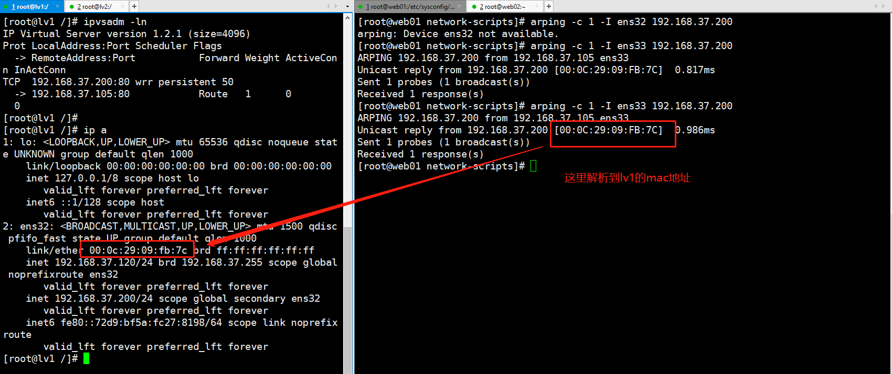

# 期末架构

## 第9章 LVS负载均衡


### 9.1、LVS的介绍--Lvs比较Nginx

# LVS负载均衡

## 为什么要负载均衡

- Internet的飞速发展，网络流量的迅猛增长，越来越多的关键性业务通过互联网开展。
- 很多门户网站面临前所未有的工作负载
  - google每天处理几亿条搜索请求
  - 雅虎网页每天被访问34亿次(2007年数据)
  - YouTube视频网站
  - 社交网站等等

## 假设网络服务的需求

- 渐进的可扩展性
- 7*24的可用性
- 可管理型
- 价格有效性

## 解决方案

- 单服务升级
  - 升级过程复杂，成本太高，单一机器故障
- 服务器集群，属于有效的网络服务架构
  - 集群系统的冗余性---高可用性
  - 分而治之（本意即使将一个较大的力量打碎分成小的力量，这样每个小的力量都不足以对抗大的力量。）---高性能、高吞吐率
  - 节点可以动态调整---可扩展性
  - 高性能/价格比

## 负载均衡

```shell
有关负载均衡的配置，看超哥的文章
http://book.luffycity.com/linux-book/%E9%AB%98%E6%80%A7%E8%83%BDWeb%E9%9B%86%E7%BE%A4%E5%AE%9E%E6%88%98/Nginx%E8%B4%9F%E8%BD%BD%E5%9D%87%E8%A1%A1%E9%9B%86%E7%BE%A4.html
```


### 为什么需要负载均衡

```shell
负载均衡（Load Balance）集群提供了一种廉价、有效、透明的方法，来扩展网络设备和服务器的负载、带宽、增加吞吐量、加强网络数据处理能力、提高网络的灵活性和可用性。
单台计算机无法承受大规模的并发访问或数据流量了，此时需要搭建负载均衡集群把流量分摊到多台节点设备上分别处理，即减少用户等待响应的时间又提升了用户体验；
7*24小时的服务保证，任意一个或多个有限后端节点设备宕机，不能影响整个业务的运行。
```

## LVS详解

中文官网`http://www.linuxvirtualserver.org/zh`

全称`Linux Virtual Server`，linux虚拟服务器的目标是

- 提供一个基本的框架，使用一组高性价比的商业化服务器建立高可扩展性的网络服务

```shell
LVS是Linux Virtual Server的简写，意即Linux虚拟服务器，是一个虚拟的服务器集群系统，可以在UNIX/LINUX平台下实现负载均衡集群功能。它是由章文嵩博士于98年在国防科技大学读博的时候创建的开源项目，是中国国内最早出现的开源软件项目之一。从Linux 2.4开始，LVS的代码已经进入了官方内核中，并得到了广泛的应用。

官网：http://www.linuxvirtualserver.org/index.html
中文资料
LVS项目介绍           http://www.linuxvirtualserver.org/zh/lvs1.html 
LVS集群的体系结构     http://www.linuxvirtualserver.org/zh/lvs2.html 
LVS集群中的IP负载均衡技术  http://www.linuxvirtualserver.org/zh/lvs3.html
LVS集群的负载调度      http://www.linuxvirtualserver.org/zh/lvs4.html
```

### 为什么用lvs

```shell
简单一句话，当并发超过了Nginx上限，就可以使用LVS了。
日1000-2000W PV或并发请求1万以下都可以考虑用Nginx。
大型门户网站，电商网站需要用到LVS。
```

#### lvs和nginx比较

#### LVS 特点是

1. 首先它是基于 4 层的网络协议的，抗负载能力强，对于服务器的硬件要求除了网卡外，其他没有太多要求；
2. 配置性比较低，这是一个缺点也是一个优点，因为没有可太多配置的东西，大大减少了人为出错的几率；
3. 应用范围比较广，不仅仅对 web 服务做负载均衡，还可以对其他应用（mysql）做负载均衡；
4. LVS 架构中存在一个虚拟 IP 的概念，需要向 IDC 多申请一个 IP 来做虚拟 IP。

#### Nginx 负载均衡器的特点

1. 工作在网络的 7 层之上，可以针对 http 应用做一些分流的策略，比如针对域名、目录结构；
2. Nginx 安装和配置比较简单，测试起来比较方便；
3. 也可以承担高的负载压力且稳定，一般能支撑超过上万次的并发；
4. Nginx 可以通过端口检测到服务器内部的故障，比如根据服务器处理网页返回的状态码、超时等等，并且会把返回错误的请求重新提交到另一个节点，不过其中缺点就是不支持 url 来检测；
5. Nginx 对请求的异步处理可以帮助节点服务器减轻负载；
6. Nginx 能支持 http 和 Email，这样就在适用范围上面小很多；
7. 默认有三种调度算法: 轮询、weight 以及 ip_hash（可以解决会话保持的问题），还可以支持第三方的 fair 和 url_hash 等调度算法；


### 9.2、LVS的工作原理


#### LVS讲解

在实际应用场景下，LVS常常与Keepalived搭配工作，实现高可用、高性能、可伸缩、可管理的服务器集群。

LVS主要由内核模块`IPVS`、`KTCPVS`与对应的管理程序`ipvsadm`、`tcpvsadm`组成。`IPVS`（IP Virtual Server）负责IP负载均衡，即四层网络的交换。`KTCPVS`（Kernel TCP Virtual Server）是基于内容的负载均衡，即七层网络的交换。

#### IPVS原理


`IPVS`的工作原理为：当SYN报文到达时，它就选择后边的一台服务器，将报文转发过去，在此之后的所有包含相同IP和TCP报文头地址的数据包都会被转到之前选择的服务器上，这个网络级别的转发效率最高。

```shell
LVS无需安装
安装的是管理工具，第一种叫ipvsadm，第二种叫keepalive
ipvsadm是通过命令行管理，而keepalive读取配置文件管理
后面我们会用Shell脚本实现keepalive的功能

早在2.2内核时， IPVS就已经以内核补丁的形式出现。
从2.4.23版本开始，IPVS软件就合并到Linux内核的常用版本的内核补丁的集合。
从2.4.24以后IPVS已经成为Linux官方标准内核的一部分。
```


### 9.3、LVS转发方式

#### LVS转发方式

`IPVS`支持三种转发方式：

- **VS/NAT（Virtual Server via Network Address Translation）：**通过网络地址转换，调度器重写请求报文的目标地址，根据预设的调度算法，将请求分派给后端的真实服务器；真实服务器的响应报文通过调度器时，报文的源地址被重写，再返回给客户，完成整个负载调度过程。
- **VS/TUN（Virtual Server via IP Tunneling）：**调度器把请求报文通过IP隧道转发至真实服务器，而真实服务器将响应直接返回给客户。
- **VS/DR（Virtual Server via Direct Routing）：**通过改写请求报文的MAC地址，将请求发送到真实服务器，而真实服务器将响应直接返回给客户。

采用`VS/NAT`技术时，由于请求和响应报文都必须经过调度器地址重写，因此它的伸缩能力有限，当服务器结点数目升到20时，调度器本身有可能成为系统的新瓶颈。但是可以与DNS负载均衡协同工作，进一步增加集群的规模。


而使用`VS/TUN`与`VS/DR`时，调度器只处理请求报文，真实服务器的响应是直接返回给客户端的，因此可以极大的提高转发的性能，由于一般网络服务应答比请求报文大许多，使用`VS/TUN`与`VS/DR`时，最大吞吐量可以提高10倍，可以调度上百台服务器，本身不会成为系统的瓶颈。


`VS/DR`比`VS/TUN`的性能要稍好一些，它没有IP隧道的开销，对集群中的真实服务器也没有必须支持IP隧道协议的要求，但是要求调度器与真实服务器都有一块网卡连在同一物理网段上，且服务器网络设备（或者设备别名）不作ARP响应。


#### 调度算法

`IPVS`支持十种负载均衡调度算法：

- **轮叫（Round Robin）：**以轮叫的方式依次将请求调度到不同的服务器，会略过权值是0的服务器。
- **加权轮叫（Weighted Round Robin）：**按权值的高低和轮叫方式分配请求到各服务器。服务器的缺省权值为1。假设服务器A的权值为1，B的权值为2，则表示服务器B的处理性能是A的两倍。例如，有三个服务器A、B和C分别有权值4、3和2，则在一个调度周期内(mod sum(W(Si)))调度序列为AABABCABC。
- **最少链接（Least Connections）：**把新的连接请求分配到当前连接数最小的服务器。
- **加权最少链接（Weighted Least Connections）：**调度新连接时尽可能使服务器的已建立连接数和其权值成比例，算法的实现是比较连接数与加权值的乘积，因为除法所需的CPU周期比乘法多，且在Linux内核中不允许浮点除法。
- **基于局部性的最少链接（Locality-Based Least Connections）：**主要用于Cache集群系统，将相同目标IP地址的请求调度到同一台服务器，来提高各台服务器的访问局部性和主存Cache命中率。LBLC调度算法先根据请求的目标IP地址找出该目标IP地址最近使用的服务器，若该服务器是可用的且没有超载，将请求发送到该服务器；若服务器不存在，或者该服务器超载且有服务器处于其一半的工作负载，则用“最少链接”的原则选出一个可用的服务器，将请求发送到该服务器。
- **带复制的基于局部性最少链接（Locality-Based Least Connections with Replication）：**主要用于Cache集群系统，它与LBLC算法的不同之处是它要维护从一个目标IP地址到一组服务器的映射。LBLCR算法先根据请求的目标IP地址找出该目标IP地址对应的服务器组；按“最小连接”原则从该服务器组中选出一台服务器，若服务器没有超载，将请求发送到该服务器；若服务器超载；则按“最小连接”原则从整个集群中选出一台服务器，将该服务器加入到服务器组中，将请求发送到该服务器。同时，当该服务器组有一段时间没有被修改，将最忙的服务器从服务器组中删除，以降低复制的程度。
- **目标地址散列（Destination Hashing）：**通过一个散列（Hash）函数将一个目标IP地址映射到一台服务器，若该服务器是可用的且未超载，将请求发送到该服务器，否则返回空。使用素数乘法Hash函数：`(dest_ip* 2654435761UL) & HASH_TAB_MASK`。
- **源地址散列（Source Hashing）：**根据请求的源IP地址，作为散列键（Hash Key）从静态分配的散列表找出对应的服务器，若该服务器是可用的且未超载，将请求发送到该服务器，否则返回空。
- **最短期望延迟（Shortest Expected Delay Scheduling）：**将请求调度到有最短期望延迟的服务器。最短期望延迟的计算公式为(连接数 + 1) / 加权值。
- **最少队列调度（Never Queue Scheduling）：**如果有服务器的连接数是0，直接调度到该服务器，否则使用上边的SEDS算法进行调度。

LVS允许运行时动态的增减负载均衡池中的服务器及调整其权值，所以可以自行通过软件实现一些动态反馈负载均衡算法，如根据服务器网络流量、CPU、内存、磁盘IO等资源的使用情况综合调整权重（Redhat Piranha提供了类似功能）。现在很多应框架也提供了友好的监控接口，如Spring Boot Actuator，JMX等，让自行实现动态反馈负载均衡更加简单。从性能方面考虑，官方建议权值调整时间间隔应该在5到20秒之间。


### 9.3、LVS部署

#### 部署LVS

#### 使用ipvsadm管理集群

`ipvsadm`是`IPVS`的命令行管理工具

在开始之前先介绍几个概念：

- **Director Server（DS）：**负责负载均衡调度的LVS服务器
- **Real Server（RS）：**负载均衡池中真实工作的服务器
- **Director Server IP（DIP）：**`DS`的IP地址
- **Real Server IP（RIP）：**`RS`的IP地址
- **Virtual Server IP（VIP）：**虚拟服务器的IP地址，在`VS/DR`模式下，`DS`与`RS`除了有自己的IP，同时还需要配置相同的`VIP`


DR原理图


#### LVS集群DR工作模式

```
a)通过在调度器LB上修改数据包的目的MAC地址实现转发。注意，源IP地址仍然是CIP，目的IP地址仍然是VIP。
b)请求的报文经过调度器，而RS响应处理后的报文无需经过调度器LB，因此，并发访问量大时使用效率很高，比Nginx代理模式强于此处。
c)因DR模式是通过MAC地址的改写机制实现转发的，因此，所有RS节点和调度器LB只能在同一个局域网中。需要注意RS节点的VIP的绑定(lo:vip/32)和ARP抑制问题。
d)强调下：RS节点的默认网关不需要是调度器LB的DIP，而应该直接是IDC机房分配的上级路由器的IP(这是RS带有外网IP地址的情况)，理论上讲，只要RS可以出网即可，不需要必须配置外网IP，但走自己的网关，那网关就成为瓶颈了。
e)由于DR模式的调度器仅进行了目的MAC地址的改写，因此，调度器LB无法改变请求报文的目的端口。LVS DR模式的办公室在二层数据链路层（MAC），NAT模式则工作在三层网络层（IP）和四层传输层（端口）。
f)当前，调度器LB支持几乎所有UNIX、Linux系统，但不支持windows系统。真实服务器RS节点可以是windows系统。
g)总之，DR模式效率很高，但是配置也较麻烦。因此，访问量不是特别大的公司可以用haproxy/Nginx取代之。这符合运维的原则：简单、易用、高效。日1000-2000W PV或并发请求1万以下都可以考虑用haproxy/Nginx(LVS的NAT模式)
h)直接对外的访问业务，例如web服务做RS节点，RS最好用公网IP地址。如果不直接对外的业务，例如：MySQL，存储系统RS节点，最好只用内部IP地址。
```

#### LVS集群搭建

实验环境的拓扑结构


实验环境中，因为客户端与`DS`、`RS`在同一个物理网网段中，所以会有ARP问题。因为`DS`、`RS`都有相同的`VIP`，当客户端需要访问`VIP`地址时，`RS`有可能先于`DS`对`ARP`解析进行抢答，这样客户端就会直接与`RS`交互，`DS`就起不到负载均衡的作用了。所以要在`RS`的相应网络接口上禁用ARP功能，禁用的命令如下：

示例

```shell
ifconfig eth1:0 192.168.33.50 netmask 255.255.255.255 broadcast 192.168.33.50 up
route add -host 192.168.33.50 dev eth1:0
ipvsadm -D -t 192.168.33.50:80
ipvsadm -A -t 192.168.33.50:80 -s rr
ipvsadm -a -t 192.168.33.50:80 -r 192.168.33.20 -g
ipvsadm -a -t 192.168.33.50:80 -r 192.168.33.30 -g
ipvsadm -l --stats
```


#### 环境环境准备

```shell
三台linux机器

主机名        ip地址            软件
lb01  192.168.37.120   lvs keepalived
lb02  192.168.37.121   lvs  keepalived

web01 192.168.37.105          nginx(用作web展示)
web02 192.168.37.106          nginx(用作web展示)
```


机器环境初始化

```shell
# 防火墙
systemctl stop firewalld
systemctl disable firewalld

iptables -F

[root@web02 ~]# getenforce
Disabled


yum install -y wget 

# yum源，基础软件安装
wget -O /etc/yum.repos.d/CentOS-Base.repo http://mirrors.aliyun.com/repo/Centos-7.repo
wget -O /etc/yum.repos.d/epel.repo http://mirrors.aliyun.com/repo/epel-7.repo


yum clean all


yum install -y bash-completion vim lrzsz wget expect net-tools nc nmap tree dos2unix htop iftop iotop unzip telnet sl psmisc nethogs glances bc ntpdate  openldap-devel git python-pip  gcc automake autoconf python-devel  sshpass lrzsz readline-devel lsof
```

#### 确保web01/02可访问

```shell
#web01和web02上分别安装nginx
yum install nginx -y # 利用nginx做基本的静态页面展示

#分别配置好nginx.conf

    server {
        listen       80;
        server_name  _;
        # Load configuration files for the default server block.
        include /etc/nginx/default.d/*.conf;

        location / {

        root  /usr/share/nginx/html;
        index index.html index.htm;
                }
    }


#准备页面内容
[root@web01 html]
echo "<meta charset="utf-8"> 
hello,我是web01
" > /usr/share/nginx/html/index.html


[root@web02 html]
echo "<meta charset="utf-8">
hello,我是web02
" > /usr/share/nginx/html/index.html


# 启动nginx
nginx
```

在lb01上测试访问

```shell
[root@lv1 ~]# curl 192.168.37.105
<meta charset="utf-8">
hello,我是web01
[root@lv1 ~]# curl 192.168.37.106
<meta charset="utf-8">
hello,我是web02
```


#### 安装Ipvsdam

在lb01安装lvs管理工具

```shell
# 检查系统内核加载的模块
执行lsmod指令，会列出所有已载入系统的模块。Linux操作系统的核心具有模块化的特性，应此在编译核心时，务须把全部的功能都放入核心。您可以将这些功能编译成一个个单独的模块，待需要时再分别载入。

# 检查系统是否支持ip_vs模块，默认是没开启的
[root@lv1 ~]# lsmod |grep ipvs_vs

# 安装工具
[root@lv1 ~]# yum install ipvsadm -y


# 激活LVS内核
[root@lv1 ~]# ipvsadm
IP Virtual Server version 1.2.1 (size=4096)
Prot LocalAddress:Port Scheduler Flags
  -> RemoteAddress:Port           Forward Weight ActiveConn InActConn


# 检查系统模块支持
[root@lv1 ~]# lsmod |grep ip_vs
ip_vs                 141432  0 
nf_conntrack          133053  1 ip_vs
libcrc32c              12644  3 xfs,ip_vs,nf_conntrack

```


#### LVS搭建

配置LVS负载均衡服务，在lb01上操作

##### 步骤1：

绑定VIP地址

```shell
[root@lv1 ~]# ip addr add  192.168.37.200 dev ens32

[root@lv1 ~]# ip a
1: lo: <LOOPBACK,UP,LOWER_UP> mtu 65536 qdisc noqueue state UNKNOWN group default qlen 1000
    link/loopback 00:00:00:00:00:00 brd 00:00:00:00:00:00
    inet 127.0.0.1/8 scope host lo
       valid_lft forever preferred_lft forever
    inet6 ::1/128 scope host 
       valid_lft forever preferred_lft forever
2: ens32: <BROADCAST,MULTICAST,UP,LOWER_UP> mtu 1500 qdisc pfifo_fast state UP group default qlen 1000
    link/ether 00:0c:29:09:fb:7c brd ff:ff:ff:ff:ff:ff
    inet 192.168.37.120/24 brd 192.168.37.255 scope global noprefixroute ens32
       valid_lft forever preferred_lft forever
    inet 192.168.37.200/32 scope global ens32
       valid_lft forever preferred_lft forever
    inet6 fe80::72d9:bf5a:fc27:8198/64 scope link noprefixroute 
       valid_lft forever preferred_lft forever

```

##### 步骤2：

清除当前所有的LVS规则

```shell
[root@lb01 ~]# ipvsadm -C
```

##### 步骤3：

设置连接超时时间，--set参数

```SHELL
--set tcp tcpfin udp set connection timeout values
[root@lv1 ~]# ipvsadm --set 30 5 60
```

##### 步骤4：

添加虚拟服务(-A)

```shell
--add-service -A add virtual service with options
```

-t 指定虚拟服务的IP端口

```shell
--tcp-service -t service-address service-address is host[:port]
```

-s 指定调度算法

```shell
--scheduler -s scheduler one of rr|wrr|lc|wlc|lblc|lblcr|dh|sh|sed|nq,
```

-p 指定超时时间

```shell
--persistent -p [timeout] persistent service
[root@lv1 ~]# ipvsadm -A -t 192.168.37.200:80 -s wrr -p 20
```

##### 步骤5：

将虚拟服务关联到真实服务 -a

也就是关联到web01/02两台机器

```shell
--add-server -a add real server with options
```

-r 指定真实服务的IP端口

```shell
--real-server -r server-address server-address is host (and port)
```

-g LVS的模式 DR模式

```shell
--gatewaying -g gatewaying (direct routing) (default)
```

-w 指定权重

```shell
--weight -w weight capacity of real server
[root@lv1 ~]# ipvsadm -a -t 192.168.37.200:80 -r 192.168.37.105:80 -g -w 1
[root@lv1 ~]# ipvsadm -a -t 192.168.37.200:80 -r 192.168.37.106:80 -g -w 1
```

##### 步骤6

查看lvs配置结果

```shell
[root@lv1 ~]# ipvsadm -ln
IP Virtual Server version 1.2.1 (size=4096)
Prot LocalAddress:Port Scheduler Flags
  -> RemoteAddress:Port           Forward Weight ActiveConn InActConn
TCP  192.168.37.200:80 wrr persistent 20
  -> 192.168.37.105:80            Route   1      0          0         
  -> 192.168.37.106:80            Route   1      0          0   
```


#### ipvsadm命令参数

***ipvsadm\**\****参数说明：*(***\*更多参照 man ipvsadm)**

| **参数\**\***(******短格式******)*** | **参数\**\***(******长格式******)***                         | **参数说明**                                                 |                      |      |      |       |        |      |      |      |                          |
| ------------------------------------ | ------------------------------------------------------------ | ------------------------------------------------------------ | -------------------- | ---- | ---- | ----- | ------ | ---- | ---- | ---- | ------------------------ |
| **-A**                               | --add-service                                                | 在内核的虚拟服务器表中添加一条新的虚拟服务器记录。也就是增加一台新的虚拟服务器。 |                      |      |      |       |        |      |      |      |                          |
| **-E**                               | --edit-service                                               | 编辑内核虚拟服务器表中的一条虚拟服务器记录。                 |                      |      |      |       |        |      |      |      |                          |
| **-D**                               | --delete-service                                             | 删除内核虚拟服务器表中的一条虚拟服务器记录。                 |                      |      |      |       |        |      |      |      |                          |
| **-C**                               | --clear                                                      | 清除内核虚拟服务器表中的所有记录。                           |                      |      |      |       |        |      |      |      |                          |
| **-R**                               | --restore                                                    | 恢复虚拟服务器规则                                           |                      |      |      |       |        |      |      |      |                          |
| **-S**                               | --save                                                       | 保存虚拟服务器规则，输出为-R 选项可读的格式                  |                      |      |      |       |        |      |      |      |                          |
| **-a**                               | --add-server                                                 | 在内核虚拟服务器表的一条记录里添加一条新的真实服务器记录。也就是在一个虚拟服务器中增加一台新的真实服务器 |                      |      |      |       |        |      |      |      |                          |
| **-e**                               | --edit-server                                                | 编辑一条虚拟服务器记录中的某条真实服务器记录                 |                      |      |      |       |        |      |      |      |                          |
| **-d**                               | --delete-server                                              | 删除一条虚拟服务器记录中的某条真实服务器记录                 |                      |      |      |       |        |      |      |      |                          |
| **-L\                                | -l**                                                         | --list                                                       | 显示内核虚拟服务器表 |      |      |       |        |      |      |      |                          |
| **-Z**                               | --zero                                                       | 虚拟服务表计数器清零（清空当前的连接数量等）                 |                      |      |      |       |        |      |      |      |                          |
| **-**                                | --set *tcp tcpfin udp*                                       | 设置连接超时值                                               |                      |      |      |       |        |      |      |      |                          |
| **-**                                | --start-daemon                                               | 启动同步守护进程。他后面可以是master 或backup，用来说明LVS Router 是master 或是backup。在这个功能上也可以采用keepalived 的VRRP 功能。 |                      |      |      |       |        |      |      |      |                          |
| **-**                                | --stop-daemon                                                | 停止同步守护进程                                             |                      |      |      |       |        |      |      |      |                          |
| **-h**                               | --help                                                       | 显示帮助信息                                                 |                      |      |      |       |        |      |      |      |                          |
| **-t**                               | --tcp-service *service-address [vip:port] or [real-server-ip:port]* | 说明虚拟服务器提供的是tcp 的服务                             |                      |      |      |       |        |      |      |      |                          |
| **-u**                               | --udp-service *service-address [vip:port] or [real-server-ip:port]* | 说明虚拟服务器提供的是udp 的服务                             |                      |      |      |       |        |      |      |      |                          |
| **-f**                               | --fwmark-service *fwmark*                                    | 说明是经过iptables 标记过的服务类型。                        |                      |      |      |       |        |      |      |      |                          |
| **-s**                               | --scheduler *scheduler*                                      | 使用的调度算法，有这样几个选项rr\                            | wrr\                 | lc\  | wlc\ | lblc\ | lblcr\ | dh\  | sh\  | sed\ | nq默认的调度算法是： wlc |
| **-p**                               | --persistent *[timeout]*                                     | 持久稳固的服务。这个选项的意思是来自同一个客户的多次请求，将被同一台真实的服务器处理。timeout 的默认值为300秒。 |                      |      |      |       |        |      |      |      |                          |
| **-M**                               | --netmask netmask                                            | persistent granularity mask                                  |                      |      |      |       |        |      |      |      |                          |
| **-r**                               | --real-server *server-address*                               | 真实的服务器[Real-Server:port]                               |                      |      |      |       |        |      |      |      |                          |
| **-g**                               | --gatewaying                                                 | 指定LVS 的工作模式为直接路由模式（也是LVS 默认的模式）       |                      |      |      |       |        |      |      |      |                          |
| **-i**                               | --ipip                                                       | 指定LVS 的工作模式为隧道模式                                 |                      |      |      |       |        |      |      |      |                          |
| **-m**                               | --masquerading                                               | 指定LVS 的工作模式为NAT 模式                                 |                      |      |      |       |        |      |      |      |                          |
| **-w**                               | --weight *weight*                                            | 真实服务器的权值                                             |                      |      |      |       |        |      |      |      |                          |
| **-**                                | --mcast-interface                                            | interface 指定组播的同步接口                                 |                      |      |      |       |        |      |      |      |                          |
| **-c**                               | --connection                                                 | 显示LVS 目前的连接 如：ipvsadm -L -c                         |                      |      |      |       |        |      |      |      |                          |
| **-**                                | --timeout                                                    | 显示tcp tcpfin udp 的timeout 值 如：ipvsadm -L --timeout     |                      |      |      |       |        |      |      |      |                          |
| **-**                                | --daemon                                                     | 显示同步守护进程状态                                         |                      |      |      |       |        |      |      |      |                          |
| **-**                                | --stats                                                      | 显示统计信息                                                 |                      |      |      |       |        |      |      |      |                          |
| **-**                                | --rate                                                       | 显示速率信息                                                 |                      |      |      |       |        |      |      |      |                          |
| **-**                                | --sort                                                       | 对虚拟服务器和真实服务器排序输出                             |                      |      |      |       |        |      |      |      |                          |
| **-**                                | --numeric -n                                                 | 输出IP 地址和端口的数字形式                                  |                      |      |      |       |        |      |      |      |                          |


#### 客户端操作web01/web02

##### 步骤1：

在lo回环地址绑定VIP，让RS机器能够接收到vip的数据包。

在lo回环地址上配置vip，可以完成，且只能配置在lo回环地址上，不能配置在ens33上，否则会造成arp缓存表紊乱，导致lvs集群无法工作。

```shell
ip addr add 192.168.37.200/32  dev lo

[root@web01 /]# ip addr add 192.168.37.200/32  dev lo
[root@web02 /]# ip addr add 192.168.37.200/32  dev lo
```

##### 步骤2：ARP控制

#### **修改内核参数抑制ARP响应**

```shell
arp说明
ARP协议,全称"Address Resolution Protocol",中文名是地址解析协议，使用ARP协议可实现通过IP地址获得对应主机的物理地址(MAC地址)。

ARP协议要求通信的主机双方必须在同一个物理网段（即局域网环境）！

为了系统ip和mac地址解析的效率，系统会把缓存结果保存下来，这个结果就是arp缓存。

Windows查看ARP缓存命令 arp -a

Linux查看ARP缓存命令 arp -n
[root@web01 /]# arp -n
Address                  HWtype  HWaddress           Flags Mask            Iface
192.168.37.1             ether   00:50:56:c0:00:08   C                     ens33
192.168.37.106           ether   00:0c:29:28:3b:aa   C                     ens33
192.168.37.120           ether   00:0c:29:09:fb:7c   C                     ens33
192.168.37.2             ether   00:50:56:e2:73:93   C                     ens33


Linux解析IP对应的MAC地址
[root@web01 /]# arping -c 1 -I ens33 192.168.37.106
ARPING 192.168.37.106 from 192.168.37.105 ens33
Unicast reply from 192.168.37.106 [00:0C:29:28:3B:AA]  0.760ms				#这就获取到了web02的mac地址
Sent 1 probes (1 broadcast(s))
Received 1 response(s)


若是没有arp命令，安装yum install net-tools -y
```


#### LVS在DR模式下关闭arp功能

实验环境中，因为客户端与`DS`、`RS`在同一个物理网网段中，所以会有ARP问题。因为`DS`、`RS`都有相同的`VIP`，当客户端需要访问`VIP`地址时，`RS`有可能先于`DS`对`ARP`解析进行抢答，这样客户端就会直接与`RS`交互，`DS`就起不到负载均衡的作用了。所以要在`RS`的相应网络接口上禁用ARP功能，禁用的命令如下：

```shell
arp作用是根据ip地址获取mac地址

[root@web01 /]# cat >>/etc/sysctl.conf<<EOF
> net.ipv4.conf.all.arp_ignore = 1
> net.ipv4.conf.all.arp_announce = 2
> net.ipv4.conf.lo.arp_ignore = 1
> net.ipv4.conf.lo.arp_announce = 2
> EOF


# 让内核参数生效
[root@web01 /]# sysctl -p
net.ipv4.conf.all.arp_ignore = 1
net.ipv4.conf.all.arp_announce = 2
net.ipv4.conf.lo.arp_ignore = 1
net.ipv4.conf.lo.arp_announce = 2

# 同样的操作，在web02也执行即可，注意
```


#### 禁止arp参数解释

***arp_announce\***

对网络接口上，本地IP地址的发出的，ARP回应，作出相应级别的限制:

确定不同程度的限制,宣布对来自本地源IP地址发出Arp请求的接口

| **数值** | **含义**                                                     |
| -------- | ------------------------------------------------------------ |
| **默认** | 在任意网络接口（eth0,eth1，lo）上的任何本地地址              |
| **1**    | 尽量避免不在该网络接口子网段的本地地址做出arp回应. 当发起ARP请求的源IP地址 是被设置应该经由路由达到此网络接口的时候很有用.此时会检查来访IP是否为所有接口 上的子网段内ip之一.如果改来访IP不属于各个网络接口上的子网段内,那么将采用级别2的方式来进行处理. |
| **2**    | 对查询目标使用最适当的本地地址.在此模式下将忽略这个IP数据包的源地址并尝试 选择与能与该地址通信的本地地址.首要是选择所有的网络接口的子网中外出访问子网中 包含该目标IP地址的本地地址. 如果没有合适的地址被发现,将选择当前的发送网络接口 或其他的有可能接受到该ARP回应的网络接口来进行发送. |

***arp_ignore\**\***定义**

**对目标地定义对目标地址为本地IP**的ARP**询问不同的应答模式0**

| **数值** | **含义**                                                     |
| -------- | ------------------------------------------------------------ |
| 默认值   | 回应任何网络接口上对任何本地IP地址的arp查询请求              |
| **1**    | 只回答目标IP地址是来访网络接口本地地址的ARP查询请求          |
| **2**    | 只回答目标IP地址是来访网络接口本地地址的ARP查询请求,且来访IP必须在该网络接口的子网段内 |
| **3**    | 不回应该网络界面的arp请求，而只对设置的唯一和连接地址做出回应 |
| **4-7**  | 保留未使用                                                   |
| **8**    | 不回应所有（本地地址）的arp查询                              |

#### 是否抑制ARP的广播图

未抑制arp的广播图，是有误的


抑制arp之后的广播情况，正确了


#### ARP缓存之双刃剑

a) 主机有了arp缓存表，可以加快ARP的解析速度，减少局域网内广播风暴。因为arp是发广播解析的，频繁的解析也是消耗带宽的，尤其是机器多的时候。

b) 正是有了arp缓存表，给恶意黑客带来了攻击服务器主机的风险，这个就是arp欺骗攻击。

c) 切换路由器，负载均衡器等设备时，可能会导致短时网络中断。因为所有的客户端ARP缓存表没有更新

#### 服务器切换ARP问题

　当集群中一台提供服务的lb01机器宕机后，然后VIP会转移到备机lb02上，但是客户端的ARP缓存表的地址解析还是宕机的lb01的MAC地址。从而导致，即使在lb02上添加VIP，也会发生客户端无法访问的情况。

　　解决办法是：当lb01宕机，VIP地址迁移到lb02时，需要通过arping命令通知所有网络内机器更新本地的ARP缓存表，从而使得客户机访问时重新广播获取MAC地址。

　　这个是自己开发服务器高可用脚本及所有高可用软件必须考虑到的问题。

#### arp刷新

```shell
[root@web01 /]# arping -I ens33 -c 1 -U 192.168.37.200  # 后面是VIP地址
ARPING 10.0.1.40 from 10.0.1.40 ens33
Sent 1 probes (1 broadcast(s))
Received 0 response(s)
```

#### 至此LVS配置完成

可以在mac/win本地访问vip地址

```shell
http://192.168.37.200/   #vip地址
```


```
这里要注意的是，lvs不像nginx一样，非常明显的一比一的关系，每次刷新，分别看到web01/web02
如果想要其结果，可以等待10s以上，或者换一个浏览器访问vip即可。
因为lvs只有在访问量非常大的时候，才能明显的基于一比一的请求转发。
可以分别看到web01和web02的页面。
```


### 9.4、LVS结合keepalive

### 	为什么要用到keepalive

#### LVS结合keepalived方案

之前的lvs虽然配置成功也实现了负载均衡，但是我们测试的时候发现，当某台real server把nginx停掉，那么director照样会把请求转发过去，这样就造成了某些请求不正常。所以需要有一种机制用来检测real server的状态，这时就可以使用keepalive。

```shell
[root@web01 ~]# nginx -s stop
```


我们是不希望发生如上的情况的。

#### keepalived的作用

在 lvs+keepalived 环境里面，lvs 主要的工作是提供调度算法，把客户端请求按照需求调度在 real 服务器，keepalived 主要的工作是提供 lvs 控制器的一个冗余，并且对 real 服务器做健康检查，发现不健康的 real 服务器，就把它从 lvs 集群中剔除，real 服务器只负责提供服务。

除了可以检测RS状态外(剔除故障的RS)，还可以添加备用director。也就是说keepalived在这里也可以配置HA集群的功能，当然了也需要一台备用的director服务器。备用director也需要安装keepalive软件。

注意：keepalive不像nginx和Apache那样，会自动检测配置文件是否错误。所以应该仔细检查配置文件。


### 9.5、keepalive的工作原理


#### 架构原理

#### keepalived

Keepalived 是运行在 lvs 之上，是一个用于做双机热备（HA）的软件，它的主要功能是实现真实机的故障隔离及负载均衡器间的失败切换，提高系统的可用性。

#### 运行原理

keepalived 通过选举（看服务器设置的权重）挑选出一台热备服务器做 MASTER 机器，MASTER 机器会被分配到一个指定的虚拟 ip，外部程序可通过该 ip 访问这台服务器，如果这台服务器出现故障（断网，重启，或者本机器上的 keepalived crash 等），keepalived 会从其他的备份机器上重选（还是看服务器设置的权重）一台机器做 MASTER 并分配同样的虚拟 IP，充当前一台 MASTER 的角色。

#### 选举策略

选举策略是根据 VRRP 协议，完全按照权重大小，权重最大（0～255）的是 MASTER 机器，下面几种情况会触发选举

1. keepalived 启动的时候
2. master 服务器出现故障（断网，重启，或者本机器上的 keepalived crash 等，而本机器上其他应用程序 crash 不算）
3. 有新的备份服务器加入且权重最大


### 9.6、keepalived的部署过程

#### keepalived 的配置文件说明

Keepalived 是运行在 lvs 之上, 它的主要功能是实现 RealServer(真实服务器)的故障隔离及 Director(负载均衡器)间的 FailOver(失败切换).

- keepalived 是 lvs 的扩展项目, 因此它们之间具备良好的兼容性
- 对 RealServer 的健康检查, 实现对失效机器 / 服务的故障隔离
- 负载均衡器之间的失败切换 failover


在lb01/02机器安装keepalived软件

毕竟我们要实现两台机器的高可用性，因此准备2台，安装keepalived服务

```shell
#lv01、lv02分别安装keepalived
[root@lv1 ~]# yum install keepalived -y
[root@lv2 ~]# yum install keepalived -y


[root@lv1 ~]#  rpm -qa keepalived
keepalived-1.3.5-16.el7.x86_64

[root@lv2 ~]#  rpm -qa keepalived
keepalived-1.3.5-16.el7.x86_64

```


#### 修改配置文件lb01

```shell
[root@lv1 keepalived]# cp /etc/keepalived/keepalived.conf{,.bak} 
[root@lv1 keepalived]# ls
keepalived.conf  keepalived.conf.bak


[root@lv1 ~]# cat /etc/keepalived/keepalived.conf
! Configuration File for keepalived
# 全局ip
global_defs {
   router_id LVS_01
}
# 实例配置
vrrp_instance VI_1 {
    state MASTER
    interface ens32     #与机器的网卡名字对应
    virtual_router_id 51
    priority 150
    advert_int 1
    authentication {
        auth_type PASS
        auth_pass 1111
    }
    virtual_ipaddress {
    192.168.37.200/24
    }
}
# 虚拟服务器配置
virtual_server 192.168.37.200 80 {
    delay_loop 6
    lb_algo wrr
    lb_kind DR
    nat_mask 255.255.255.0
    persistence_timeout 50
    protocol TCP
      # 真实服务器一
    real_server 192.168.37.105 80{
        weight 1
    TCP_CHECK {
         connect_timeout 8
         nb_get_retry 3
         delay_before_retry 3
         connect_port 80
          }
        }
        # 真实服务器二
    real_server 192.168.37.106 80{
        weight 1
    TCP_CHECK {
         connect_timeout 8
         nb_get_retry 3
         delay_before_retry 3
         connect_port 80
          }
        }


}
```

参数解释

TCP方式

```
onnect_port 80         # 设置监控检查的端口
bindto  <IPADD>         # 设置健康检查的 IP 地址
connect_timeout   3     # 设置连接超时时间
nb_get_retry  3         # 设置重连次数
delay_before_retry  2   # 设置重连间隔
```

Virtual_server虚拟主机配置

```shell
关于 keeplived 的虚拟主机配置有三种如下所示
virtual server IP port
virtual server fwmark int
virtual server group string

以常用的第一种为例
virtual_server 192.168.1.2 80
含义: 设置一个 virtual server: VIP:Vport

delay_loop 3
含义: 设置 service polling 的 delay 时间即服务轮询的时间间隔

lb_algo rr|wrr|lc|wlc|lblc|sh|dh
含义: 设置 LVS 调度算法

lb_kind NAT|DR|TUN
含义: 设置 LVS 集群模式

persistence_timeout 120
含义: 设置会话保持时间秒为单位即以用户在 120 秒内被分配到同一个后端 realserver, 超过此时间就重新分配

persistence_granularity
含义: 设置 LVS 会话保持粒度 ipvsadm 中的 - M 参数默认是 0xffffffff 即每个客户端都做会话保持

protocol TCP
含义: 设置健康检查用的是 TCP 还是 UDP

ha_suspend
含义: suspendhealthchecker’s activity

virtualhost
含义: HTTP_GET 做健康检查时检查的 web 服务器的虚拟主机即 host 头

sorry_server
含义: 设置 backupserver 就是当所有后端 realserver 节点都不可用时就用这里设置的也就是临时把所有的请求都发送到这里

real_server
含义: 设置后端真实节点主机的权重等设置主要后端有几台这里就要设置几个

weight 1
含义: 设置给每台的权重 0 表示失效 (不知给他转发请求知道他恢复正常) 默认是 1

inhibit_on_failure
含义: 表示在节点失败后把他权重设置成 0 而不是冲 IPVS 中删除

notify_up |
含义: 设置检查服务器正常 (UP) 后要执行的脚本
notify_down |
含义: 设置检查服务器失败 (down) 后要执行的脚本

注: keepalived 检查机制说明
keepalived 健康检查方式有: HTTP_GET|SSL_GET|TCP_CHECK|SMTP_CHECK|MISC_CHECK 几种如下所示
```


#### 修改lb02配置文件

```shell
1.安装keepalived服务

[root@lv2 ~]# yum install keepalived -y

2.修改配置文件
#备份一份
[root@lv2 ~]# cp /etc/keepalived/keepalived.conf{,.bak}

[root@lv2 ~]# cat /etc/keepalived/keepalived.conf
! Configuration File for keepalived

global_defs {
   router_id LVS_02
}

vrrp_instance VI_1 {
    state BACKUP
    interface ens32			#与机器的网卡名字对应
    virtual_router_id 51
    priority 100
    advert_int 1
    authentication {
        auth_type PASS
        auth_pass 1111
    }
    virtual_ipaddress {
     192.168.37.200/24
    }
}
virtual_server 192.168.37.200 80 {
    delay_loop 6
    lb_algo wrr
    lb_kind DR
    nat_mask 255.255.255.0
    persistence_timeout 50
    protocol TCP

    real_server 192.168.37.105 80 {
        weight 1
        TCP_CHECK {
        connect_timeout 8
        nb_get_retry 3
        delay_before_retry 3
        connect_port 80
        }
    }

    real_server 192.168.37.106 80 {
        weight 1
        TCP_CHECK {
        connect_timeout 8
        nb_get_retry 3
        delay_before_retry 3
        connect_port 80
        }
    }
}
```

#### 启动keepalived服务

注意，先关闭先前设置的ipvsadm的配置，重启网络即可

```shell
systemctl restart network
```

启动keepalived，即可生成vip

```shell
[root@lv02 ~]# systemctl start keepalived

[root@lv01 ~]# systemctl start keepalived
```

检查vip的漂移，只有正确漂移，才能保证实验的准确。

```shell

#停止lv2的keepalived、启动lv1的keepalived
[root@lv2 /]# systemctl stop keepalived
[root@lv1 ~]# systemctl start keepalived

#分别查看lv1、lv2的ip
[root@lv1 /]# ip a|grep 'inet 192'|awk '{print $2}'
192.168.37.120/24
192.168.37.200/24
[root@lv2 /]# ip a|grep 'inet 192'|awk '{print $2}'
192.168.37.121/24


#停止lv1的keepalived、启动lv2的keepalived
[root@lv1 /]# systemctl stop keepalived
[root@lv2 /]# systemctl start keepalived


#分别查看lv1、lv2的ip
[root@lv2 /]# ip a|grep 'inet 192'|awk '{print $2}'
192.168.37.121/24
192.168.37.200/24

[root@lv1 /]# ip a|grep 'inet 192'|awk '{print $2}'
192.168.37.120/24

#说明都能进行VIP漂移、说明配置ok

```

如有失败，检查配置文件，防火墙！

```shell
1.停止 lb01的kp服务，检查lb02的vip漂移

2.启动lb01的kp服务，检查lb02的vip漂移
```

检查ipvsadm的状态

```shell
#最后要确保这lv1、lv2的服务规则存在

[root@lv1 /]# ipvsadm -ln
IP Virtual Server version 1.2.1 (size=4096)
Prot LocalAddress:Port Scheduler Flags
  -> RemoteAddress:Port           Forward Weight ActiveConn InActConn
TCP  192.168.37.200:80 wrr persistent 50
  -> 192.168.37.105:80            Route   1      0          0         
  -> 192.168.37.106:80            Route   1      0          0  


[root@lv2 /]# ipvsadm -ln
IP Virtual Server version 1.2.1 (size=4096)
Prot LocalAddress:Port Scheduler Flags
  -> RemoteAddress:Port           Forward Weight ActiveConn InActConn
TCP  192.168.37.200:80 wrr persistent 50
  -> 192.168.37.105:80            Route   1      0          0         
  -> 192.168.37.106:80            Route   1      1          0   

```


#### 在web01/02上配置

```shell
1.抑制客户端arp解析
ip addr add 192.168.37.200/24 dev lo

2.修改内核参数，抑制arp响应
cat >>/etc/sysctl.conf<<EOF
net.ipv4.conf.all.arp_ignore = 1
net.ipv4.conf.all.arp_announce = 2
net.ipv4.conf.lo.arp_ignore = 1
net.ipv4.conf.lo.arp_announce = 2
EOF
sysctl -p

3.注意命令修改只是临时生效，可以写入rc.local，实现永久生效。
```


#### 验证lvs+keepalived

访问lvs


解析关系一



lb01如果宕机，也不影响服务

```shell
# 停止lb01的vip
[root@lv1 /]# systemctl stop keepalived

# 检查lb02的vip
[root@lb02 ~]# ip a
[root@lv2 /]# ip a|grep 'inet 192'|awk '{print $2}'
192.168.37.121/24
192.168.37.200/24	#vip
```

再次测试


即使断开了lb01，页面也不影响访问


此时可以恢复lb01的vip，检查arp解析。

```shell
[root@lbv1 ~]# systemctl start keepalived

[root@web01 ~]# arping -c 1 -I ens33 192.168.37.200
ARPING 192.168.37.200 from 192.168.37.105 ens33
Unicast reply from 192.168.37.200 [00:0C:29:09:FB:7C]  1.119ms
Sent 1 probes (1 broadcast(s))
Received 1 response(s)

```


#### 添加多个回环地址永久生效

```shell
#复制以下文件并重命名
cp /etc/sysconfig/network-scripts/ifcfg-lo/etc/sysconfig/network-scripts/ifcfg-lo:0

#并写入以下内容
DEVICE=lo:0
IPADDR=192.168.37.200

#重启网卡服务
sysytemctl restart network
```

